# 01 · What Is Inference & Inference Engineering?

**Source:** [fanout.sh / inference-eng / in-01](https://fanout.sh/inference-eng/curriculum/in-01) · ~9 min · Next: *The Inference Stack*

> **TL;DR.** Inference is running a trained model token by token, every time someone uses it, so across a fleet it usually costs more than training. Decode is limited by memory bandwidth (moving weights), not arithmetic. Latency, throughput and cost pull against each other, and batching is the first lever. The job is a loop: measure, find the bottleneck, change one thing, measure again.

## 1. Why inference matters: the DeepSeek bill

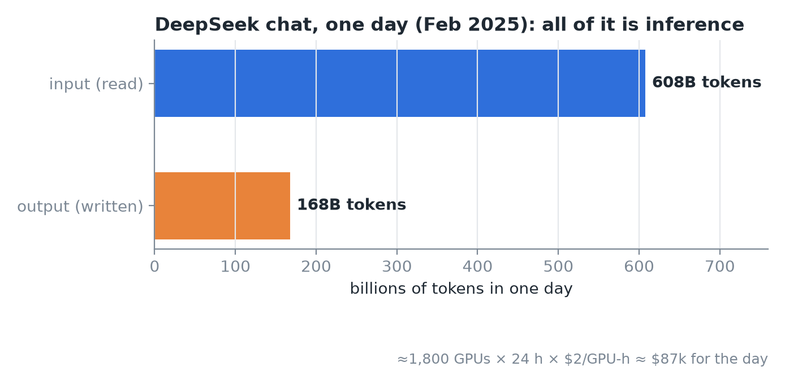
*DeepSeek chat service, 24 h, Feb 2025: ~1,800 GPUs on average, ~$87k for the day at $2/GPU-hour.*

- One day of DeepSeek chat: **608B input tokens** read, **168B output tokens** written.
- Ran on **~1,800 GPUs** on average. At $2/GPU-hour: 1,800 × 24 × $2 ≈ **$87k/day**.
- The model was trained months earlier. Every one of those tokens was inference.

**Key point:** the gap between serving well and serving badly comes from a small number of engineering decisions. That gap is the job.

## 2. What inference actually is

- A trained model is **just a file of numbers**. Llama 3 8B has about 8B params at 16 bits (2 bytes each), so the file is **about 16 GB**.
- **Inference = running it.** Feed in text, predict the next token, append it, and repeat until done. This is **autoregressive** generation.

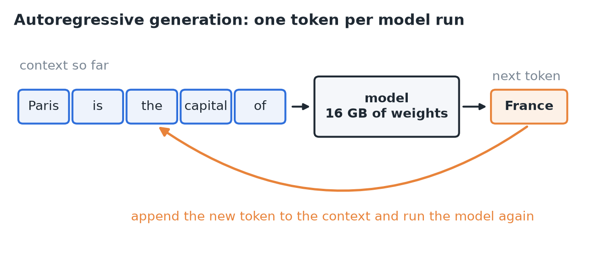
*The autoregressive loop: each generated token is fed back in as input.*

**Training vs inference**

| | Training | Inference |
|---|---|---|
| How often | Once, or a few times | Every request, every chat, every agent step |
| Cost shape | Huge one-off | Ongoing, scales with usage |

- Google fleet-wide, 2019 to 2021: **~3/5 of ML energy went to inference** and ~2/5 to training.
- **"Train once, serve forever."** This lopsided cost is why inference is its own discipline.

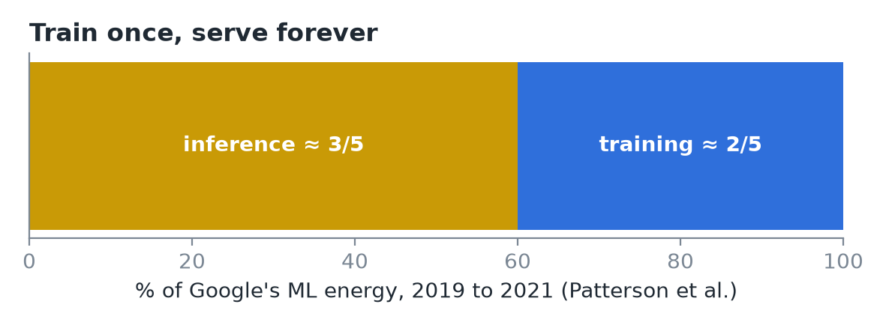
*Google ML energy use, 2019 to 2021 (Patterson et al.).*

## 3. One request: prefill and decode

Running example: a chat app serving **Llama 3 8B on one H100**. The prompt is ~500 tokens and the answer is ~250 tokens.

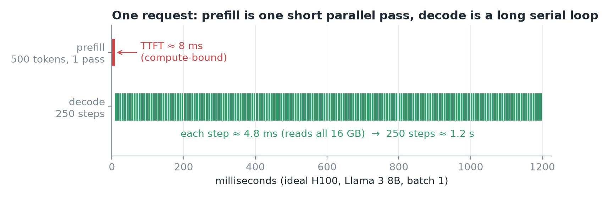
*Ideal timings: prefill handles all 500 prompt tokens in one pass (the red sliver is time to first token), then decode runs 250 serial steps of about 4.8 ms each.*

- **Prefill:** all 500 prompt tokens go through the model in **one parallel pass**. This causes the pause before the first word, called **TTFT (time to first token)**.
- **Decode:** generate one token, append, run again. **250 sequential steps.**
- **The surprise:** every decode step reads **all 16 GB of weights** from GPU memory (HBM) to produce **one token**.

### The bandwidth ceiling (memorize this calculation)

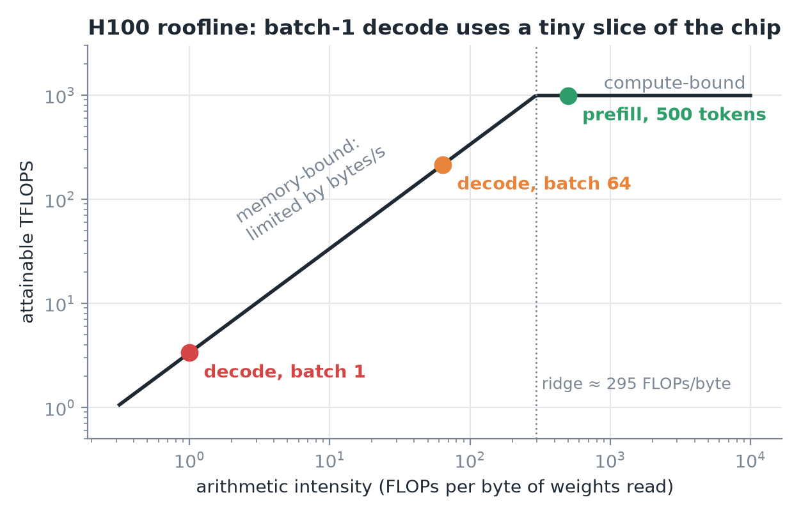
*Batch-1 decode does about 1 FLOP per byte of weights read, far left of the ridge, so memory bandwidth sets its speed. Prefill sits past the ridge and is compute-bound.*

```
H100 HBM bandwidth   ≈ 3.35 TB/s
Weights per step     = 16 GB
Time per step        = 16 / 3350 s ≈ 4.8 ms
Max tokens/s (1 user) ≈ 1 / 4.8 ms ≈ 200 tok/s
```

This is a hard ceiling, even with perfect code.

- The chip could do far more math. The limit is **how fast bytes arrive**. Decode at batch 1 is **memory-bandwidth-bound**.

## 4. The three numbers (and one constraint)

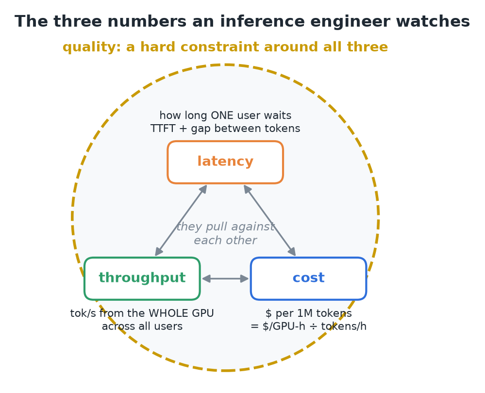
*Quality isn't traded: a faster but worse answer is not a win.*

- The gap between tokens is called **ITL** (inter-token latency) or **TPOT** (time per output token).

### The first trade-off: batching

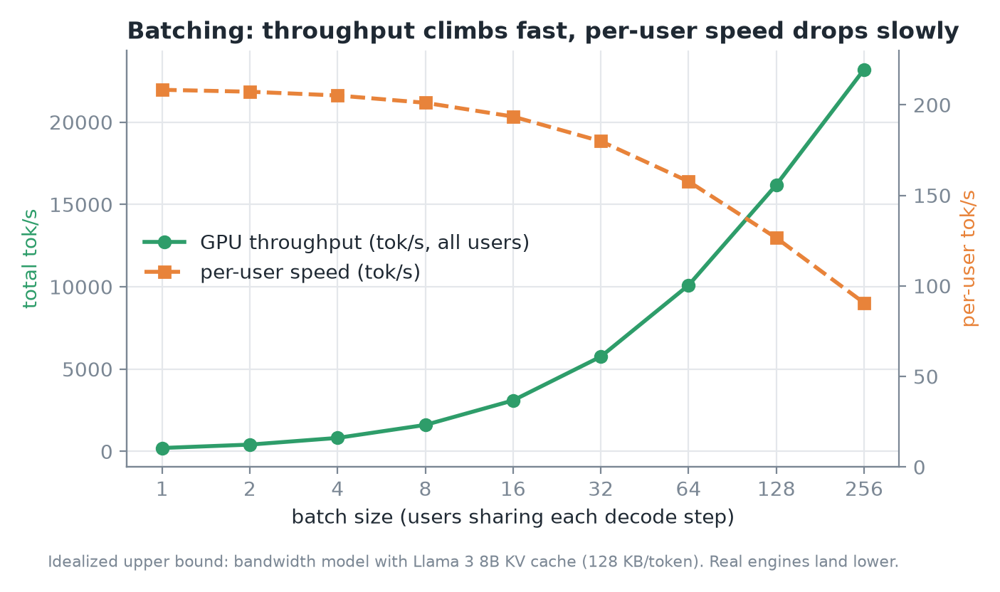
*One read of the weights serves every user in the batch, so total throughput climbs steeply while each user's speed falls only gradually.*

- **Batch 1:** read 16 GB and get 1 token.
- **Batch 64:** read the same 16 GB and get **64 tokens**, one per user. The weight read is **amortized**.
- Throughput jumps. Each step does more work, so **per-user latency goes up a bit**.
- **"The whole game is a better deal on this trade."** Much of the course is about getting more throughput for less added latency.

## 5. Putting money on it

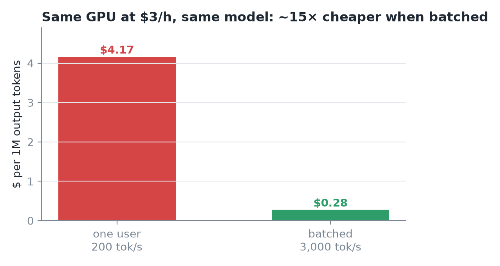
*Illustrative prices, real arithmetic. Cost per 1M tokens = $3 ÷ (tok/s × 3,600) × 10⁶.*

Real-world evidence:
- **vLLM (2023):** up to **24×** the throughput of plain Hugging Face Transformers, with the same GPUs and the same weights.

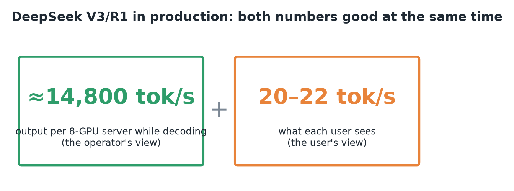

## 6. What an inference engineer does all day

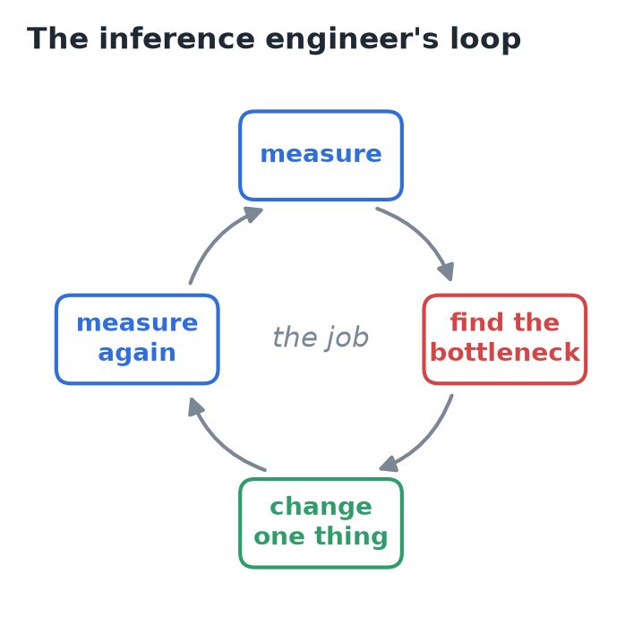

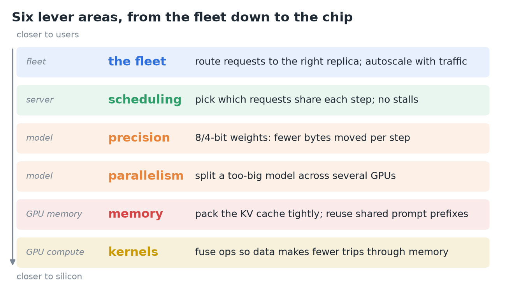
*Each lever area gets its own module later in the course.*

## 7. Three myths

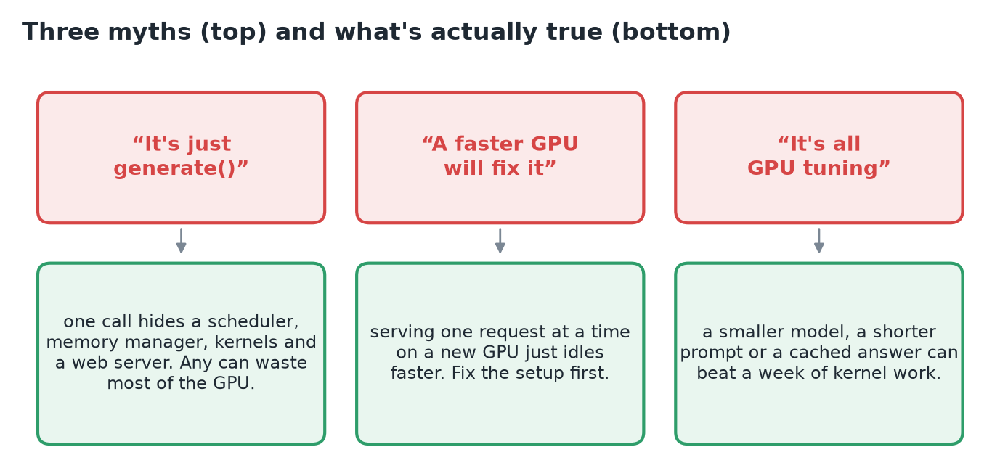

## 8. Recap

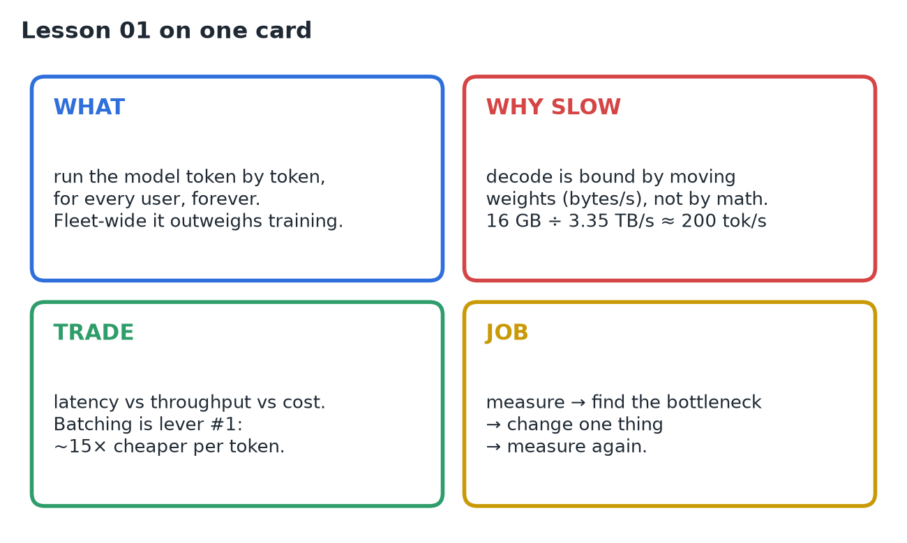

## Interview cheat sheet

*Revise from this page alone. ★ = from the lesson; ◆ = my addition beyond the video.*

### Say it in 30 seconds

> Inference is running a trained model to generate tokens, one at a time, for every request. Because it happens on every use, fleet-wide it costs more than training. Decode is limited by memory bandwidth, since every step streams all the weights to make one token per sequence. So the core trade is latency vs throughput vs cost, and batching is the first lever. The job is a loop: measure, find the bottleneck, change one thing, measure again.

### Numbers to memorize

| | Number | Why it matters |
|---|---|---|
| ★ | H100 HBM bandwidth **3.35 TB/s** | Sets decode speed |
| ◆ | H100 BF16 dense **~989 TFLOPS** | Sets prefill speed |
| ◆ | H100 ridge point **~300 FLOPs/byte** | Below it you're memory-bound |
| ★ | Llama 3 8B in BF16 = **16 GB** | Read in full on every decode step |
| ◆ | Llama 3 8B KV cache **~128 KB/token** | Caps how many users fit in a batch |
| ★ | Batch-1 decode ceiling **~4.8 ms/step, ~200 tok/s** | Best case for one user on one H100 |
| ★ | **$4.17 vs $0.28** per 1M tokens | Batching gives ~15× cheaper tokens |
| ★ | vLLM vs HF Transformers: up to **24×** throughput | Serving software matters as much as hardware |
| ★ | DeepSeek: **~14.8k tok/s** per 8-GPU node, **20–22 tok/s** per user | High throughput and good latency together |
| ★ | Google ML energy: **~3/5 inference** | "Train once, serve forever" |

### Formulas

| | Quantity | Formula | Example (Llama 3 8B, H100) |
|---|---|---|---|
| ★ | Weight bytes | params × bytes/param | 8B × 2 = 16 GB (INT8: 8, INT4: ~4) |
| ★ | Decode step time (batch 1) | weight bytes ÷ bandwidth | 16 GB ÷ 3.35 TB/s ≈ 4.8 ms |
| ★ | Cost per 1M tokens | $/GPU-h ÷ (tok/s × 3600) × 10⁶ | $3 ÷ (200 × 3600) × 10⁶ ≈ $4.17 |
| ◆ | FLOPs per token | ≈ 2 × params | ≈ 16 GFLOPs |
| ◆ | Arithmetic intensity (decode) | ≈ batch size FLOPs/byte (ignoring KV) | batch 1 ≈ 1, far below ~300 |
| ◆ | Prefill time (ideal) | prompt × 2 × params ÷ peak FLOPS | 500 × 16 GF ÷ 989 TF ≈ 8 ms |
| ◆ | KV bytes per token | 2 × layers × kv_heads × head_dim × bytes | 2 × 32 × 8 × 128 × 2 = 128 KB |

### Prefill vs decode

| | Prefill | Decode |
|---|---|---|
| Work | Whole prompt in one parallel pass | One token per sequence per step, serial |
| Bottleneck | Compute (FLOPs) | Memory bandwidth (bytes) |
| User sees it as | TTFT | Gap between tokens (ITL / TPOT) |
| Grows with | Prompt length | Output length, and batch × context (KV reads) |

### Symptom → lever (for "how would you fix it?" questions)

| Symptom | Likely cause | First levers |
|---|---|---|
| High $/token, GPU underused | Batch too small | ★ Scheduling / continuous batching |
| Batch capped by out-of-memory | KV cache fills memory | ★ Memory: pack KV tightly, reuse shared prefixes |
| Slow per-token speed at low load | Too many weight bytes per step | ★ Precision: 8/4-bit weights |
| High TTFT | Long prompts or queueing | ★ Shorter prompts, prefix reuse, ★ more replicas (fleet) |
| Model doesn't fit one GPU | Size | ★ Parallelism across GPUs, ★ precision |
| Kernel time dominated by memory traffic | Unfused ops | ★ Kernels: fuse operations |
| Any of the above | | ★ Off-GPU wins: smaller model, cached answers |

### Rapid-fire Q&A

| Question | Crisp answer |
|---|---|
| Why is decode memory-bound? | Each step streams all the weights to make one token per sequence: ~1 FLOP/byte vs a ~300 ridge. |
| Why does batching help? | One weight read serves every sequence in the batch, raising FLOPs per byte. |
| What does batching cost? | Per-user latency rises (bigger steps, more KV reads) and KV memory grows. |
| ◆ Max tok/s for 70B BF16 on 8×H100 (tensor parallel)? | 140 GB ÷ 26.8 TB/s ≈ 5.2 ms/step, so ≤ ~190 tok/s. Real is lower (communication, KV). |
| Cost too high: where do you start? | Measure utilization, batch size, TTFT/ITL percentiles, then fix the biggest bottleneck first. |
| Will a faster GPU fix a slow service? | Not if the setup is bad: one request at a time just idles faster. |

### Traps to avoid

- Saying inference is "just `generate()`": it hides a scheduler, memory manager, kernels and server.
- Treating quality as tradeable: a faster but worse answer is not a win.
- Forgetting batching's cost: KV memory and per-user latency.
- Jumping to kernel tuning before checking model size, prompt length and caching.
