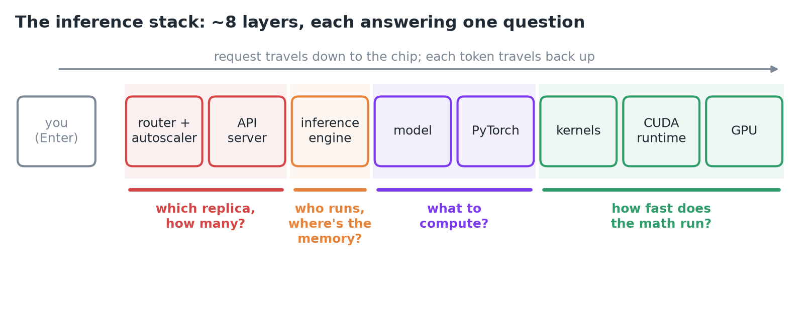
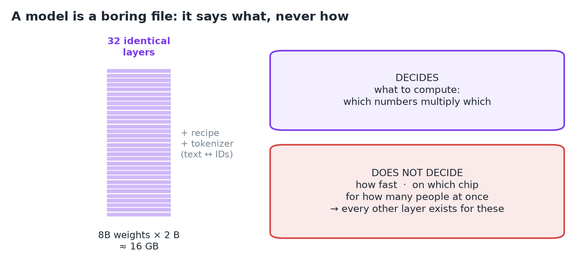
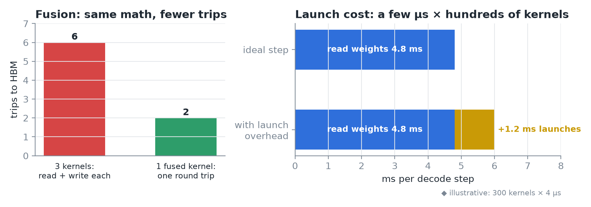
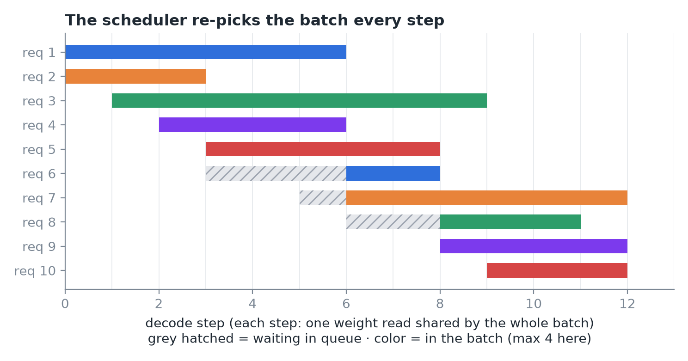
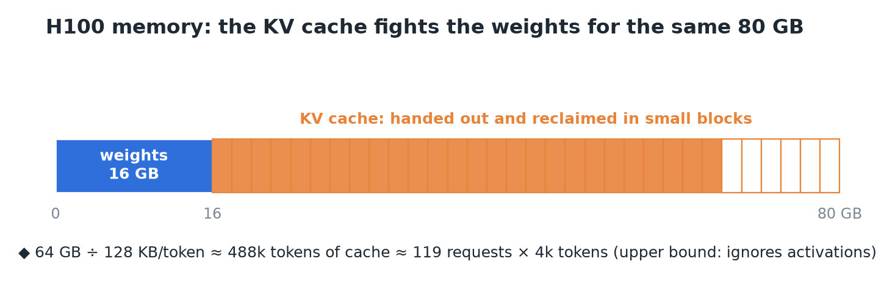
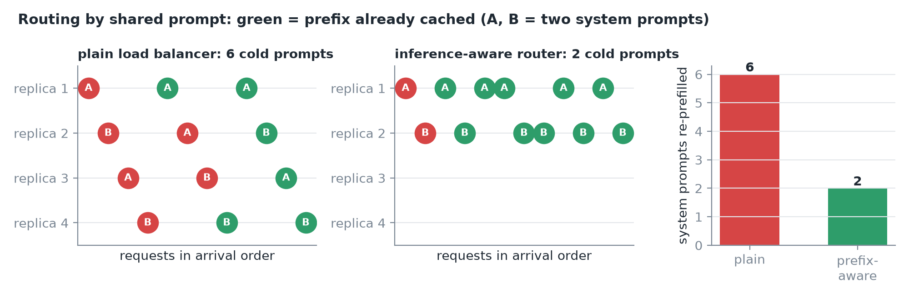
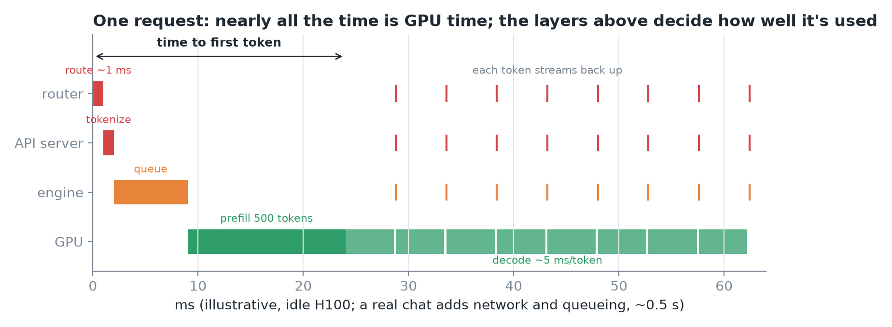
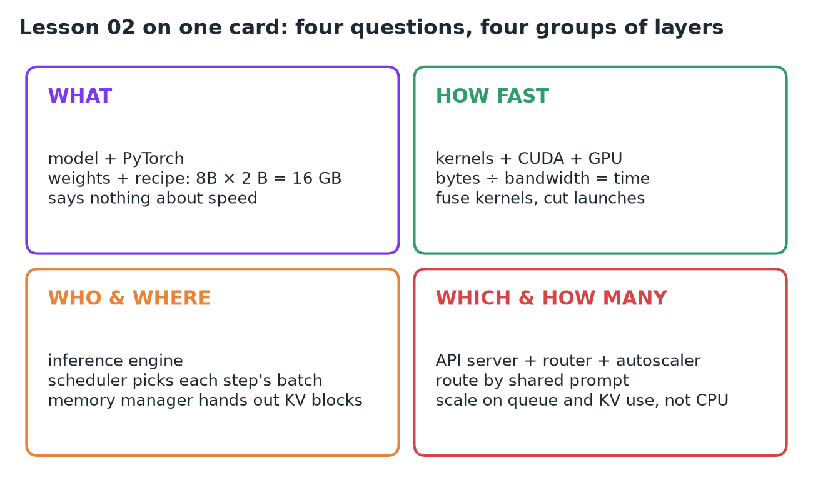

# 02 · The Inference Stack: Model to GPU to Production

**Source:** [fanout.sh / inference-eng / in-03](https://fanout.sh/inference-eng/curriculum/in-03) · ~9 min · Next: *Math for memory, throughput and speedups*

> [!NOTE]
> Between pressing Enter and seeing the first word (~0.5 s), a request crosses about **8 layers** of software and hardware. Each layer exists to answer one question the others can't. The model says **what** to compute; kernels and the GPU decide **how fast**; the engine decides **who runs each step and where their memory goes**; the server and fleet decide **which replica, and how many**. The rest of the course climbs this map.

*The stack from user to silicon, grouped by the question each group of layers answers.*

## 1. The model: a file that says what, never how

*Llama 3.1 8B: 8B weights in 32 identical layers, plus a recipe and a tokenizer.*

- On disk a model is **weights** (a file of numbers) plus a short **recipe** for combining them.
- Llama 3.1 8B: **~8B weights**, **32 identical layers**, 2 bytes each in 16-bit, so **~16 GB**.
- A **tokenizer** sits beside it and converts text to integer IDs and back.

> [!IMPORTANT]
> The model says nothing about how fast, on which chip, or for how many users at once. Every other layer exists to answer those questions.

## 2. The GPU: arithmetic waits on memory

- An H100 has two parts that matter: **132 streaming multiprocessors** (thousands of arithmetic units) and **80 GB of HBM** right next to the chip.
- The 16 GB of weights must live in HBM, and **every new token reads every weight once**:

$$t_{\mathrm{step}} = \frac{16\ \mathrm{GB}}{3.35\ \mathrm{TB/s}} \approx 4.8\ \mathrm{ms} \quad\Rightarrow\quad \leq 200\ \mathrm{tok/s\ per\ stream}$$

> [!IMPORTANT]
> This one division, **bytes ÷ bandwidth = time**, is the most useful number in inference. No software above the chip can beat it for a single stream; the arithmetic units mostly wait on memory.

## 3. Framework, kernels, CUDA: translating math for the chip

| Layer | Role | Examples |
|---|---|---|
| Framework | Expresses the model as tensor ops (matmul, norm, attention) | PyTorch |
| Kernels | Small GPU programs, each launched across thousands of threads | cuBLAS (matmul), FlashAttention |
| CUDA runtime + driver | Hands kernels to the hardware | CUDA |

The same math can run at very different speeds depending on the kernel:

*Left: fusing three kernels cuts the trips to memory. Right: per-kernel launch costs add up across hundreds of kernels per token.*

- **Fusion:** three separate kernels each read from and write back to memory; one fused kernel makes a single round trip.
- **Launch overhead:** each launch costs a few **µs of CPU time**, repeated across **hundreds of kernels per token**.
- This layer answers: **how fast does this exact math run on this exact chip?**

## 4. The inference engine: who runs, and where their memory goes

Engines like **vLLM, SGLang and TensorRT-LLM** turn a model into a service. They're built around one trick: if 64 users each need a token, **read the weights once and serve all 64 in the same step**. The step gets only a little slower, but it does 64× the work.

*Requests wait in a queue and join the batch at step boundaries; the scheduler re-decides the batch on every step.*

- **Job 1, the scheduler:** decides, every single step, which requests join the batch.
- **Job 2, the memory manager:** each request carries a **KV cache** (keys and values of every token it has seen), about **128 KB per token** for Llama 8B. A few thousand tokens × dozens of requests and the cache competes with the weights for HBM, so the engine hands out and reclaims cache in **small blocks**.

*After 16 GB of weights, the remaining 64 GB of HBM is the KV cache's budget.*

## 5. Server and fleet: which replica, and how many

- **Replica** = one engine on one GPU, fronted by an **API server** that speaks the OpenAI HTTP format, runs the tokenizer and streams tokens back.
- **Router:** a plain load balancer spreads requests evenly. An **inference-aware router** sends a request that shares a long system prompt to the replica that already has it cached, turning hundreds of ms of repeated prefill into almost nothing.

*Same 12 requests, two shared system prompts: routing by prefix avoids re-prefilling prompts that are already cached.*

- **Autoscaler:** adds or removes replicas. It watches **queue length and KV cache use, not CPU load**, because the CPU is mostly idle. Scaling up is slow: **16 GB of weights must load** before a new replica serves anyone.
- **Metrics and tracing** on every layer tell you which one is hurting.
- The engine optimizes **one replica**; the fleet layer is **everything across replicas**.

## 6. One request, down and back

*Route (~1 ms), tokenize, queue, prefill, then decode at ~5 ms per token, each token streaming back up the stack.*

1. The **router** picks a replica in about **1 ms**.
2. The **API server** turns the text into ~**500 token IDs**.
3. The **scheduler** queues the request; at the next step it joins the batch.
4. **Prefill:** all 500 prompt tokens go through the model at once, filling the KV cache; the first token appears (**time to first token**).
5. **Decode:** one token per step, **~5 ms each**, each token climbing back through engine, server and router to the screen.

> [!IMPORTANT]
> Almost all the time is spent on the GPU, but the layers above decide how well that GPU time is used.

## 7. Recap

## Interview cheat sheet

*Revise from these pages alone. ◆ = my addition beyond the video; everything else is from the lesson. Builds on 01's derivations.*

### Say it in 30 seconds

> A request crosses about eight layers. The model defines the math; kernels, CUDA and the GPU set how fast it runs, bounded by bytes ÷ bandwidth. The inference engine batches requests every step and manages KV cache memory. The API server, router and autoscaler pick the replica and the replica count. Nearly all time is GPU time; the upper layers decide how well it's used.

### Only numbers worth memorizing

- **H100:** 80 GB HBM, 132 SMs. **Llama 3.1 8B:** 32 layers. Routing ~1 ms; decode ~5 ms/token.

### Derive, don't memorize

Every derivation here is the same idea: **time = bytes ÷ bandwidth**, or **capacity = bytes ÷ bytes-per-item**. Per-step time: see 01, derivation 1. KV per token: see 05, derivation 2.

#### 1. KV capacity = memory left after the weights ÷ cache per token ◆

$$N_{\mathrm{tokens}} \approx \frac{\mathrm{HBM} - \mathrm{weights}}{\mathrm{KV/token}} = \frac{80 - 16\ \mathrm{GB}}{128\ \mathrm{KB}} \approx 488\mathrm{k} \approx 119\ \mathrm{requests} \times 4\mathrm{k}$$

> [!TIP]
> That token budget, not compute, caps the batch. It's why engines manage KV in blocks and why quantizing weights or KV frees room for more users.

#### 2. Launch overhead = kernels × launch cost, against the step time ◆

$$\frac{N_{\mathrm{kernels}} \times t_{\mathrm{launch}}}{t_{\mathrm{step}}} = \frac{300 \times 4\ \mu\mathrm{s}}{4.8\ \mathrm{ms}} \approx 25\%$$

> [!TIP]
> Illustrative numbers, but the shape is real: at small batch, CPU launch time is a big slice of each step. Fusion (and ◆ CUDA graphs) cut it.

#### 3. Cold start = weight bytes ÷ load bandwidth ◆

$$t_{\mathrm{cold}} \approx \frac{16\ \mathrm{GB}}{2\ \mathrm{GB/s}} = 8\ \mathrm{s}$$

> [!TIP]
> Assumes ~2 GB/s from local disk; from network storage it's often slower. Scaling reacts late, so autoscalers must scale before the queue explodes.

### Layer → question → what to watch

| Layer | Answers | Tools | Watch / lever |
|---|---|---|---|
| Model + framework | What to compute | Weights, recipe, tokenizer, PyTorch | Model size, precision |
| Kernels + CUDA + GPU | How fast the math runs | cuBLAS, FlashAttention, CUDA | Bytes moved, fusion, launches |
| Inference engine | Who runs each step; where memory goes | vLLM, SGLang, TensorRT-LLM | Batch size, KV usage |
| API server | Speaks HTTP, tokenizes, streams | OpenAI-compatible server | Streaming latency |
| Router + autoscaler | Which replica; how many | Prefix-aware router | Queue length, cache hits |

### Symptom → layer to investigate

| Symptom | Layer | First fix |
|---|---|---|
| GPU idle between kernels, CPU busy | Kernels | Fuse kernels; cut launches |
| Same math slower than expected | Kernels | Better kernels (cuBLAS, FlashAttention) |
| Repeated system prompts inflate TTFT | Router | Prefix-aware routing |
| Queue grows while CPU looks idle | Autoscaler | Scale on queue length and KV use |
| New replicas arrive too late | Fleet | Derivation 3: scale earlier, load faster |

### Rapid-fire Q&A

| Question | Crisp answer |
|---|---|
| What does an inference engine add over PyTorch? | A per-step scheduler (batching) and a KV cache memory manager. |
| Why not autoscale on CPU? | The work is on the GPU; the CPU idles. Watch queue length and KV use. |
| Why is a round-robin load balancer wasteful? | It scatters shared prompts, so each replica re-prefills them. |
| What's a replica? | One engine on its GPU(s), behind an API server. |
| Where does a request's time go? | Mostly GPU (prefill, then ~5 ms per decode step); upper layers decide utilization. |

> [!WARNING]
>
> - Treating LLM serving like a stateless web app: round-robin routing and CPU-based autoscaling.
> - Assuming the model file determines speed: it only defines the math.
