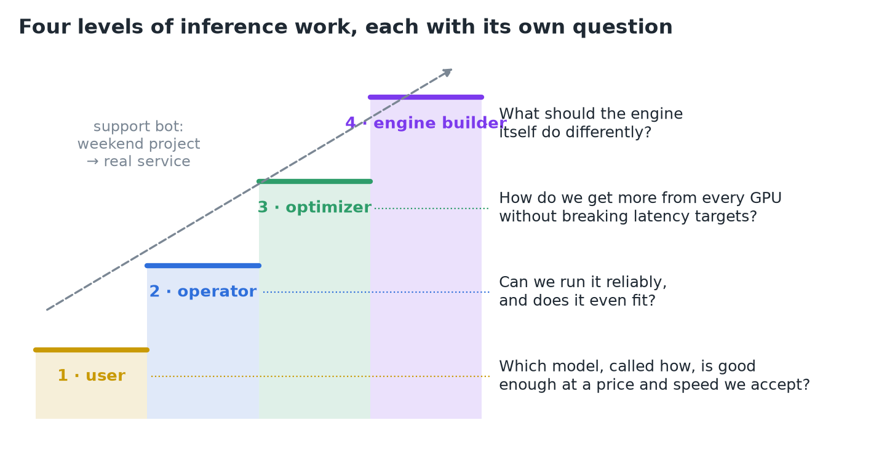
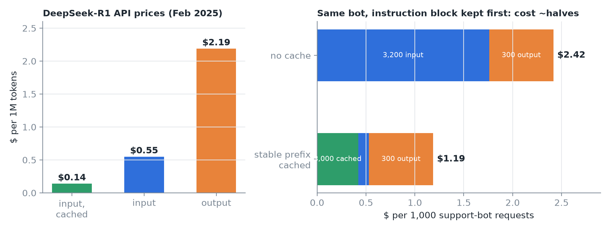
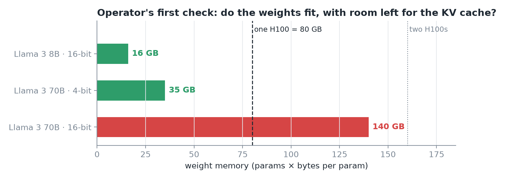
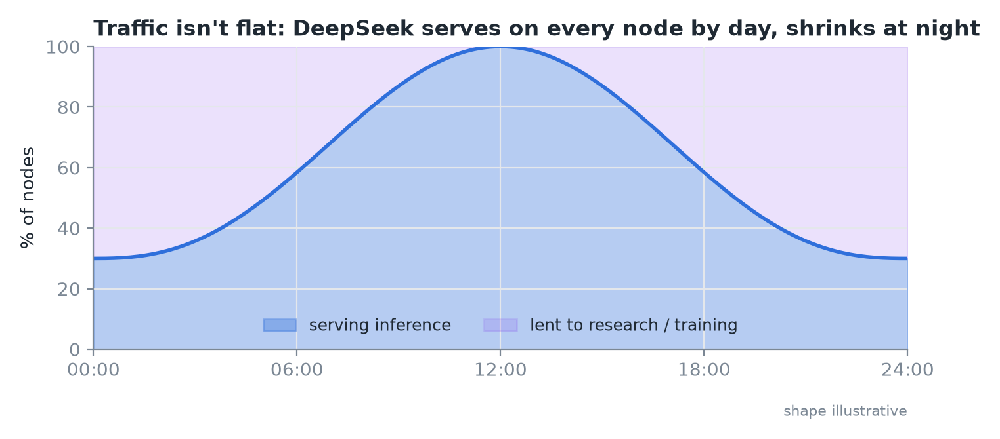
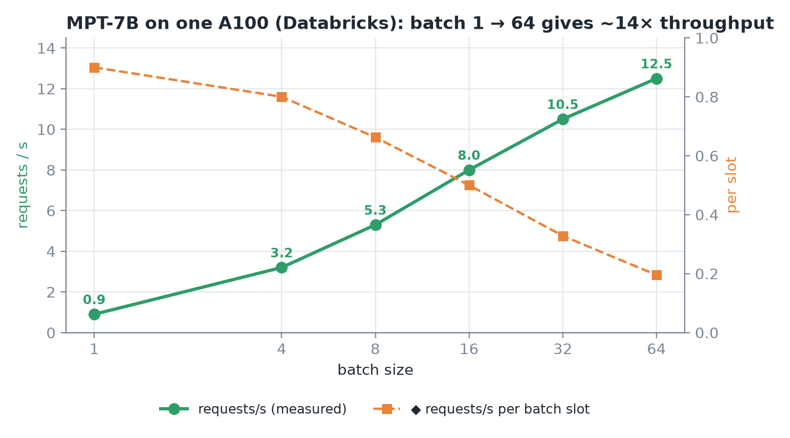
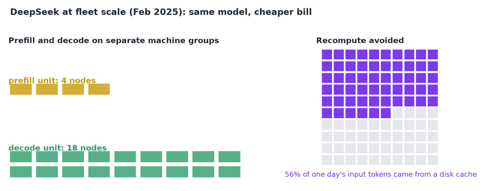
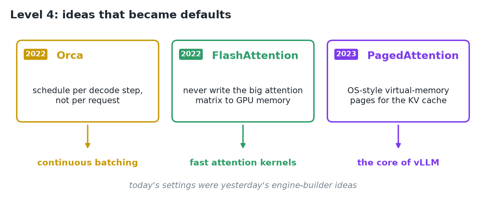
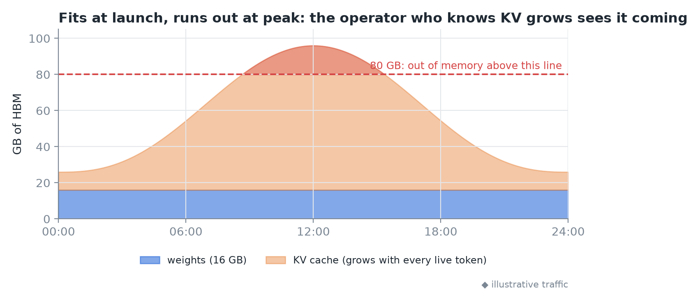
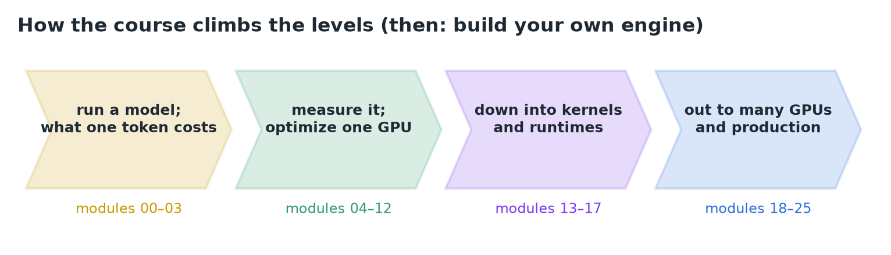
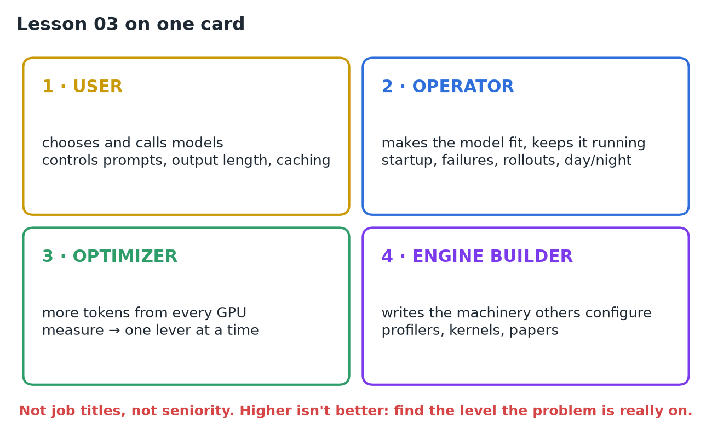

# 03 · Levels of Inference Engineering

**Source:** [fanout.sh / inference-eng / in-04](https://fanout.sh/inference-eng/curriculum/in-04) · ~9 min

> [!NOTE]
> "Inference engineering" covers four very different jobs, best seen as a ladder: **user**, **operator**, **optimizer**, **engine builder**. Each level asks its own question, and each is easier once you understand the level below. The levels aren't job titles or seniority, and higher isn't better: most money is saved on the first three. The key skill is spotting which level a problem is really on.

Two engineers who both "work on inference": one **halved the model bill** by moving a block of text to the front of a prompt; the other rewrote an attention kernel for **+11% tokens/s** on the same GPUs. Same word, different jobs.

*The running example, a customer-support bot, climbs from weekend project to real service.*

## 1. Level 1, the user: someone else runs the GPUs

You call a hosted model through an API. You don't control hardware, but you do control **which model**, **prompt length**, **how many output tokens**, and **whether you stream**.

*Left: output costs ~4× input; cached input is ~4× cheaper than uncached. Right: the bot's cost per 1,000 requests with and without a cached instruction block.*

- DeepSeek-R1 prices (Feb 2025): **$0.55/M input**, **$2.19/M output** (~4×, because generating is the slow part), **$0.14/M cached input**.
- The bot sends a **3,000-token instruction block** + ~200-token question, gets ~300 tokens back. Keep the block **identical and at the very front** so it hits the provider's cache:

$$\frac{3000 \times 0.14 + 200 \times 0.55 + 300 \times 2.19}{1000} = \$1.19 \quad\mathrm{vs}\quad \frac{3200 \times 0.55 + 300 \times 2.19}{1000} = \$2.42$$

> [!IMPORTANT]
> Per 1,000 requests the bill roughly halves, with no GPU involved: just knowing how the provider's engine works underneath.

## 2. Level 2, the operator: does it fit, and does it stay up?

The company wants its own model on its own GPUs (cost, privacy, control).

*Weights vs one H100's 80 GB: 8B fits with room for cache; 70B at 16-bit needs two GPUs or 4-bit.*

- **Fit check is arithmetic:** Llama 3 8B at 16-bit ≈ **16 GB** of 80, plenty left for the KV cache. Llama 3 70B ≈ **140 GB**: split across GPUs, or quantize to 4-bit ≈ **35 GB**.
- Starting an engine is one command (`vllm serve ...`) and gives an OpenAI-compatible API your code already speaks.
- But now you own what the API hid: **loading 16 GB at startup**, **surviving GPU failures**, **rolling out new model versions** without dropping requests.

*DeepSeek runs inference on every node in busy hours and lends GPUs to research and training at night.*

## 3. Level 3, the optimizer: more from every GPU, within latency targets

**Measure first:** time to first token, time per output token, total throughput, cost per million tokens. Then pull **one lever at a time**.

*Databricks: MPT-7B on one A100, batch 1 → 64 takes throughput from 0.9 to 12.5 requests/s.*

| Lever | What it buys |
|---|---|
| **Batching** | Many users share each step (~**14×** in the measurement above) |
| **Quantization** | Fewer bytes to move per step |
| **Prefix caching** | Repeated prompts skip work |
| **Speculative decoding** | One step can produce several tokens |

At fleet scale the levers get bigger:

*Prefill and decode run on separately tuned groups (4-node vs 18-node units); 56% of a day's input tokens came from a disk cache.*

> [!IMPORTANT]
> None of this changes the model. All of it changes the bill.

## 4. Level 4, the engine builder: writes the tools the others configure

The question: **what should the engine itself do differently?** Much of what lower levels treat as settings started as one of these ideas.

*Orca (OSDI 2022), FlashAttention (2022) and PagedAttention (SOSP 2023), and what each became.*

The work: reading **profiler traces**, writing **kernels**, reading **papers**. The +11% attention-kernel engineer lives here.

## 5. Why each level needs the one below

- A **user** who knows prefill processes the whole prompt understands why a long prompt raises **both the wait and the bill**.
- An **operator** who knows the KV cache grows with every token understands why a server that **fits at launch can run out of memory at peak**.

*Weights are fixed; the KV cache rises with traffic until it crosses the 80 GB line.*

*The course climbs the levels in this order, and near the end you build an engine of your own.*

> [!WARNING]
>
> - The levels are **not job titles or seniority**: one person can go from a bill to a kernel in a single week.
> - **Higher isn't better:** a smaller model, a fixed prompt or a turned-on cache often beats a month of kernel work.

## 6. Recap

Underneath all four levels is the same arithmetic: **how many bytes, how many operations, and how fast the hardware moves them**.

## Interview cheat sheet

*Revise from these pages alone. ◆ = my addition beyond the video; everything else is from the lesson. Builds on 01 and 02.*

### Say it in 30 seconds

> Inference work sits on four levels: the user picks and calls models, the operator makes a model fit and stay up, the optimizer gets more tokens per GPU within latency targets, and the engine builder changes the engine itself. Each level is easier if you understand the one below. The key skill is finding which level a problem lives on; cheap fixes on lower levels often beat kernel work.

### Only numbers worth memorizing

- **DeepSeek-R1 (Feb 2025):** $0.55/M input, $2.19/M output (~4×), $0.14/M cached input.
- **Batching measured:** MPT-7B/A100 0.9 → 12.5 req/s (~14×).

### Derive, don't memorize

#### 1. API bill = tokens × price, per token type

Each token type has its own price, and a cached prefix bills at the cached rate:

$$\mathrm{cost} = N_{\mathrm{cached}} \cdot p_{\mathrm{cached}} + N_{\mathrm{in}} \cdot p_{\mathrm{in}} + N_{\mathrm{out}} \cdot p_{\mathrm{out}} \quad\Rightarrow\quad \$2.42 \rightarrow \$1.19\ \mathrm{per\ 1k\ requests}$$

> [!TIP]
> Put stable text first (caches match prefixes ◆, so any change early in the prompt invalidates everything after it), and cap output length: output tokens cost ~4×.

The operator's fit check (params × bytes per param vs GPU memory): see 04, derivation 1.

### The four levels

| Level | Question | Controls | Example win |
|---|---|---|---|
| 1 · User | Which model, called how? | Model, prompt, output length, streaming, caching | Stable prefix first: bill ÷ 2 |
| 2 · Operator | Does it fit and stay up? | GPUs, precision, startup, failover, rollouts | Day/night fleet sizing |
| 3 · Optimizer | More per GPU within latency? | Batching, quantization, prefix caching, speculative decoding, PD split | ~14× from batching |
| 4 · Engine builder | What should the engine do differently? | Schedulers, kernels, memory layout | Orca, FlashAttention, PagedAttention |

### Symptom → which level

| Symptom | Level | First fix |
|---|---|---|
| API bill high, same instructions every request | 1 | Identical block at the front for cache hits |
| Model won't load on one GPU | 2 | Split across GPUs or quantize |
| Fits at launch, out of memory at peak | 2 | Budget KV for peak concurrency |
| Attention kernel dominates the profile | 4 | Kernel work (after levels 1–3 are exhausted) |

### Rapid-fire Q&A

| Question | Crisp answer |
|---|---|
| Why do output tokens cost ~4× input? | Decode is serial and memory-bound; prefill is parallel (see 01, derivation 2). |
| Why split prefill and decode onto separate machines? | ◆ Prefill is compute-bound, decode memory-bound; each group is tuned for its own job. |
| What did Orca, FlashAttention, PagedAttention contribute? | Per-step scheduling (continuous batching); no big attention matrix in HBM; paged KV cache (vLLM). |
| Is the engine builder the "senior" level? | No: levels aren't seniority, and most savings come from levels 1–3. |

> [!WARNING]
>
> - Jumping to level 4 (kernels) before checking model choice, prompts and caching.
> - Sizing memory for launch traffic instead of peak.
