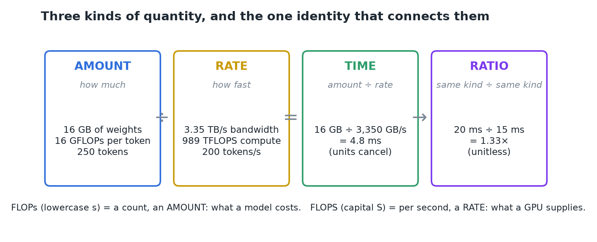
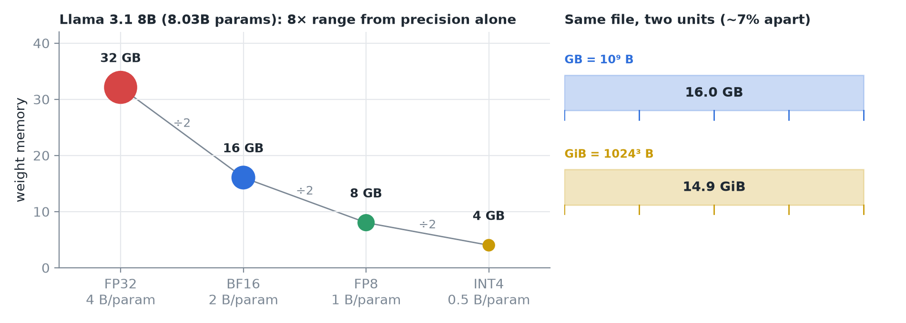
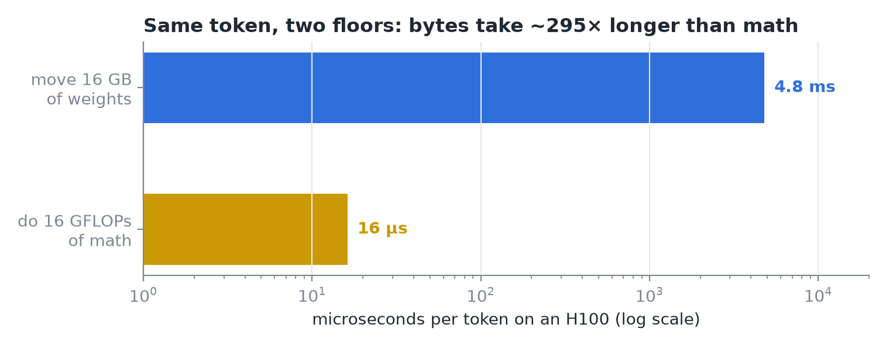
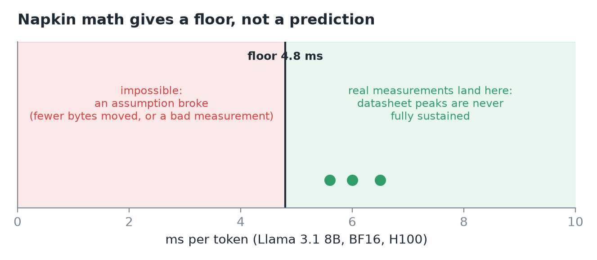
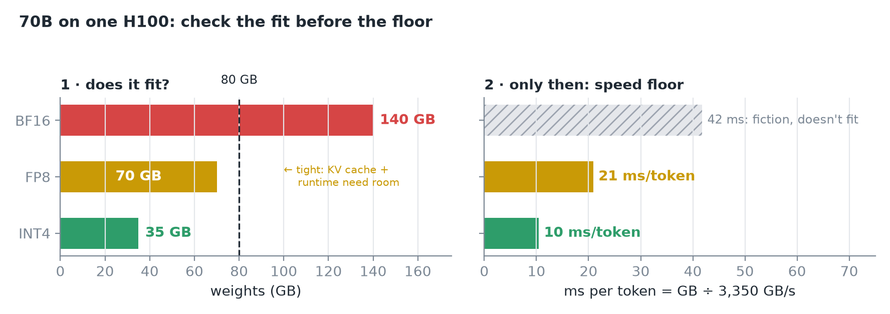
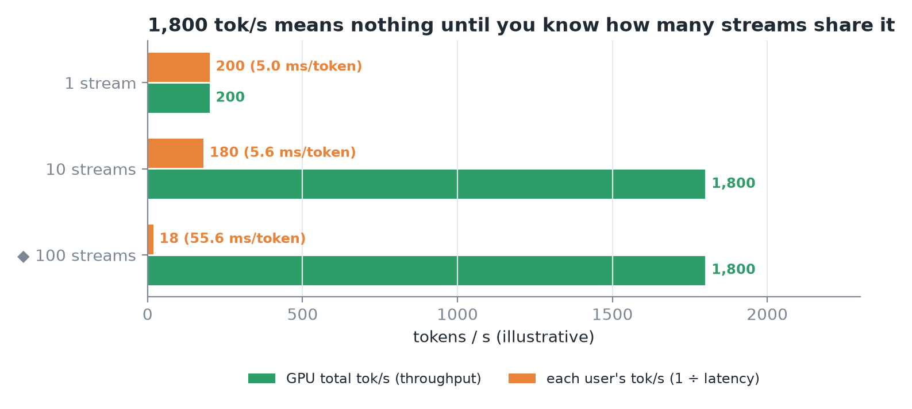
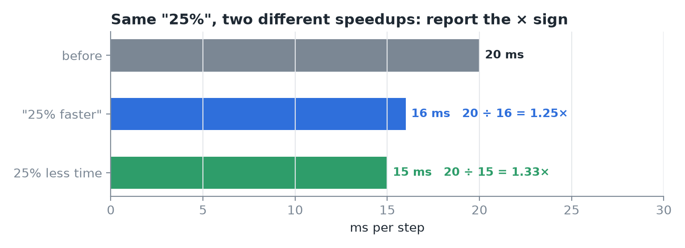
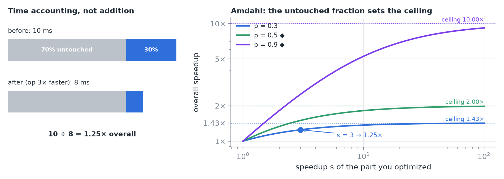
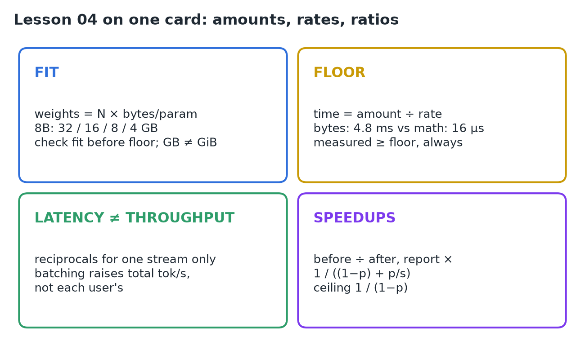

# 04 · Math for Memory, Throughput & Speedups

**Source:** [fanout.sh / inference-eng / 00-01](https://fanout.sh/inference-eng/curriculum/00-01) · ~8 min

> [!NOTE]
> Almost every number in inference is an **amount** (16 GB), a **rate** (3.35 TB/s) or a **ratio** (1.25×). With careful units and one identity, **time = amount ÷ rate**, you can answer three questions before touching hardware: does the model fit, how fast can it possibly run, and what is a claimed speedup really worth.

*Amounts divided by rates give times; times divided by times give unitless ratios.*

## 1. Amounts: does it fit?

- Each parameter is stored at some **precision**: FP32 = **4 bytes**, BF16 = **2**, FP8 = **1**, INT4 = **0.5**.
- **Weight memory = parameters × bytes per parameter.** Llama 3.1 8B has **8.03B** parameters:

*Left: each halving of precision halves memory, an 8× range overall. Right: one 16 GB file reads as 14.9 GiB.*

> [!WARNING]
> **GB vs GiB:** a GB is 10⁹ bytes; a GiB is 1024³, about 7% bigger. A 16 GB file shows as **14.9 GiB**. Check the unit before doubting the math.

## 2. Rates: how fast can it possibly run?

Three rates do most of the work: **memory bandwidth** (bytes/s), **compute** (FLOPS) and **generation speed** (tokens/s).

- **FLOPs** (lowercase s) is a count: an amount a model *costs*. **FLOPS** (capital S) is per second: a rate a GPU *supplies*.
- Generating one token reads all 16 GB of weights; an H100 moves 3,350 GB/s. Put both in GB and the GB cancel:

$$t_{\mathrm{bytes}} = \frac{16\ \mathrm{GB}}{3350\ \mathrm{GB/s}} \approx 4.8\ \mathrm{ms} \qquad t_{\mathrm{math}} = \frac{2 \times 8 \times 10^{9}\ \mathrm{FLOP}}{989 \times 10^{12}\ \mathrm{FLOP/s}} \approx 16\ \mu\mathrm{s}$$

*Moving the bytes takes ~300× longer than doing the math. That imbalance is what the field organizes around.*

### Floors, not predictions

Datasheet numbers are **peaks** that real systems never sustain, so these times are **floors**.

*Real measurements land above the floor. Below it means an assumption broke.*

### Scaling up: 70B on one 80 GB H100

*BF16 doesn't fit, so its floor is meaningless. FP8 fits tightly at ~21 ms/token; INT4 fits at ~10 ms/token.*

> [!IMPORTANT]
> "Fits" means the **weights** fit; a running model also needs growing per-request state (KV cache) and runtime overhead, so FP8 is tight, not comfortable. And **check the fit before the floor**: a speed floor for a model that doesn't fit is fiction.

## 3. Latency vs throughput

| | Latency | Throughput |
|---|---|---|
| Unit | Time per event (ms/token) | Events per second (tokens/s) |
| Better | Smaller | Bigger |
| One stream | 5 ms/token | = 200 tokens/s (reciprocals) |

Once requests share the hardware, the two **decouple**: batching can raise total tokens/s by an order of magnitude while each stream gets no faster, and a little slower under load.

*The same 1,800 tok/s can mean 180 tok/s per user or 18; the total says nothing without the stream count.*

## 4. Speedups

A speedup is a **ratio of times: before ÷ after**. 20 ms → 15 ms is **1.33×**.

*"25% faster" usually means 1.25×, but "25% less time" is 1.33×. Report the × sign; ask which flavor a percent is.*

Speedups compose by **time accounting, not addition**. If one op is 30% of a step and gets 3× faster, the 30 becomes 10 and the step drops to 80% of its old time: only **1.25×** overall. In general (**Amdahl's law**), if a fraction *p* of the time gets *s* times faster:

$$S = \frac{1}{(1 - p) + p/s} \qquad \lim_{s \rightarrow \infty} S = \frac{1}{1 - p} = \frac{1}{0.7} \approx 1.43$$

*Left: the 30%/70% example. Right: no matter how fast the optimized part gets, the untouched fraction caps the overall gain.*

> [!IMPORTANT]
> Before valuing any optimization, ask **what fraction of the time it touches**.

## 5. Recap

## Interview cheat sheet

*Revise from these pages alone. ◆ = my addition beyond the video; everything else is from the lesson. Builds on 01–03.*

### Say it in 30 seconds

> Every number is an amount, a rate or a ratio, and time = amount ÷ rate. Weight memory is params × bytes per param, so precision is the first lever for fit. Divide bytes by bandwidth and FLOPs by FLOPS to get floors; real runs land above them. Latency and throughput are reciprocals only for one stream. Speedups are before ÷ after, and Amdahl's law caps them by the fraction of time touched.

### Only numbers worth memorizing

- **Bytes per param:** FP32 4, BF16 2, FP8 1, INT4 0.5.

### Byte units: decimal vs binary

| Decimal (SI) | Bytes | Binary (IEC) | Bytes | Binary ÷ decimal |
|---|---|---|---|---|
| 1 KB (kilobyte) | 10³ = 1,000 | 1 KiB (kibibyte) | 2¹⁰ = 1,024 | 1.024 |
| 1 MB (megabyte) | 10⁶ | 1 MiB (mebibyte) | 2²⁰ = 1024² ≈ 1.049 × 10⁶ | 1.049 |
| 1 GB (gigabyte) | 10⁹ | 1 GiB (gibibyte) | 2³⁰ = 1024³ ≈ 1.074 × 10⁹ | 1.074 |
| 1 TB (terabyte) | 10¹² | 1 TiB (tebibyte) | 2⁴⁰ = 1024⁴ ≈ 1.100 × 10¹² | 1.100 |

The "i" means binary: kibi = **ki**lo **bi**nary, mebi = **me**ga **bi**nary, and so on. Say "kibibyte" (KIB-ee-byte), "gibibyte" (GIB-ee-byte).

- **GB → GiB:** divide by 1.074. 16 GB = **14.9 GiB**; an 80 GB H100 = **74.5 GiB**.
- ◆ Datasheet rates are decimal: **1 TB/s = 1 GB/ms = 1 MB/µs**, so 3.35 TB/s moves 16 GB in 16 ÷ 3.35 ≈ 4.8 ms.

### Derive, don't memorize

#### 1. Weights = params × bytes per param; check fit first

$$\mathrm{weights} = N \times \frac{\mathrm{bits}}{8}: \quad 70\mathrm{B} \rightarrow 140\ (\mathrm{BF16}),\ 70\ (\mathrm{FP8}),\ 35\ (\mathrm{INT4})\ \mathrm{GB}\ \mathrm{vs}\ 80\ \mathrm{GB}$$

> [!TIP]
> "Fits" means weights + KV cache at peak + runtime (KV capacity: see 02, derivation 1). Too big: split across GPUs or quantize.

#### 2. Time = amount ÷ rate, and the slower floor wins ◆

Each token must both move bytes and do math; whichever takes longer sets the floor:

$$t \geq \max\left(\frac{\mathrm{bytes}}{\mathrm{BW}},\ \frac{\mathrm{FLOPs}}{\mathrm{FLOPS}}\right) \quad 70\mathrm{B\ FP8}: \frac{70}{3350} \approx 21\ \mathrm{ms} \qquad \mathrm{INT4}: \approx 10\ \mathrm{ms}$$

> [!TIP]
> A measurement below the floor means an assumption broke (fewer bytes moved, or a bad measurement). Why bytes usually win: see 01, derivation 2.

#### 3. Speedup = before ÷ after; Amdahl caps it

$$S = \frac{t_{\mathrm{before}}}{t_{\mathrm{after}}} \qquad S_{\mathrm{overall}} = \frac{1}{(1-p) + p/s} \leq \frac{1}{1-p}$$

> [!TIP]
> "x% faster" = 1 + x; "x% less time" = 1 / (1 − x). 30% of a step made 3× faster gives 1.25×; infinitely faster gives 1.43×.

### Symptom → diagnosis

| Symptom | Diagnosis |
|---|---|
| Tool shows 14.9 for a 16 GB file | GiB vs GB, not a bug |
| Measured faster than the bandwidth floor | Fewer bytes moved than assumed, or a broken measurement |
| Kernel 3× faster, end to end barely moves | Small *p*: Amdahl |
| "1,800 tok/s" but users say it's slow | Throughput across many streams; ask per-stream speed |

### Rapid-fire Q&A

| Question | Crisp answer |
|---|---|
| FLOPs vs FLOPS? | Count (what a model costs) vs per second (what a GPU supplies). |
| Why are napkin numbers floors? | Datasheet peaks are never sustained, so real runs are slower. |
| 20 ms → 15 ms: how much faster? | 1.33× (25% less time), not 1.25×. |
| Is a throughput gain a latency gain? | Only for one stream; with batching they decouple. |

> [!WARNING]
>
> - Adding speedups ("2× + 2× = 4×"): compose by time accounting instead.
> - Quoting a speed floor for a model that doesn't fit.
