# 05 · Dot Products, Softmax & Attention Math

**Source:** [fanout.sh / inference-eng / 00-03](https://fanout.sh/inference-eng/curriculum/00-03) · ~11 min

> [!NOTE]
> To write one new token at 4,096 tokens of context, Llama 3 8B's attention does about **4.2 million dot products** (~2.1B operations) but must read about **0.5 GB** of stored keys and values. That's ~4 operations per byte, far below the ~300 an H100 needs, so **decode attention is memory-bound**. The K/V data grows with every token and every user until it outweighs the model. Softmax needs the whole row, which is why fast kernels use a running (online) softmax.

## 1. The dot product: an agreement score

Multiply two equal-length lists pair by pair, then add:

$$(2, -1, 0.5) \cdot (3, 4, 2) = 6 - 4 + 1 = 3$$

- In attention each list has **128 numbers**: 128 multiplies + ~128 adds ≈ **256 operations**.
- The result says how much two vectors **point the same way**:

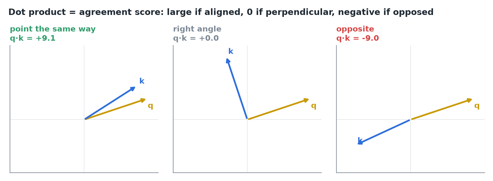
*Aligned vectors give a large positive score, perpendicular ones zero, opposed ones negative.*

- Attention uses it as a **relevance score**: the current token's **query** asks, each past token's **key** answers, and q·k says how well they match.

### Why divide by √128

If query and key entries are random with mean 0 and variance 1, their dot product has **variance = length** (footnote in *Attention Is All You Need*). For 128 numbers, scores spread to about **±11**, and softmax then puts nearly all weight on one token: attention stops blending and just picks.

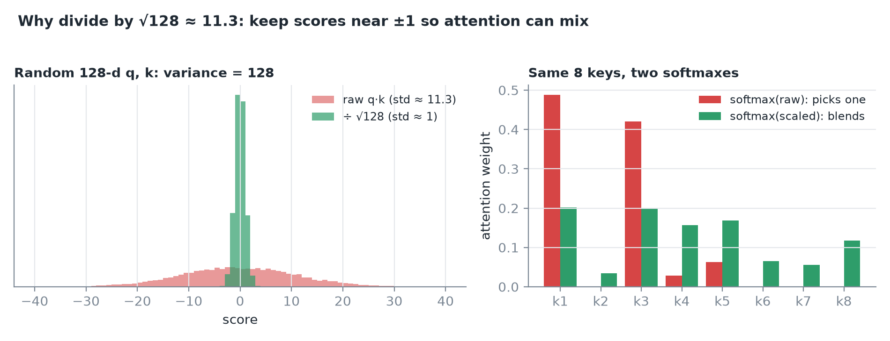
*Simulated: raw scores spread ±11 and softmax picks a winner; dividing by √128 ≈ 11.3 brings them to ±1 and the weights blend.*

> [!TIP]
> For inference the scaling is nearly free: one multiply per score, and fast kernels fold it into work they already do.

## 2. Softmax: scores into weights

Softmax makes scores **positive and summing to 1**: raise e to each score, divide by the total.

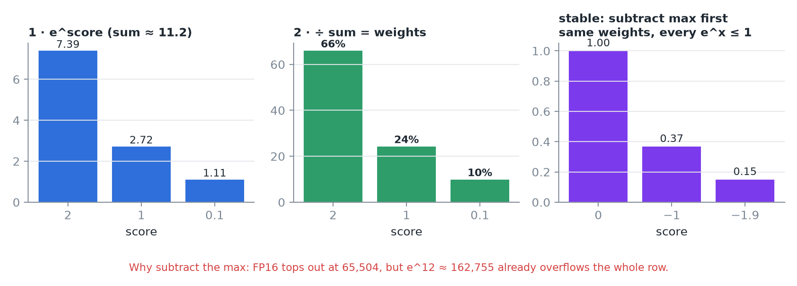
*Scores 2, 1, 0.1 → e^x ≈ 7.39, 2.72, 1.11 (sum ≈ 11.2) → 66%, 24%, 10%. The biggest score wins most, but nothing gets zero.*

- **Overflow trap:** FP16's largest value is **65,504**, but e¹² ≈ **162,755**. One large score turns the whole row into garbage.
- **Fix:** subtract the row's **maximum** first (2, 1, 0.1 → 0, −1, −1.9). Same weights, and every exponent is ≤ 1.

> [!IMPORTANT]
> Softmax needs the **max and the sum over the entire row** before any weight is final. This shapes how every fast attention kernel is built (section 6).

## 3. One head, one new token

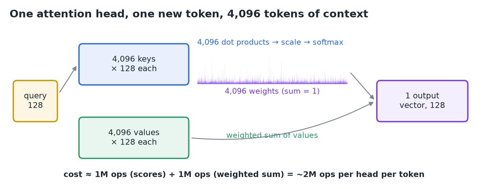
*Query · 4,096 keys → scale → softmax → weighted sum of 4,096 values → one 128-number summary of the conversation, as seen from the new token.*

Work: ~**1M ops** for the scores + ~**1M ops** for the weighted sum = **~2M ops per head**.

## 4. The bill for one token: ops vs bytes

Scale to the whole model: **32 layers × 32 query heads × 4,096 = 4,194,304 dot products ≈ 2.1B operations**. The weight matrices cost ~**15B** ops per token, so at this context attention's arithmetic is only **~1/8**.

Where 2.1B comes from: two equal halves, the scores and the weighted sum of values (scaling and softmax add only a few million).

$$\mathrm{scores}: 4.19\mathrm{M\ dots} \times 256 \approx 1.07\mathrm{B} \qquad \mathrm{values}: 32 \times 32 \times 4096 \times 128 \times 2 \approx 1.07\mathrm{B} \qquad \Rightarrow \approx 2.1\mathrm{B}$$

Where ~15B comes from: each weight does one multiply and one add per token, so ~2 ops per parameter. The ~0.5B-parameter input embedding table (128,256 vocab × 4,096) is a lookup, not a matmul, so ~7.5B parameters do work:

$$2 \times (8.03\mathrm{B} - 0.53\mathrm{B}) \approx 15\mathrm{B} \qquad \frac{2.1}{15 + 2.1} \approx 12\% \approx \frac{1}{8}$$

Now count bytes. Llama 3 uses **grouped-query attention (GQA)**: the 32 query heads share just **8** sets of keys and values.

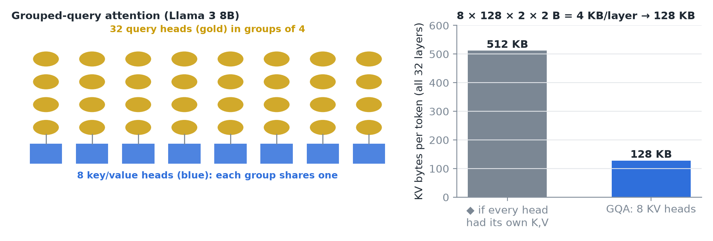
*Four query heads share each K/V head, so each layer stores 8 keys + 8 values per token.*

$$8\ \mathrm{heads} \times 128 \times 2\ (\mathrm{K,V}) \times 2\ \mathrm{B} = 4\ \mathrm{KB/token/layer} \quad \times 32 = 128\ \mathrm{KB/token} \quad \times 4096 \approx 0.5\ \mathrm{GB}$$

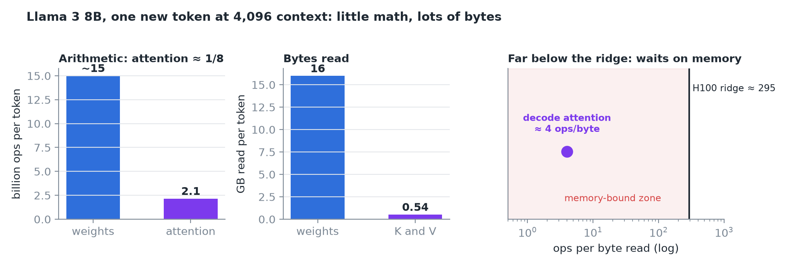
*2.1B ops over ~0.54B bytes ≈ 4 ops/byte; an H100 needs ~295 (989 TFLOPS ÷ 3.35 TB/s) to keep its math units busy.*

> [!IMPORTANT]
> Four is nowhere near 300: **decode attention spends almost all its time waiting on memory**.

## 5. The memory bill grows

- **Weights:** a fixed **16 GB**, read once per step however long the conversation.
- **Keys and values:** **+128 KB per token**, per user.

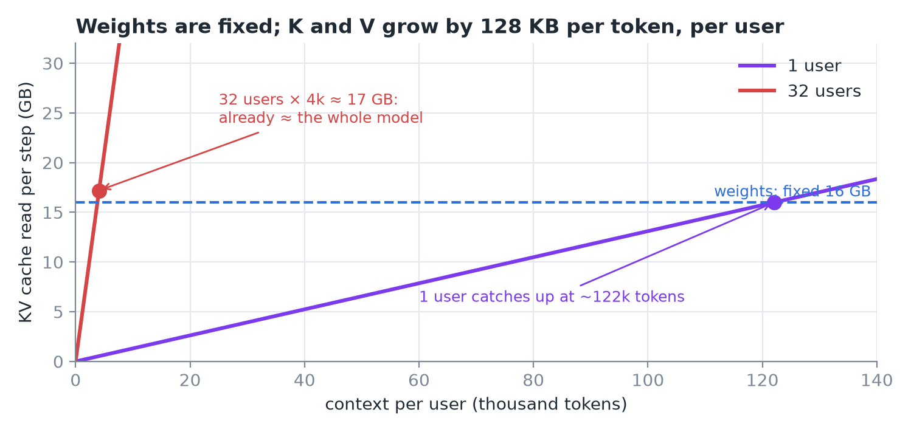
*One user's K/V catches the weights at ~120k tokens; 32 users at 4k tokens each already hold ~17 GB.*

**Prefill** has a different problem: every prompt token is a query at once, so the scores form an **n × n square**.

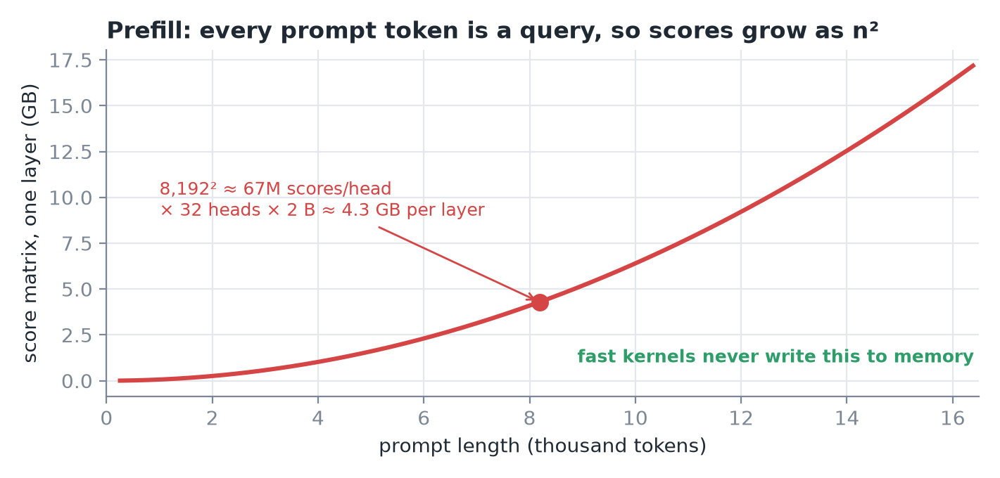
*An 8,192-token prompt: ~67M scores per head; × 32 heads × 2 bytes ≈ 4.3 GB of scratch per layer.*

## 6. Online softmax: never write the square

Fast attention kernels walk the keys **in blocks** and keep a **running max and running sum**. When a new block raises the max, rescale the old sum by e^(old max − new max), then add the new terms.

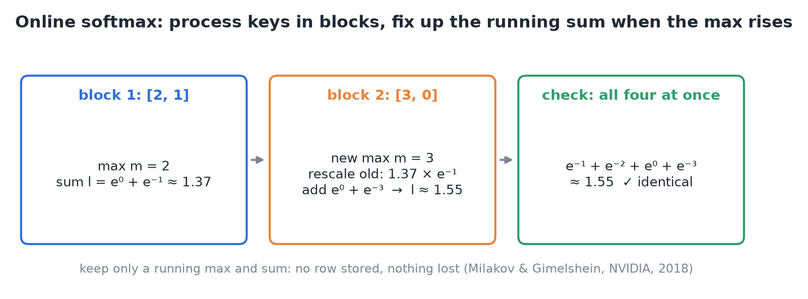
*Blocks [2, 1] then [3, 0] give a running sum of ~1.55, exactly the full-row result. Nothing stored, nothing lost.*

This is the **online softmax** (two NVIDIA engineers, 2018), the foundation of **FlashAttention**; the attention module builds on it.

## 7. Two misconceptions

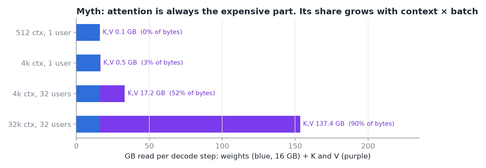
*At short context and small batch the weights dominate the bytes; attention's share grows with context × batch, mostly through memory.*

> [!WARNING]
>
> - "Attention is always the expensive part": not at short contexts and small batches.
> - "Softmax is cheap, so it doesn't matter": the arithmetic is cheap, but needing the whole row shapes every fast kernel.

## 8. Recap

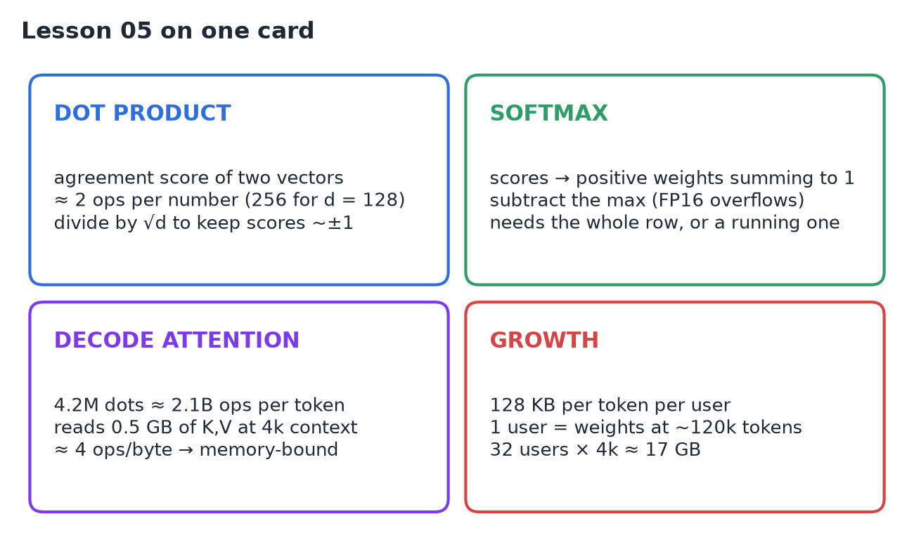

## Interview cheat sheet

*Revise from these pages alone. ◆ = my addition beyond the video; everything else is from the lesson. Builds on 01–04.*

### Say it in 30 seconds

> Attention scores are dot products of the new token's query with every past key, scaled by √d and softmaxed into weights that mix the values. Per decode token that's little arithmetic but a full read of every stored key and value, about 4 ops per byte, so decode attention is memory-bound. K/V grows 128 KB per token per user in Llama 3 8B, overtaking the weights at long context or big batch. Prefill instead faces an n² score matrix, which FlashAttention avoids with an online softmax.

### Only numbers worth memorizing

- **Llama 3 8B attention:** 32 layers, 32 query heads, 8 KV heads (GQA), head dim 128. **FP16 max:** 65,504.

### Derive, don't memorize

Let *L* = layers, *H* = heads, *d* = head dim, *n* = context length.

#### 1. Attention ops per decode token = dots × cost per dot × 2 (scores + weighted sum)

$$\mathrm{ops} \approx L \cdot H_{q} \cdot n \cdot 2d \cdot 2 = 32 \cdot 32 \cdot 4096 \cdot 256 \cdot 2 \approx 2.1\ \mathrm{B} \quad (\mathrm{vs} \approx 15\ \mathrm{B\ for\ weights})$$

> [!TIP]
> The final ×2 = scores + weighted sum of values. Where the weights' ~15B comes from: see 07, derivation 2.

#### 2. KV bytes per token: one K and one V per KV head per layer

$$\mathrm{KV/token} = 2 \cdot L \cdot H_{\mathrm{kv}} \cdot d \cdot \mathrm{bytes} = 2 \cdot 32 \cdot 8 \cdot 128 \cdot 2 = 128\ \mathrm{KB} \quad \Rightarrow \quad \frac{2.1\ \mathrm{B\ ops}}{4096 \times 128\ \mathrm{KB}} \approx 4\ \mathrm{ops/byte}$$

> [!TIP]
> 4 ≪ ~300 ridge (01, derivation 2): memory-bound. K/V matches the 16 GB weights at 16 GB ÷ 128 KB ≈ 122k tokens for one user, or ~4k each for 32 users. GQA's 8 KV heads instead of 32 cut this 4× (Llama 2 7B: 512 KB/token, see 07).

#### 3. Prefill scores = n² per head

$$n^{2} \cdot H \cdot 2\ \mathrm{B} = 8192^{2} \times 32 \times 2 \approx 4.3\ \mathrm{GB\ per\ layer}$$

> [!TIP]
> Quadratic scratch is why FlashAttention tiles keys and never writes the square to memory.

#### 4. Online softmax: running max *m* and sum *l*, rescaled when *m* rises

$$m' = \max(m, m_{\mathrm{blk}}) \qquad l' = l \cdot e^{m - m'} + \sum_{\mathrm{blk}} e^{x - m'}$$

> [!TIP]
> Blocks [2, 1] then [3, 0]: l = 1.37 → 1.37·e⁻¹ + e⁰ + e⁻³ ≈ 1.55, identical to the full row.

### Decode attention vs prefill attention

| | Decode (1 new token) | Prefill (n prompt tokens) |
|---|---|---|
| Queries | 1 per head | n per head |
| Problem | Reading all K/V (bytes) | n × n score matrix (scratch) |
| Grows with | Context × batch | Prompt length squared |
| Main fixes | GQA, KV quantization ◆, paged KV | FlashAttention (tiling + online softmax) |

### Rapid-fire Q&A

| Question | Crisp answer |
|---|---|
| Why divide by √d? | Random q·k has variance d; unscaled scores make softmax one-hot. |
| Why subtract the max in softmax? | FP16 overflows (e¹² > 65,504); the weights are unchanged. |
| What does GQA save? | K/V memory and bandwidth: 8 shared KV heads instead of 32. |
| Is attention the bottleneck? | Only at long context or big batch; otherwise the weights dominate. |

> [!WARNING]
>
> - Counting attention FLOPs instead of K/V bytes for decode.
> - Calling softmax "cheap": its whole-row dependency dictates kernel design.
