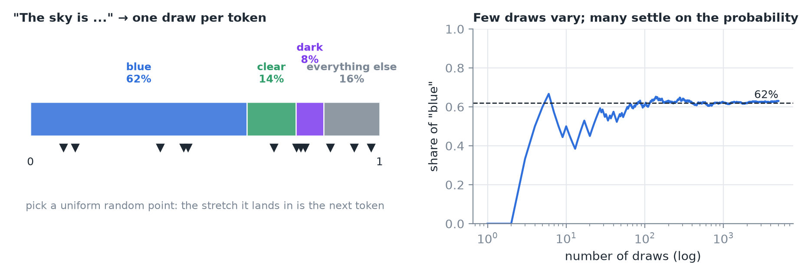
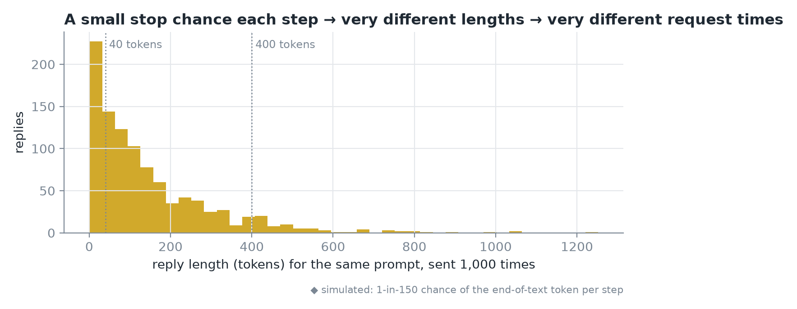
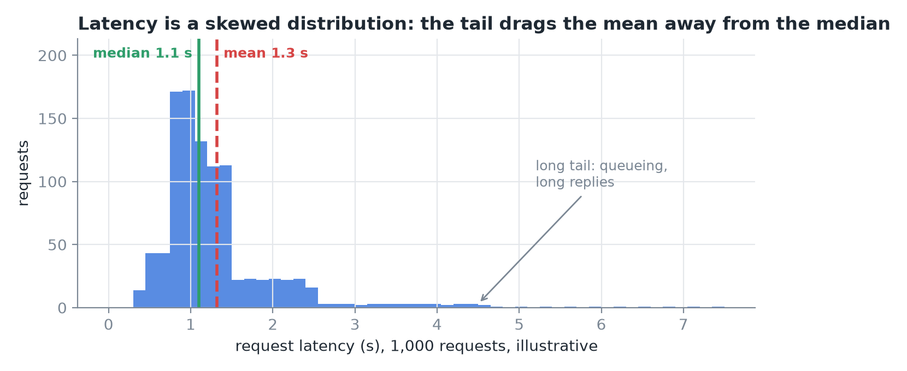
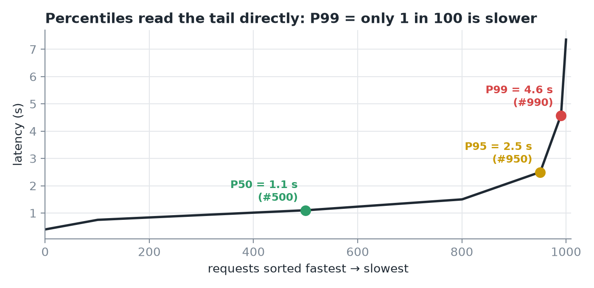
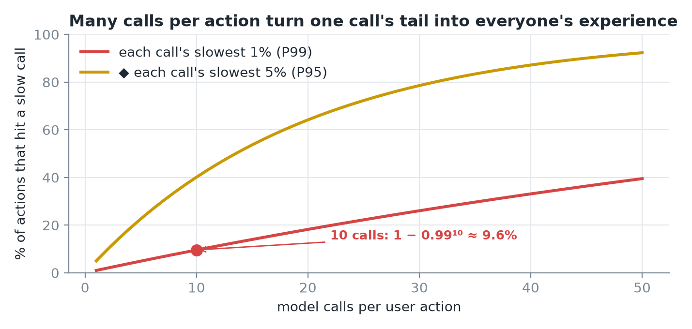
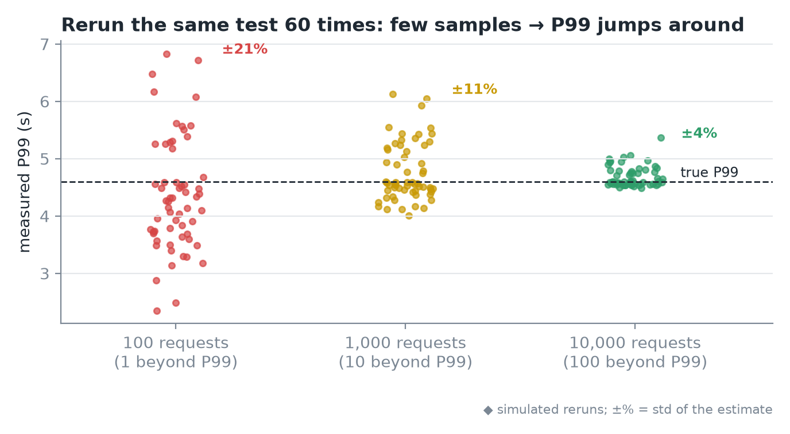
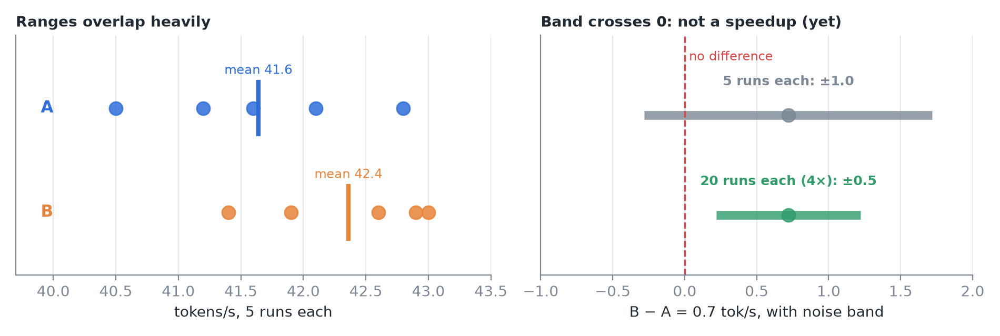
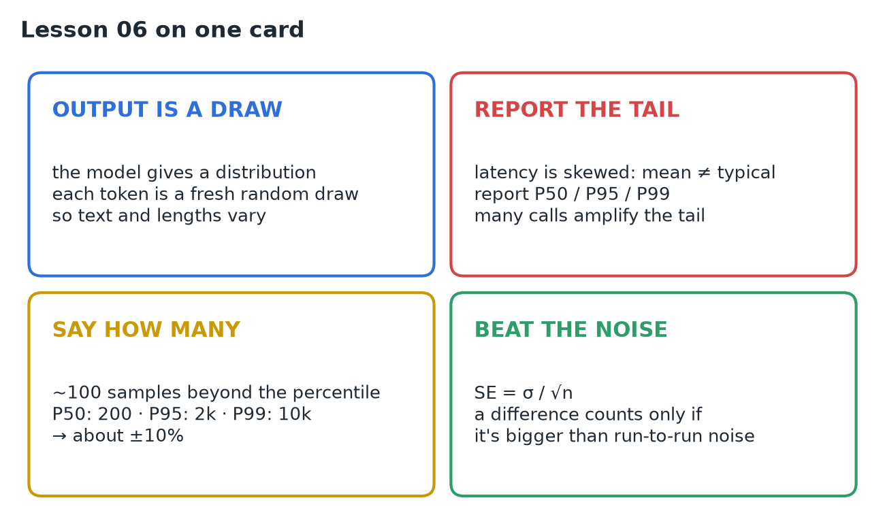

# 06 · Probability, Sampling & Benchmark Statistics

**Source:** [fanout.sh / inference-eng / 00-04](https://fanout.sh/inference-eng/curriculum/00-04) · ~8 min

> [!NOTE]
> A model's output is a **random draw** from a probability distribution, so the same prompt gives different text and different lengths. That makes request latency a **skewed distribution with a long tail**: report **P50 / P95 / P99**, not just the mean. Tail percentiles need **many samples**, so always say how many. And a measured difference only counts if it's **bigger than run-to-run noise**.

Two puzzles share one root, randomness: a benchmark gives 41.6 tok/s, then 42.4 tok/s after a settings change (faster?), and asking the model the same question twice gives two different answers.

## 1. Distributions and sampling

- Given "the sky is", the model outputs a **probability for every possible next token**: blue **62%**, clear **14%**, dark **8%**, everything else **16%**. Each outcome gets a number in [0, 1] and they **sum to exactly 1**.
- **Sampling** = one random draw. Lay the probabilities end to end on a 0–1 line, pick a uniform random point; the stretch it lands in is the token.

*Left: each token owns a stretch of the 0–1 line. Right: over a few draws "blue" wanders; over thousands it settles on 62%.*

> [!IMPORTANT]
> Every token is a fresh draw. That's why the same prompt can give different answers.

## 2. Randomness leaks into performance

A reply ends when the model draws the **end-of-text token**. A small chance of that at every step means some replies stop after **40 tokens** and others run to **400**. Each decode step costs about the same time, so **reply length decides request time**.

*Simulated: the same prompt sent 1,000 times gives a wide spread of reply lengths.*

So a benchmark never measures *one* latency; it measures a **distribution** of latencies.

## 3. Mean, median and the tail

*1,000 requests (illustrative): most near 1 s, but queueing and long replies stretch a tail to the right.*

| Summary | How | Here | Use |
|---|---|---|---|
| **Mean** | Sum ÷ count | **1.3 s** (dragged right by the tail) | Describes almost nobody when the tail is long |
| **Median (P50)** | Middle request: half faster, half slower | **1.1 s** | The typical request |

The tail, the slowest requests, is exactly what users complain about.

## 4. Percentiles describe the tail

Sort the 1,000 latencies. **P50** is the value at position 500, **P95** at 950 (95% are faster), **P99** at 990 (only 1 in 100 is slower).

*Here P50 = 1.1 s, P95 = 2.5 s, P99 = 4.6 s.*

Why care about 1 in 100? Real pages and agents make **many calls** per user action:

$$P(\mathrm{at\ least\ one\ of\ 10\ calls\ in\ the\ slowest\ 1\%}) = 1 - 0.99^{10} \approx 9.6\%$$

*The more calls per action, the more often someone hits a slow one.*

> [!IMPORTANT]
> The tail of each call becomes the typical experience of the whole task. That's why serving targets are percentiles, e.g. **P99 time to first token < 2 s**.

## 5. How many samples does a percentile need?

With only **100 requests**, P99 is the value at position 99, decided by the **single slowest request**. Rerun the test and that one request changes, so P99 jumps around.

*Simulated reruns: P99 from 100 requests swings widely; from 10,000 it barely moves.*

**Rule of thumb:** about **100 samples beyond the percentile** you report gives an estimate steady to about **1/√100 = 10%**.

| Report | Fraction beyond | Requests needed |
|---|---|---|
| P50 (median) | 50% | **200** |
| P95 | 5% | **2,000** |
| P99 | 1% | **10,000** |

> [!TIP]
> Whenever you see a P99, ask: **out of how many requests?**

## 6. Real speedup, or noise?

Back to 41.6 vs 42.4 tok/s. The honest move: **run each setting several times**. Five runs each: A lands from ~40.5 to nearly 43, B from ~41.5 to 43. The ranges **overlap heavily**.

- **Standard deviation** (spread of runs): **σ ≈ 0.8** tok/s.
- **Standard error** of an average shrinks with √n: SE = σ/√n = 0.8/√5 ≈ **0.4**.
- For the **difference of the two averages**, the noise band is about **±1 tok/s**. The observed difference is only **0.7**, inside the noise.

*With 5 runs each the band crosses zero: can't claim B is faster. 4× the runs halves the band; if the 0.7 held up, it would clear zero.*

> [!IMPORTANT]
> Before calling something a speedup, compare it to the **run-to-run noise**.

## 7. Recap

## Interview cheat sheet

*Revise from these pages alone. ◆ = my addition beyond the video; everything else is from the lesson. Builds on 01–05.*

### Say it in 30 seconds

> Each generated token is a random draw from the model's distribution, so reply text and length vary and latency becomes a long-tailed distribution. Report P50, P95 and P99, not the mean, and state the sample count: you need about 100 samples beyond a percentile for ~10% precision. Many calls per task amplify the tail. Treat a speedup as real only if it exceeds run-to-run noise, measured with the standard error σ/√n.

### Only numbers worth memorizing

- **Samples for ±10%:** P50 → 200, P95 → 2,000, P99 → 10,000 requests. **10 calls at P99:** ~9.6% of tasks hit the tail.

### Derive, don't memorize

#### 1. Tail amplification: chance at least one of *k* calls lands in the slowest fraction *q*

$$P = 1 - (1 - q)^{k} = 1 - 0.99^{10} \approx 9.6\%$$

> [!TIP]
> For small *q*, P ≈ *k*·*q* ◆. An agent making 50 calls hits a P99-slow call ~40% of the time: set per-call targets at a high percentile.

#### 2. Samples needed: ~100 beyond the percentile, error ≈ 1/√100

$$n \approx \frac{100}{1 - p} \qquad \mathrm{P99}: \frac{100}{0.01} = 10000 \qquad \mathrm{error} \approx \frac{1}{\sqrt{100}} = 10\%$$

#### 3. Noise band: standard error shrinks with √n

$$\mathrm{SE} = \frac{\sigma}{\sqrt{n}} = \frac{0.8}{\sqrt{5}} \approx 0.4 \qquad \mathrm{band}_{\mathrm{diff}} \approx 2 \times \sqrt{2} \times \mathrm{SE} \approx \pm 1.0$$

> [!TIP]
> ◆ √2 because both averages are noisy; ×2 for ~95% confidence. 4× the runs halves the band. 0.7 < 1.0: not proven.

### Mean vs median vs percentiles

| | Mean | Median (P50) | P95 / P99 |
|---|---|---|---|
| Tells you | Average cost (capacity math) ◆ | The typical request | The tail users complain about |
| Long tail effect | Dragged right (1.3 vs 1.1 s) | Unaffected | Is the tail |
| Samples needed | Few | ~200 | ~2,000 / ~10,000 |

### Symptom → diagnosis

| Symptom | Diagnosis |
|---|---|
| Mean latency fine, users complain | Long tail: look at P95/P99 |
| P99 jumps between identical reruns | Too few samples beyond P99 |
| "2% faster" from one run each | Compare to run-to-run noise first |
| Same prompt, very different request times | Sampled reply lengths differ |

### Rapid-fire Q&A

| Question | Crisp answer |
|---|---|
| Why does the same prompt give different outputs? | Each token is a random draw from a distribution. |
| Why are SLOs written as percentiles? | The tail is what users feel, and multi-call tasks amplify it. |
| How do you know a speedup is real? | Repeat runs; the difference must exceed the noise band. |
| ◆ How do temperature / top-p relate? | They reshape or truncate the distribution before the draw. |

> [!WARNING]
>
> - Reporting only the mean for a long-tailed latency distribution.
> - Quoting P99 from a few hundred requests without saying so.
