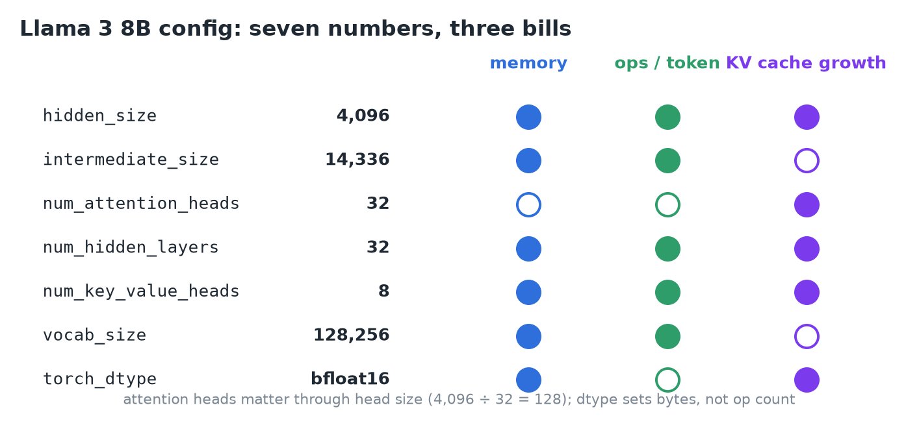
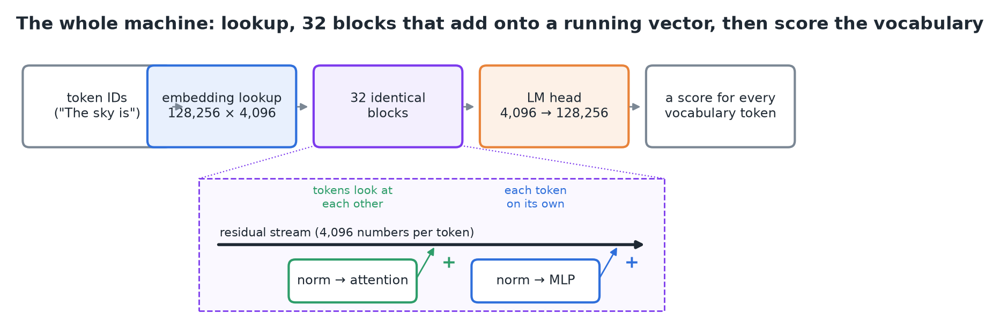
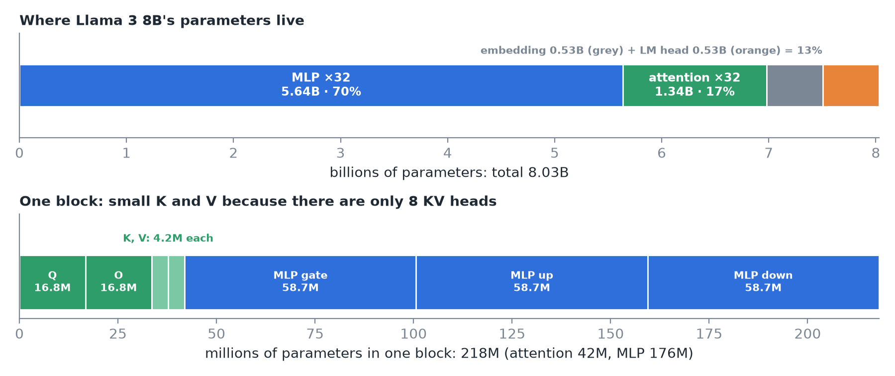
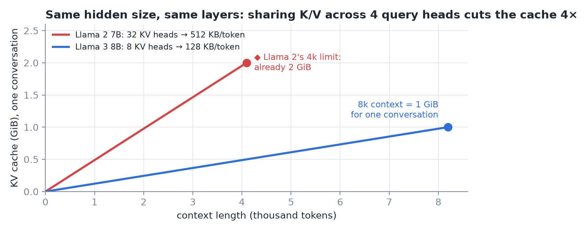
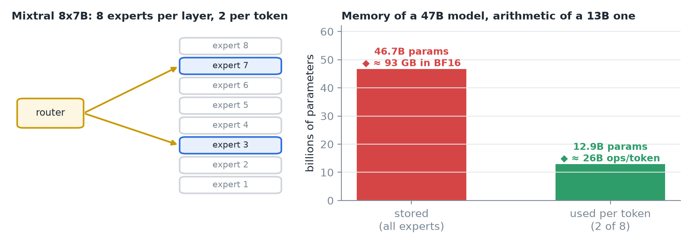
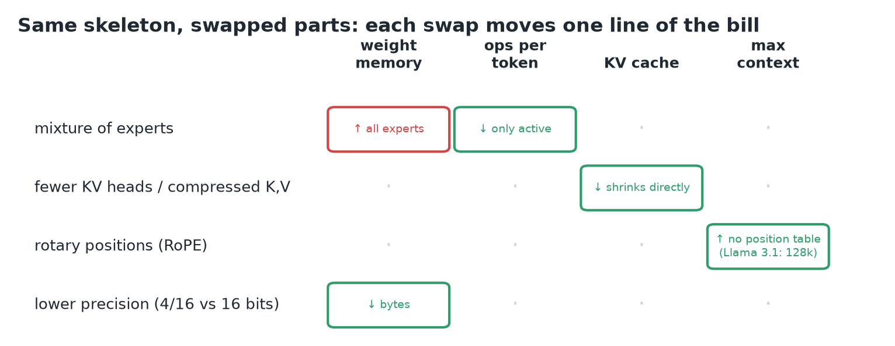
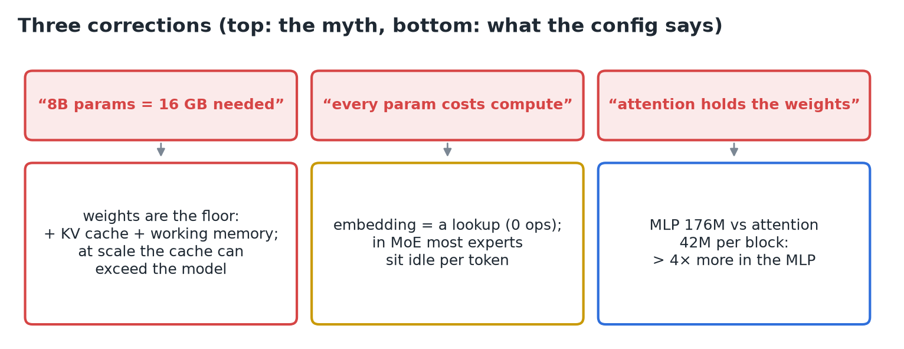
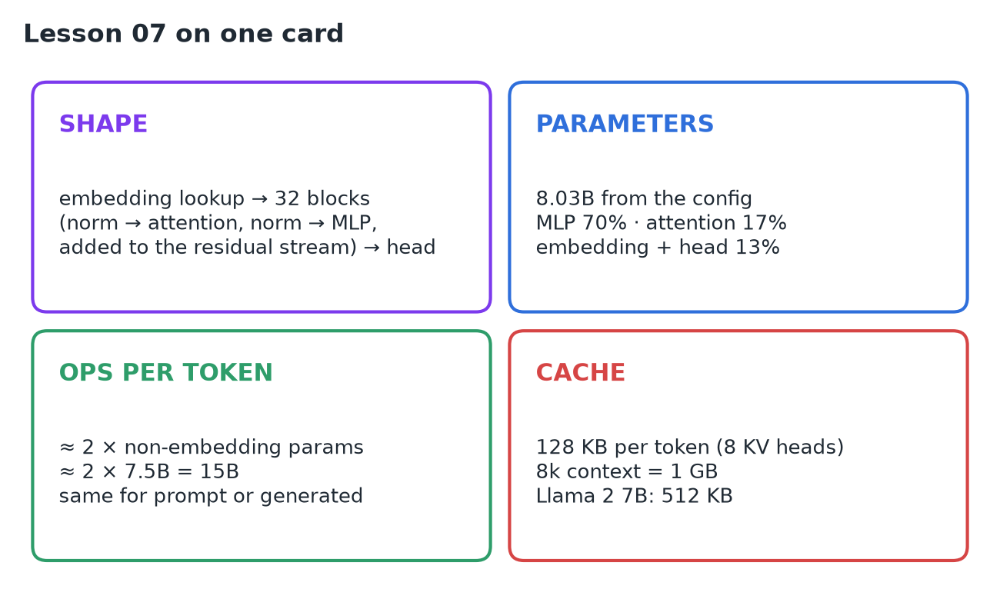

# 07 · Transformer Architecture Refresher

**Source:** [fanout.sh / inference-eng / 00-06](https://fanout.sh/inference-eng/curriculum/00-06) · ~9 min

> [!NOTE]
> A transformer is an **embedding lookup**, a stack of **identical blocks** (attention + MLP, each adding onto a running vector), and a **head** that scores the whole vocabulary. Seven numbers in Llama 3 8B's ~30-line config decide its whole bill: **8.03B parameters** (70% in the MLPs), **~15B operations per token**, and a KV cache of **128 KB per token**. New models mostly swap parts of this skeleton, and each swap moves one line of the bill.

*The seven config numbers that matter, and which bill each one feeds.*

## 1. The whole machine

*Token IDs pick rows of the embedding table; 32 blocks add their results onto the residual stream; the LM head scores all 128,256 tokens.*

- Each token ID picks a **row of the embedding table**: a vector of **4,096 numbers**.
- The vectors pass through **32 identical blocks**. Each block has **attention** (tokens look at each other) and an **MLP** (each token processed on its own).
- Each part reads a **normalized copy** of the vector and **adds** its result back: that running vector is the **residual stream**.
- The **LM head** turns each final vector into a score for every vocabulary token (**128,256**).

> [!IMPORTANT]
> That's the entire architecture. Everything an inference engine does is about running this stack faster.

## 2. Counting parameters from the config

| Piece | Shape | Parameters |
|---|---|---|
| Embedding table | 128,256 × 4,096 | **~525M** |
| Attention Q, O (per block) | 4,096 × 4,096 each | ~17M each |
| Attention K, V (per block) | 4,096 × 1,024 each (8 KV heads × 128) | ~4M each |
| **Attention total (per block)** | | **~42M** |
| MLP (per block) | 3 matrices of 4,096 × 14,336 | **~176M** |
| **One block** | | **~218M** → × 32 ≈ **6.98B** |
| LM head (separate, not tied) | 4,096 × 128,256 | ~525M |
| **Total** | | **8.03B** (the "8B") |

*MLPs hold 70% of the weights, attention 17%, embedding + head 13%. Within a block, K and V are small because there are only 8 KV heads.*

## 3. Parameters → bytes

Bytes = parameters × bytes per parameter (see 04): **16 GB** at 16-bit, **~8 GB** at 8-bit, **~4 GB** at 4-bit (plus a little for scaling factors). Decode reads **every byte every step**, so precision is both a **memory knob and a speed knob**.

> [!TIP]
> The MLPs' 70% is where quantization saves most of the bytes, and most of the time.

## 4. Parameters → operations

Each weight is used once per token as **one multiply + one add**, so a token costs **~2 operations per parameter**, except the **embedding table**, which is a lookup (free). The LM head is a real matmul and one of the biggest matrices.

$$2 \times 7.5\mathrm{B\ non{-}embedding\ params} \approx 15\mathrm{B\ ops\ per\ token}$$

The same 15B whether the token is in the prompt or generated; what changes is **how they arrive**:

- **Prefill:** 500 prompt tokens together = **7.5 trillion ops** in one batch, keeping the math units busy.
- **Decode:** 15B ops against 16 GB of weight reads ≈ **1 op per byte**: the GPU mostly waits on memory (see 01, 04).

## 5. The KV cache: the line that grows

Every block keeps the **keys and values of every token it has seen**, so they're never recomputed. From the config: 8 KV heads × 128 × 2 (K, V) × 2 bytes = **4 KB per token per layer**, × 32 layers = **128 KB per token**. A full **8k context ≈ 1 GB**, for one conversation.

*Llama 2 7B gave each of its 32 query heads its own K and V: 512 KB per token, 4× Llama 3 8B, with the same hidden size and layers.*

> [!IMPORTANT]
> Sharing keys and values across groups of query heads (GQA) is one of the cheapest wins in modern architectures.

## 6. Variants on the same skeleton

- **Mixture of experts (MoE):** replace the one big MLP with many smaller **experts**; a **router** picks a few per token.

*Mixtral 8x7B: 8 experts per layer, 2 per token. 46.7B parameters stored, 12.9B used per token: memory and compute come apart.*

- **Attention variants:** fewer KV heads or compressed keys and values **shrink the cache line** directly.
- **Positions:** Llama rotates each query and key by a **position-dependent angle (RoPE)**. With no position table to outgrow, this is part of how **Llama 3.1 reached 128k tokens** of context.

*Each swap shows up on exactly one line of the bill.*

## 7. Three corrections

*Parameter count isn't memory needed; not every parameter costs compute; the MLPs, not attention, hold most weights.*

## 8. Recap

## Interview cheat sheet

*Revise from these pages alone. ◆ = my addition beyond the video; everything else is from the lesson. Builds on 01–06.*

### Say it in 30 seconds

> A decoder transformer is an embedding lookup, a stack of identical blocks with attention and an MLP adding onto a residual stream, and an LM head over the vocabulary. From the config you can count parameters (Llama 3 8B: 8.03B, 70% in MLPs), turn them into bytes with the precision, and estimate ~2 ops per non-embedding parameter per token. The KV cache, set by the number of KV heads, is the line that grows. MoE, GQA and RoPE each move one line of that bill.

### Only numbers worth memorizing

- **Llama 3 8B config:** hidden 4,096 · MLP 14,336 · 32 layers · 32 heads · 8 KV heads · vocab 128,256 · bf16.
- **Shares:** MLP 70%, attention 17%, embedding + head 13%. **Mixtral 8x7B:** 46.7B stored, 12.9B active.

### Derive, don't memorize

Let *h* = hidden, *i* = MLP size, *V* = vocab, *L* = layers, *H*ₖᵥ·*d* = KV width (8 × 128 = 1,024).

#### 1. Parameters from the config

$$\mathrm{block} = 2h^{2} + 2h \cdot H_{\mathrm{kv}} d + 3hi \qquad N = L \cdot \mathrm{block} + 2Vh = 32 \times 218\mathrm{M} + 2 \times 525\mathrm{M} \approx 8.03\mathrm{B}$$

The three terms are Q and O (*h* × *h*), K and V (*h* × *H*ₖᵥ*d*), and the three MLP matrices (*h* × *i*).

> [!TIP]
> The 2*Vh* assumes an untied LM head (Llama 3 8B). If embeddings are tied ◆, count *Vh* once.

#### 2. Ops per token = 2 × non-embedding parameters

$$2 \times (8.03\mathrm{B} - 0.53\mathrm{B}) \approx 15\mathrm{B\ ops/token}$$

$$\mathrm{prefill\ 500\ tokens} = 7.5\mathrm{T\ ops\ per\ weight\ read} \qquad \mathrm{decode} \approx \frac{15\mathrm{B\ ops}}{16\ \mathrm{GB}} \approx 1\ \mathrm{op/byte}$$

#### 3. MoE splits memory from compute

$$\mathrm{memory} \propto N_{\mathrm{total}} = 46.7\mathrm{B} \qquad \mathrm{ops/token} \approx 2 N_{\mathrm{active}} = 2 \times 12.9\mathrm{B}$$

> [!TIP]
> ◆ In BF16 that's ~93 GB to host but only ~26B ops per token. KV per token comes straight from the config too: see 05, derivation 2.

### Swap → which line of the bill

| Swap | Weight memory | Ops per token | KV cache | Context |
|---|---|---|---|---|
| Mixture of experts | ↑ all experts | ↓ only active | | |
| Fewer KV heads / compressed K,V | | | ↓ | |
| RoPE positions | | | | ↑ (Llama 3.1: 128k) |
| Lower precision | ↓ bytes | | | |

### Rapid-fire Q&A

| Question | Crisp answer |
|---|---|
| Where do most parameters live? | MLPs (~70%); > 4× attention per block. |
| Does 8B params mean 16 GB is enough? | No: weights are the floor; KV cache and working memory add on top. |
| Which parameters cost no compute? | The embedding lookup, and idle experts in MoE. |
| Why did Llama 3 use 8 KV heads? | GQA cuts the cache 4× vs Llama 2 7B (128 vs 512 KB/token). |
| Why quantize MLPs first? | They hold most bytes, and decode time ∝ bytes read. |

> [!WARNING]
>
> - Equating parameter count with required memory.
> - Assuming MoE is cheap to host because it's cheap per token.
