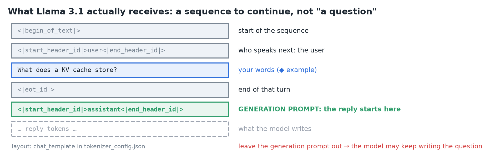
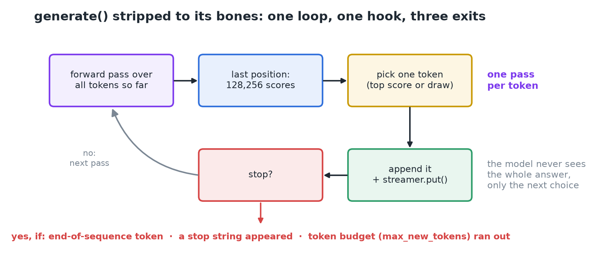
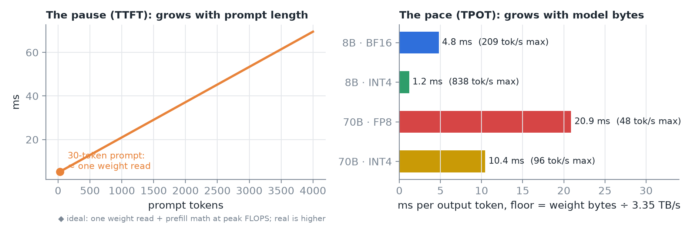
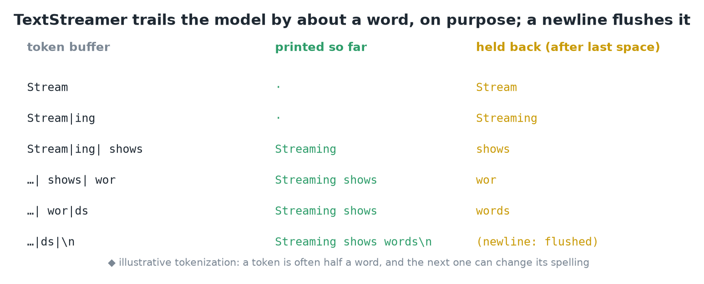
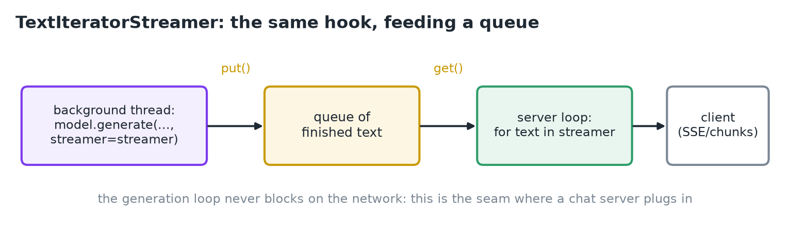
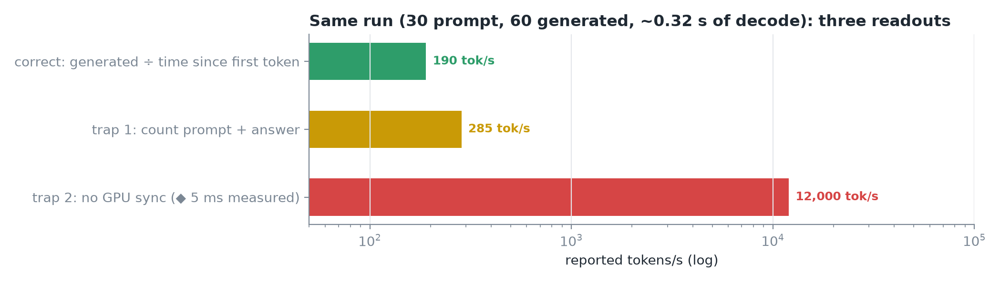
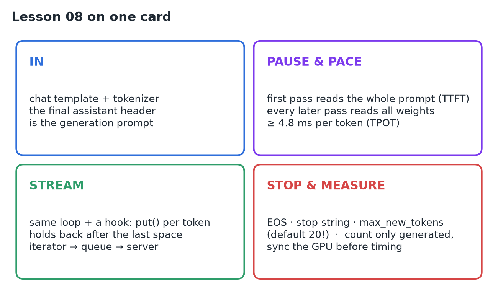

# 08 · Generate & Stream Your First Tokens

**Source:** [fanout.sh / inference-eng / 01-03](https://fanout.sh/inference-eng/curriculum/01-03) · ~8 min

> [!NOTE]
> What a user sees, **a pause then a steady stream**, is the whole of inference from the outside. The prompt is wrapped in a **chat template** and tokenized; `generate()` runs **one forward pass per token**. The first pass reads the whole prompt (**the pause, TTFT**); every later pass reads all the weights once (**the pace, TPOT**, ≥ 4.8 ms on an H100). Streaming is the **same loop with a hook**. Generation stops for exactly three reasons, and the tokens/s you see is easy to mis-measure.

Running example: **Llama 3.1 8B Instruct on one H100**.

## 1. What the model actually receives

A language model only **continues a sequence of tokens**. "User" and "assistant" are conventions learned from how training data was laid out; the **chat template** (shipped in `tokenizer_config.json`) reproduces that layout.

*Your message is wrapped in special markers, then the template appends an assistant header and stops.*

- That final assistant header is the **generation prompt**: the cue that the next tokens are the reply. Leave it out and the model may keep writing *your* question, the most natural continuation.
- The tokenizer then turns the text into integers: a ~30-word question ≈ **~30 tokens** (illustrative).

## 2. The loop

*Run the model, take the last position's 128,256 scores, pick one token, append it, check whether to stop, repeat.*

> [!IMPORTANT]
> **One forward pass per token.** The model never sees the whole answer, only the next choice. And the first trip round the loop is different from all the others.

## 3. The pause and the pace

- **First pass (prefill):** reads all ~30 prompt tokens **at once**, in parallel across every layer, and stores their **keys and values** for later. Real arithmetic: the GPU is busy.
- **Every later pass (decode):** adds **one** token and reuses the stored K/V. Tiny arithmetic, but it still reads all **16 GB** of weights:

$$t_{\mathrm{token}} \geq \frac{16\ \mathrm{GB}}{3.35\ \mathrm{TB/s}} \approx 4.8\ \mathrm{ms} \quad (\approx 200\ \mathrm{tok/s})$$

*Left: a longer prompt means a longer pause. Right: a bigger (or less quantized) model means a slower pace. The loop is the same.*

The pause = **time to first token (TTFT)**; the pace = **time per output token (TPOT)**.

## 4. Streaming: the same loop with a hook

In Transformers you pass `generate()` a **streamer**; every time a token is picked, the loop calls `streamer.put()`.

- **`TextStreamer`** keeps the tokens so far, decodes the whole buffer, and prints only what's new.
- It **holds back everything after the last space**: a token is often half a word, and the next token can change how the previous one should be spelled. So the display trails the model by about a word, **on purpose**; a newline flushes it.

*Text is printed only up to the last space; the partial word waits for the next token.*

- **`TextIteratorStreamer`** pushes finished text into a **queue**; your server reads from the other end without blocking the loop. That's the seam where a chat server plugs in.

*generate() runs in a background thread; the server iterates over the queue and forwards text to the client.*

## 5. Why it stopped

Only three reasons, and **none of them is punctuation**:

| Reason | Where it's set |
|---|---|
| The model picked an **end-of-sequence token** | `generation_config.json`: Llama 3.1 lists **three** EOS ids |
| A **stop string** you asked for appeared | Per request |
| The **token budget** ran out | `max_new_tokens`: **defaults to 20** in Transformers unless the model config says otherwise |

> [!WARNING]
> An unset `max_new_tokens` is the classic cause of an answer that **ends mid-sentence**.

The same config carries this model's **sampling defaults**: sampling on, **temperature 0.6**, **top-p 0.9**. Those are someone's choices, not laws: read them, and override per request.

## 6. Reading the numbers

Most tools print: **prompt tokens** (what went in, after the template), **generated tokens** (what came out), and **tokens/s**, usually *generated tokens ÷ time since the first token*.

Our request (illustrative): ~**30** prompt tokens, **60** generated, a pause of a few hundred ms, then roughly **200 tok/s** at the floor (the floor is arithmetic).

*The same run reported three ways: correctly, counting the prompt as output, and timing an unsynchronized GPU call.*

- **Trap 1:** `generate()` returns **prompt + answer**; count the whole output and you overcount.
- **Trap 2:** GPU work is **asynchronous**: the Python call returns before the GPU finishes, so a stopwatch around it measures almost nothing. **Synchronize first**, or use **CUDA events**.

> [!WARNING]
>
> - "The model is slow to start": the first step is doing ~30 tokens of work in one go.
> - "Streaming makes generation faster": it changes **when you see** tokens, not when they're made.
> - "It stops at the end of a sentence": it stops on an end token, a stop string or a budget.

## 7. Recap

## Interview cheat sheet

*Revise from these pages alone. ◆ = my addition beyond the video; everything else is from the lesson. Builds on 01–07.*

### Say it in 30 seconds

> A chat request is templated into a token sequence ending in an assistant header, the generation prompt. generate() then loops one forward pass per token: the first pass prefills the whole prompt and caches K/V (the pause, TTFT); each later pass reads all weights for one token (the pace, TPOT). Streaming is a put() hook on that loop, holding back partial words. It stops on an EOS token, a stop string or max_new_tokens. Measure tokens/s from generated tokens only, with the GPU synchronized.

### Only numbers worth memorizing

- **Llama 3.1 defaults:** 3 EOS ids, do_sample on, temperature 0.6, top-p 0.9. **Transformers `max_new_tokens`:** 20 if unset.

### Derive, don't memorize

#### 1. Request time = the pause + the pace × remaining tokens ◆

$$t_{\mathrm{request}} \approx \mathrm{TTFT} + (N_{\mathrm{out}} - 1) \cdot \mathrm{TPOT} \approx 0.31\ \mathrm{s} + 59 \times 5.3\ \mathrm{ms} \approx 0.62\ \mathrm{s}$$

> [!TIP]
> TTFT grows with prompt length (prefill); TPOT's floor is weight bytes ÷ bandwidth (01, derivation 1). Long prompts hurt the pause; big models hurt the pace.

#### 2. Reported tokens/s = generated tokens ÷ time since the first token

$$\frac{60}{0.316\ \mathrm{s}} \approx 190\ \mathrm{tok/s} \qquad \mathrm{counting\ the\ prompt}: \frac{90}{0.316} \approx 285\ (1.5\times\ \mathrm{too\ high})$$

> [!TIP]
> Without a GPU sync the timer stops early and the rate looks absurdly high: synchronize or use CUDA events.

### Streamer options

| | TextStreamer | TextIteratorStreamer |
|---|---|---|
| Output | Prints to stdout | Pushes text into a queue |
| Use | Notebooks, CLI | Servers: read without blocking the loop |
| Shared behavior | `put()` per token; holds back after the last space; flushes on newline | Same |

### Symptom → diagnosis

| Symptom | Diagnosis |
|---|---|
| Answer cut off mid-sentence | `max_new_tokens` unset (default 20) |
| Model continues writing the user's question | Missing generation prompt (◆ `add_generation_prompt=True`) |
| Stream lags the model by a word | Hold-back by design, not a bug |
| tokens/s implausibly high | Counted the prompt, or no GPU sync |
| Same prompt, different answers | Sampling is on by default (temperature 0.6, top-p 0.9) |

### Rapid-fire Q&A

| Question | Crisp answer |
|---|---|
| What's the generation prompt? | The trailing assistant header that cues the reply. |
| Why is the first token slow? | It runs prefill over the whole prompt and fills the KV cache. |
| Does streaming speed up generation? | No: it changes when you see tokens, not when they're made. |
| Why hold back text after the last space? | The next token can change how a partial word decodes. |

> [!WARNING]
>
> - Timing `generate()` with a plain stopwatch and no GPU sync.
> - Leaving `max_new_tokens` unset in production.
