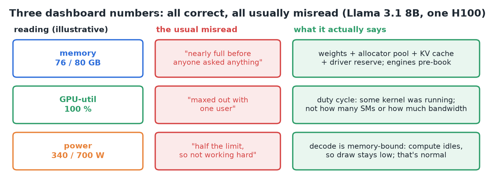
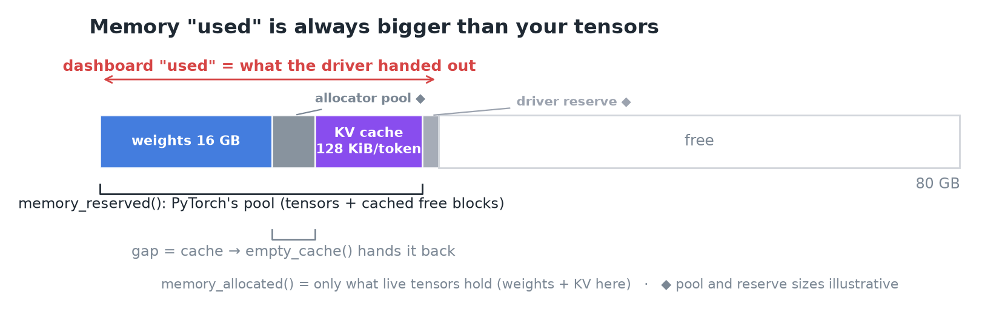
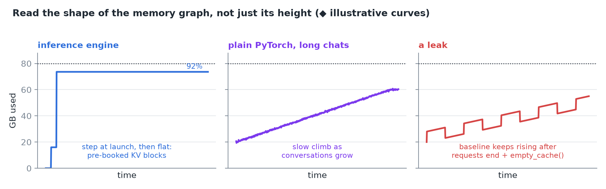
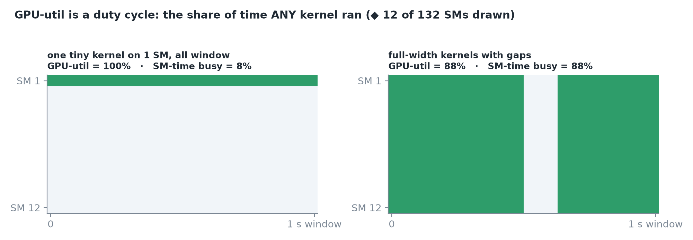
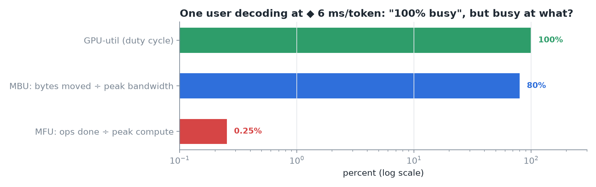
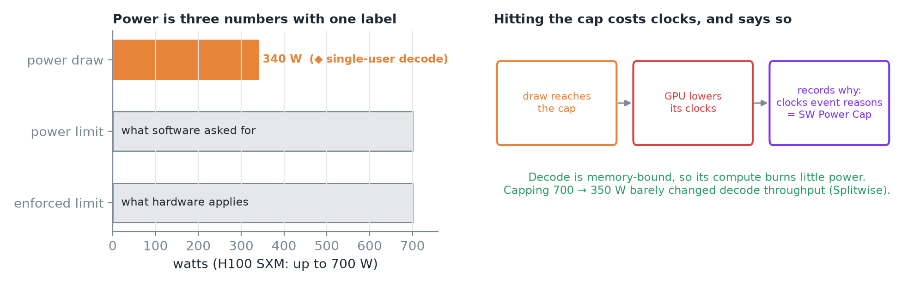
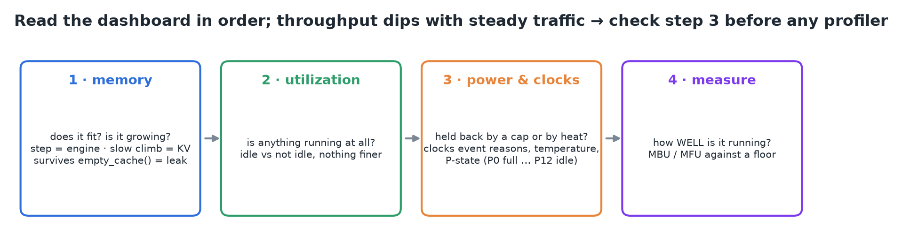
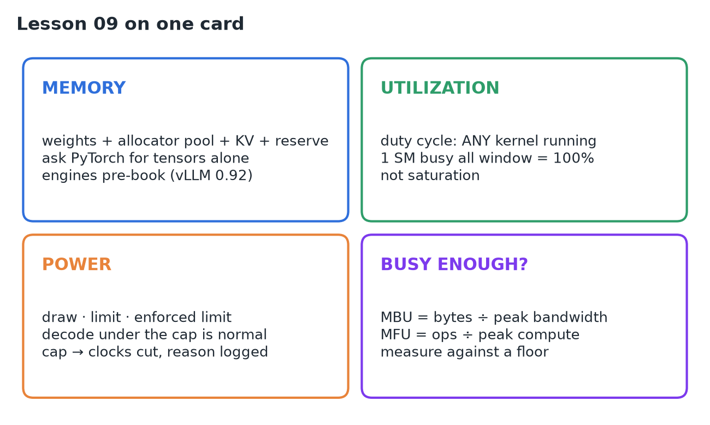

# 09 · Watch GPU Memory, Utilization & Power

**Source:** [fanout.sh / inference-eng / 01-04](https://fanout.sh/inference-eng/curriculum/01-04) · ~8 min

> [!NOTE]
> A GPU dashboard shows three numbers: **memory, utilization, power**. All three are correct and all three are usually misread. **Memory used** is weights + the framework's cached pool + the KV cache + a driver reserve, and engines pre-book most of the card on purpose. **Utilization** is a duty cycle (was *any* kernel running?), not saturation. **Power** under the cap is normal for memory-bound decode; caps and heat show up in the clock reasons. Read them in that order, then measure against a floor.

*Running example: Llama 3.1 8B on one H100. Each reading, its usual misread, and what it actually says.*

## 1. Memory: what the driver has handed out

The dashboard's "used" is a sum of four things:

1. **Weights:** 16 GB for this model.
2. **The framework's pool:** PyTorch's **caching allocator** keeps freed memory for itself (not the driver) so the next allocation is fast. The PyTorch docs say unused memory managed by the allocator still shows as used in the dashboard.
3. **KV cache:** grows with every token of every open conversation, **128 KiB per token** here.
4. **Driver reserve:** memory the driver keeps (the API calls it *reserved for system use*).

*Dashboard "used" ⊇ PyTorch reserved (pool) ⊇ PyTorch allocated (live tensors).*

- **`torch.cuda.memory_allocated()`** = what tensors hold; **`memory_reserved()`** = what the pool holds. The gap is cache; **`torch.cuda.empty_cache()`** hands it back (useful when another process needs the card).

### Under an inference engine

vLLM's **`--gpu-memory-utilization`** defaults to **0.92**: it takes **92% of the card at launch**, before any request, and turns everything above the weights into **KV cache blocks** to serve as many conversations as fit. Nothing is leaking; the engine **pre-books** the room.

*The tell is the shape: a step at launch then flat (engine), a slow climb (KV in long conversations), or a baseline that keeps rising after requests end (leak).*

## 2. Utilization: a duty cycle

NVIDIA's definition, paraphrased: the **percent of time over the last sample period during which one or more kernels was executing**. Read it as a **duty cycle**; the window is between **1/6 s and 1 s**.

*A kernel occupying one SM for the whole window reads 100%; the metric says nothing about how many of the 132 SMs were busy.*

- It doesn't say **how many of the 132 SMs** were busy, nor **how much memory bandwidth** was used.
- So one user decoding at ~4.8 ms/token can **pin utilization at 100%** while the arithmetic units mostly wait for weights.
- **Memory utilization** is the same kind of duty cycle for the memory bus: the fraction of time it was reading or writing, not how much it moved.

### "Busy enough" needs a different measurement

Compare what the GPU did to what it could do: **bytes moved ÷ peak bandwidth (MBU)** and **operations ÷ peak compute (MFU)**.

*Same single-user decode: 100% utilization, high bandwidth use, a sliver of compute.*

> [!IMPORTANT]
> **100% utilization means something was running. It does not mean nothing more could run.**

## 3. Power: three numbers with one label

*Draw vs the requested and enforced limits; when draw hits the cap the GPU lowers its clocks and logs the reason.*

- **Power draw:** the last measurement of what the whole board pulls (watts).
- **Power limit:** the ceiling software asked for. **Enforced limit:** the ceiling hardware actually applies. An **H100 SXM** can be configured up to **700 W**.
- At the cap the GPU **lowers its clocks** and records why in **clocks event reasons** (e.g. *SW Power Cap*).
- Single-user decode reads **full utilization but about half the cap**, which is consistent: decode is bandwidth-bound, so compute units burn little. Measured: capping an H100 from **700 → 350 W barely changed decode throughput** (Splitwise).

> [!TIP]
> Power draw tells you what the GPU is **spending**, not how hard it's **working**.

### Two more fields that explain mystery slowdowns

- **Temperature:** past the limit, *SW thermal slowdown* cuts clocks; *HW slowdown* can **halve** them.
- **Performance state:** **P0** = full speed … **P12** = idle; a card stuck at a high number is being held back.

## 4. Read the dashboard in order

*Memory → utilization → power & clocks → then measure how well it runs against a floor.*

If throughput dips with **no change in traffic**, check power, temperature and P-state **before any profiler**.

## 5. Recap

## Interview cheat sheet

*Revise from these pages alone. ◆ = my addition beyond the video; everything else is from the lesson. Builds on 01–08.*

### Say it in 30 seconds

> Dashboard memory is weights plus the allocator's cached pool plus the KV cache plus a driver reserve, and engines like vLLM pre-book 92% at launch for KV blocks. GPU utilization is a duty cycle, the share of time any kernel ran, so one user's decode can read 100% while compute idles. Power below the cap is normal for memory-bound decode; caps and thermal events show up in clock reasons. For how well the GPU is used, measure MBU and MFU against a floor.

### Only numbers worth memorizing

- **vLLM** `gpu_memory_utilization` default **0.92**. **Util window:** 1/6 s–1 s. **H100 SXM:** up to 700 W. **P0** full … **P12** idle.

### Derive, don't memorize

#### 1. Dashboard memory is a sum, nested around your tensors

$$\mathrm{used} = W + \mathrm{pool} + \mathrm{KV} + \mathrm{reserve} \qquad \mathrm{allocated} \leq \mathrm{reserved} \leq \mathrm{used}$$

> [!TIP]
> Engine pre-book: 0.92 × 80 ≈ 73.6 GB, so ≈ 57.6 GB above the 16 GB weights becomes KV blocks ◆ (minus activations). How many tokens that holds: see 02, derivation 1.

#### 2. Utilization = time any kernel ran ÷ sample window

$$\mathrm{util} = \frac{t_{\mathrm{any\ kernel}}}{t_{\mathrm{window}}} \qquad \mathrm{1\ of\ 132\ SMs\ busy\ all\ window} \Rightarrow 100\%$$

#### 3. "Busy enough" = achieved ÷ peak, for bytes and for ops ◆

$$\mathrm{MBU} = \frac{16\ \mathrm{GB} / 6\ \mathrm{ms}}{3.35\ \mathrm{TB/s}} \approx 80\% \qquad \mathrm{MFU} = \frac{15\ \mathrm{GFLOP} / 6\ \mathrm{ms}}{989\ \mathrm{TFLOPS}} \approx 0.25\%$$

> [!TIP]
> Decode: judge by MBU (bandwidth-bound). Prefill and big batches: MFU matters too (01, derivation 2).

### What each reading shows

| Reading | Shows | Doesn't show | Check instead |
|---|---|---|---|
| Memory used | What the driver handed out | Live tensors alone | `memory_allocated()` |
| GPU-util | Any kernel running | SMs busy, bandwidth used | MBU / MFU |
| Memory-util | Memory bus active time | Bytes moved | MBU |
| Power draw | What the board spends | How hard it works | Clocks event reasons |

### Symptom → diagnosis

| Symptom | Diagnosis |
|---|---|
| ~92% memory before any request | Engine pre-booked KV blocks, not a leak |
| Memory climbs during long chats | KV cache growth |
| Growth survives finished requests + `empty_cache()` | A real leak |
| 100% util with one user | Duty cycle; compute mostly waiting on memory |
| Throughput dips, traffic unchanged | Power cap, thermal slowdown or high P-state |

### Rapid-fire Q&A

| Question | Crisp answer |
|---|---|
| Why is "used" bigger than my tensors? | Allocator pool, KV cache and driver reserve are included. |
| Does 100% util mean saturated? | No: it means a kernel was running. |
| Decode at half the power cap: problem? | No: memory-bound decode leaves compute idle. |
| Where do power or heat throttles show? | Clocks event reasons (SW Power Cap, thermal slowdown). |

> [!WARNING]
>
> - Treating GPU-util as saturation, or power draw as effort.
> - Calling an engine's launch-time pre-booking a memory leak.
