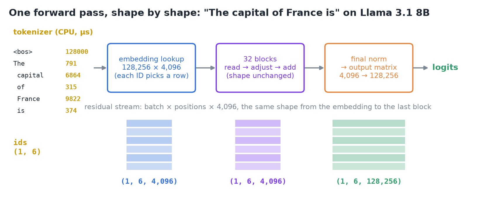
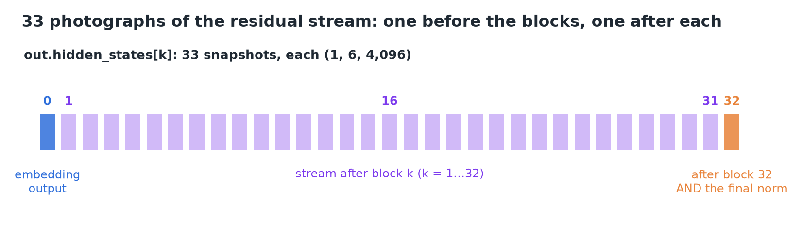
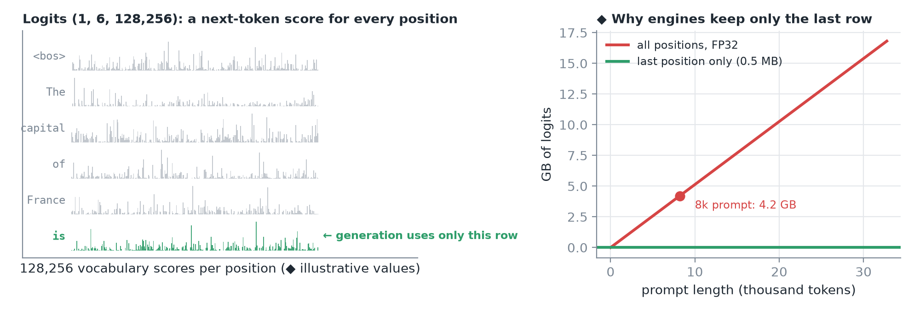
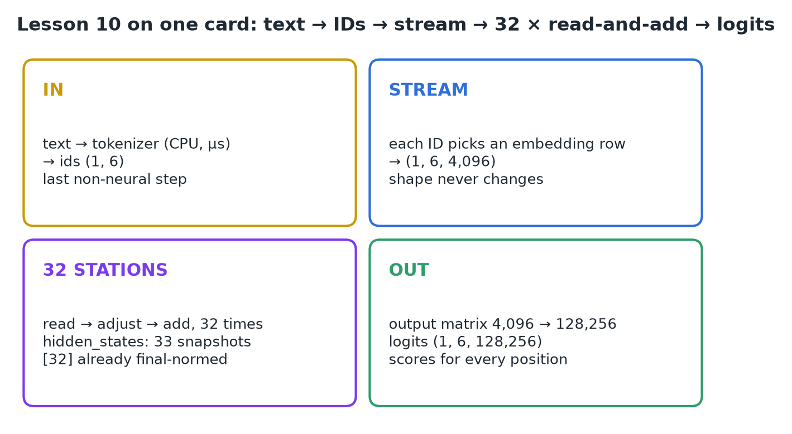

# 10 · Trace the Transformer Forward Pass

**Source:** [fanout.sh / inference-eng / 02-01](https://fanout.sh/inference-eng/curriculum/02-01) · ~5 min

> [!NOTE]
> Every generated token is **one forward pass**: tensors in, tensors out. Trace "The capital of France is" through Llama 3.1 8B and you get three things back: **6 token IDs**, **logits of shape (1, 6, 128,256)**, and **33 hidden states of shape (1, 6, 4,096)**. Text becomes IDs, IDs become one residual stream whose shape never changes, 32 blocks read-and-add to it, and one projection turns it into a score for every vocabulary entry, **at every position**.

## 1. Skip the wrapper, call the model

`model.generate()` is a convenience wrapper; underneath is the forward pass, run once per token. Call the model directly and ask it to keep intermediate results:

```python
enc = tok("The capital of France is", return_tensors="pt")
out = model(**enc, output_hidden_states=True)
enc.input_ids.shape        # (1, 6)
out.logits.shape           # (1, 6, 128256)
len(out.hidden_states)     # 33, each (1, 6, 4096)
```

The whole trace is in those three results.


*From six token IDs to a (1, 6, 4,096) stream to (1, 6, 128,256) logits.*

## 2. In: tokenizer and embedding

- **Tokenizer:** 5 words + a begin-of-text marker → **6 IDs** (128000, 791, 6864, 315, 9822, 374). It's the **last non-neural step**: a lookup table plus merge rules, running on the **CPU in microseconds**. After it, the request is only tensors.
- **Embedding:** each ID **selects its row** of the 128,256 × 4,096 embedding matrix. Six rows stacked = **(1, 6, 4,096)**: batch, positions, numbers per position.

> [!IMPORTANT]
> That tensor is the **residual stream**, and from here to the far end of the model **its shape never changes**.

## 3. Through: 32 read-and-add stations

Each of the **32 blocks** reads the stream, computes an adjustment, and **adds it back**: same shape in, same shape out. Inside each block, attention lets the six positions inform one another under a **backward-only (causal) mask**, and the MLP (where most parameters live) works per position, with normalization around both.


*Index 0 is the embedding output; 1–32 are the stream after each block. The last one has the final norm already applied.*

- `hidden_states[0]` = embedding output (before any block); `hidden_states[k]` = stream after block *k*.
- **Wrinkle:** the library returns the last snapshot **after the final norm** has been applied.
- Compare the last position's first few numbers at index 0 and index 32: same position, same shape, **different numbers**. That difference is the model's reading of the prompt.

## 4. Out: logits for every position

After the last block and the final norm, an **output matrix** (the same size as the embedding) projects each position's 4,096 numbers onto the vocabulary: **128,256 scores, called logits**.


*Left: the model scored a next token at all six positions. Right (◆): keeping every position's logits gets expensive for long prompts.*

> [!IMPORTANT]
> The shape is **(1, 6, 128,256)**: the model scored a next token for **all six positions**, not just the last. Generation uses only the last position's row.

## 5. Recap



## Interview cheat sheet

*Revise from these pages alone. ◆ = my addition beyond the video; everything else is from the lesson. Builds on 01–09.*

### Say it in 30 seconds

> One forward pass per token: the tokenizer (CPU, microseconds) turns text into IDs, each ID picks an embedding row to form a (batch, positions, 4,096) residual stream, 32 blocks each read the stream and add an adjustment without changing its shape, and the final norm plus output matrix produce logits of shape (batch, positions, 128,256). The model scores every position; generation reads only the last.

### Only numbers worth memorizing

- **"The capital of France is":** 6 IDs → stream (1, 6, 4,096) → logits (1, 6, 128,256); **33** hidden states (embedding + 32 blocks).

### Derive, don't memorize

Let *B* = batch, *T* = positions, *h* = 4,096, *V* = 128,256, *L* = 32.

#### 1. Shapes through the pass

$$(B, T) \rightarrow (B, T, h) \rightarrow \cdots \rightarrow (B, T, h) \rightarrow (B, T, V) \qquad \mathrm{hidden\ states} = L + 1 = 33$$

#### 2. Full-sequence logits are big ◆

$$B \cdot T \cdot V \cdot 4\ \mathrm{B} = 8192 \times 128256 \times 4 \approx 4.2\ \mathrm{GB} \quad \mathrm{vs} \quad 128256 \times 4 \approx 0.5\ \mathrm{MB\ for\ the\ last\ row}$$

> [!TIP]
> ◆ Serving only needs the last position's logits, so engines project just that row. Kept hidden states cost (L+1)·T·h·2 B ≈ 2.2 GB at 8k: debugging only.

### hidden_states index map

| Index | What it is |
|---|---|
| 0 | Embedding output, before any block |
| 1 … 31 | Stream after block 1 … 31 |
| 32 | After block 32 **and** the final norm |

### Symptom → diagnosis

| Symptom | Diagnosis |
|---|---|
| `hidden_states[-1]` ≠ what you expect before the head | It's already final-normed |
| Wrong next token from your own loop | Read `logits[:, 0]` instead of `logits[:, -1]` |
| ◆ OOM on long prompts in a plain forward | Full (B, T, V) logits or kept hidden states |

### Rapid-fire Q&A

| Question | Crisp answer |
|---|---|
| What's the last non-neural step? | The tokenizer: lookup + merge rules on the CPU. |
| What does an embedding lookup do? | Each ID selects one row; no multiplication. |
| Does a block change the stream's shape? | No: it reads, computes an adjustment, adds it back. |
| Why are there 33 hidden states for 32 blocks? | Index 0 is the embedding output. |

> [!WARNING]
>
> - Assuming the model scores only the last position: it scores all of them.
> - Treating `hidden_states[32]` as the raw block output: the final norm is applied.
