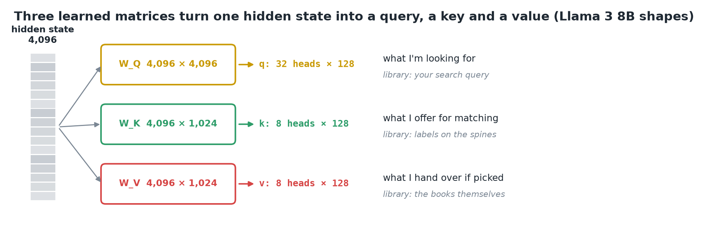
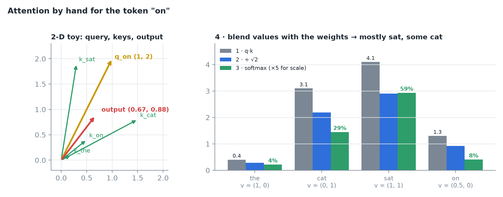
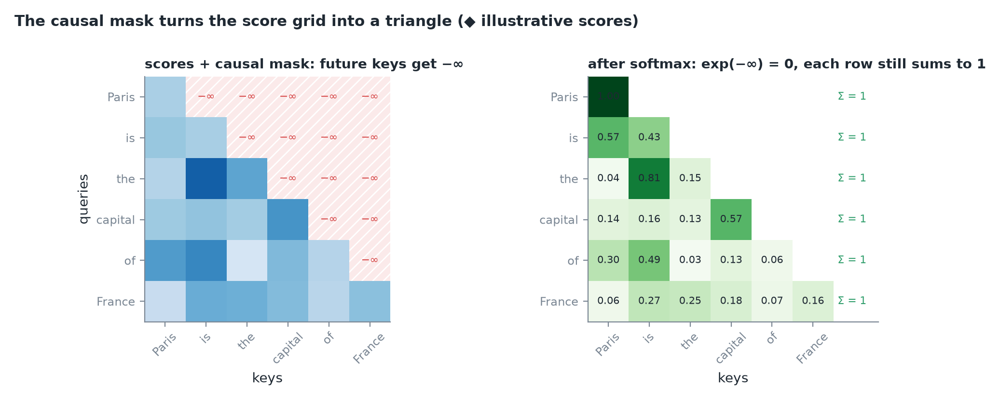
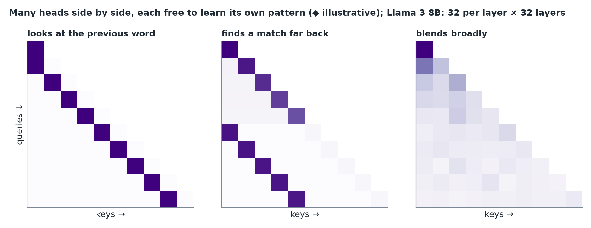
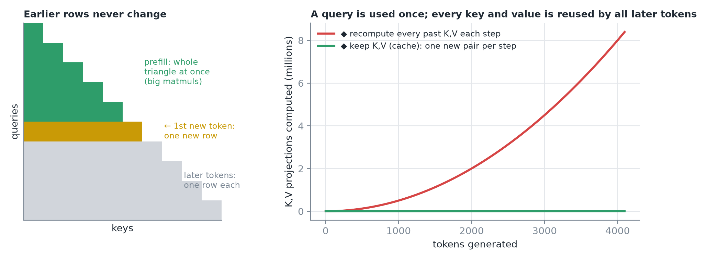
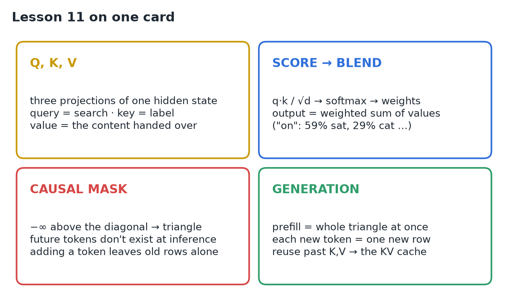

# 11 · Q, K, V & Causal Attention During Inference

**Source:** [fanout.sh / inference-eng / 02-02](https://fanout.sh/inference-eng/curriculum/02-02) · ~7 min

> [!NOTE]
> Attention lets each token **pull in information from earlier tokens**. Every token's hidden state is projected three ways: a **query** (what I'm looking for), a **key** (what I offer for matching) and a **value** (what I hand over). Scores are q·k, scaled and softmaxed into weights, and the output is a **weighted blend of values**. A **causal mask** blocks the future, so the score grid is a **triangle**. During generation, each new token adds **one new row**. Its query is used once, but every past key and value is **read again by every later token**. That is why the KV cache exists, and why decode is memory-bound.

## 1. Why tokens need to look back

In *"the animal didn't cross the street because it was too tired"*, the word **"it"** means nothing on its own. To be understood it has to **look back and find "animal"**. Attention is the mechanism that lets each position gather what it needs from earlier positions.

## 2. Query, key, value

Each token's hidden state (**4,096 numbers**) is multiplied by three **learned matrices**, W_Q, W_K and W_V, giving three new vectors.

*Library analogy: the query is your search, keys are the labels on the spines, values are the books you take home. ◆ W_K and W_V are 4,096 × 1,024 because Llama 3 8B keeps only 8 KV heads × 128.*

> [!TIP]
> Keys decide **who gets attention**; values decide **what gets passed along**. They are separate so a token can be easy to find for one reason and contribute something different.

## 3. Attention by hand

Tokens *the, cat, sat, on*, with 2-D vectors. The current token is **"on"**, query q = (1, 2).

*Scores are divided by √2 (the head size here is 2) before softmax.*

| Token | Key | q·k | Weight | Value |
|---|---|---|---|---|
| the | (0.2, 0.1) | 0.4 | 4% | (1, 0) |
| cat | (1.5, 0.8) | 3.1 | 29% | (0, 1) |
| sat | (0.3, 1.9) | **4.1** | **59%** | (1, 1) |
| on | (0.5, 0.4) | 1.3 | 8% | (0.5, 0) |

Output = 0.04·(1, 0) + 0.29·(0, 1) + 0.59·(1, 1) + 0.08·(0.5, 0) ≈ **(0.67, 0.88)**: mostly **sat**'s value, with some of **cat**'s.

## 4. The score grid and the causal mask

Do this for every token and you get a **grid of scores**: rows are queries, columns are keys. A token must **never see the future**, so every cell above the diagonal gets **−∞** before softmax. Since exp(−∞) = 0, those cells get **exactly zero weight**, and each row still sums to 1.

*The grid becomes a triangle: row i only mixes tokens 1 … i.*

- **In training**, the mask stops the model from cheating by peeking at the answer.
- **At inference**, the future doesn't exist yet anyway.
- **Consequence:** appending a token **never changes earlier rows**. Their masks already excluded it.

## 5. Many heads, many layers

One set of Q/K/V is one **head**. The model runs **many heads side by side**, and each learns its own pattern: one may track the previous word, another may find a matching name far back.

*◆ Illustrative patterns. Each head's outputs are concatenated back to 4,096.*

Llama 3 8B: **32 query heads** of 128, but only **8 KV heads**, each shared by a group of 4 query heads (grouped-query attention, GQA). Stored K/V is **4× smaller**. The whole thing repeats in **32 layers** (GQA details in 05 and 07).

## 6. What happens during generation

- **Prefill:** all prompt tokens are known, so the **whole triangle** is computed at once in big matrix multiplies.
- **Decode:** each new token adds **one row**: 1 query against all keys so far. Earlier rows are untouched (section 4).

*Right (◆): projecting every past K and V again at each step grows like N²/2; keeping them grows like N.*

> [!IMPORTANT]
> A token's **query is used once**, at its own step. Its **key and value are needed by every later token**. So engines store K and V instead of recomputing them: the **KV cache**. At 4,000 tokens × 128 KB ≈ **500 MB of K/V read for every generated token**, so decode is memory-bound.

## 7. Recap

## Interview cheat sheet

*Revise from these pages alone. ◆ = my addition beyond the video; everything else is from the lesson. Dot products, √d scaling, softmax, KV bytes per token and decode ops/byte are in 05; GQA vs Llama 2 is in 07.*

### Say it in 30 seconds

> Each token's hidden state is projected into a query, key and value. Scores are q·k / √d, softmaxed into weights, and the output is the weighted sum of values. A causal mask sets future scores to −∞, so the grid is a lower triangle and appending a token never changes earlier rows. Prefill computes the whole triangle; each decode step adds one row. Queries are used once, but keys and values are reread by every later token, so we cache them, and reading that cache makes decode memory-bound.

### Only numbers worth memorizing

- **Worked example:** q_on = (1, 2) → weights 4 / 29 / 59 / 8% → output **(0.67, 0.88)**, mostly "sat".

### Derive, don't memorize

#### 1. Masked attention in one line

Scores, mask, softmax, blend. The mask is added, not multiplied, so future cells become exp(−∞) = 0.

$$\mathrm{Attn}(Q, K, V) = \mathrm{softmax}\left(\frac{QK^{T}}{\sqrt{d}} + M\right) V \qquad M_{ij} = 0\ (j \leq i), \quad -\infty\ (j > i)$$

> [!TIP]
> Why −∞ and not 0? A score of 0 still gets weight e⁰ = 1. Only −∞ gives exactly zero.

#### 2. Work per step: the triangle vs one row

$$\mathrm{prefill\ cells} = \frac{n(n+1)}{2} \qquad \mathrm{decode\ step\ } t = t\ \mathrm{cells\ (one\ new\ row)}$$

> [!TIP]
> Earlier rows can't change, so decode never redoes them: it only needs the new query and every past K and V. Bytes for those are in 05, derivation 2.

#### 3. Why cache K and V, not Q ◆

Without a cache, step t projects all t past tokens again:

$$\sum_{t=1}^{N} t = \frac{N(N+1)}{2} \approx 8.4\mathrm{M}\ (N = 4096) \quad \mathrm{vs} \quad N = 4096\ \mathrm{with\ a\ cache}$$

> [!TIP]
> ◆ The cache trades compute for memory: projections drop from quadratic to linear, and the price is 128 KB per token of storage that must be read every step.

### Query vs key vs value

| | Query | Key | Value |
|---|---|---|---|
| Role | What I'm looking for | What I offer for matching | What I hand over |
| Library | Your search | Spine labels | The books |
| Heads (Llama 3 8B) | 32 × 128 | 8 × 128 | 8 × 128 |
| Lifetime | Used once, at its own step | Reread by every later token | Reread by every later token |
| Cached? | No | Yes | Yes |

### Symptom → diagnosis

| Symptom | Diagnosis |
|---|---|
| Training loss suspiciously low | Mask missing: the model peeks at future tokens |
| Earlier outputs shift when you append a token | ◆ Mask bug: attention isn't causal |
| Decode slows as the conversation grows | Each step rereads all past K/V |

### Rapid-fire Q&A

| Question | Crisp answer |
|---|---|
| Why separate keys and values? | Keys decide who is attended to; values decide what is passed on. |
| Is the mask needed at inference? | ◆ Yes in prefill: prompt tokens run in parallel and must not see later prompt tokens. |
| What does a new token add to the grid? | One row: 1 query × all keys so far. |
| What's the shape of the score grid per head? | n × n queries by keys, lower triangle after masking. |

> [!WARNING]
>
> - Thinking the mask is training-only: prefill still needs it ◆.
> - Caching queries: they're never reused.
> - Multiplying by a 0/1 mask after softmax: rows no longer sum to 1. Add −∞ before softmax.
