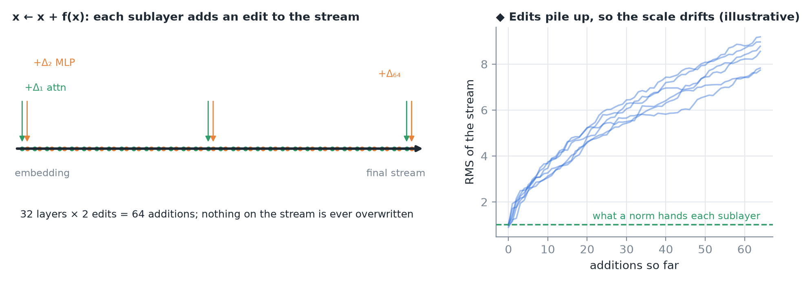
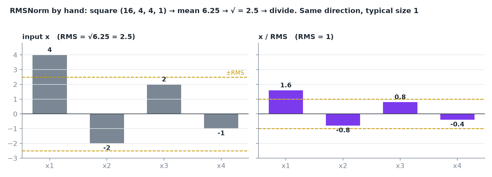
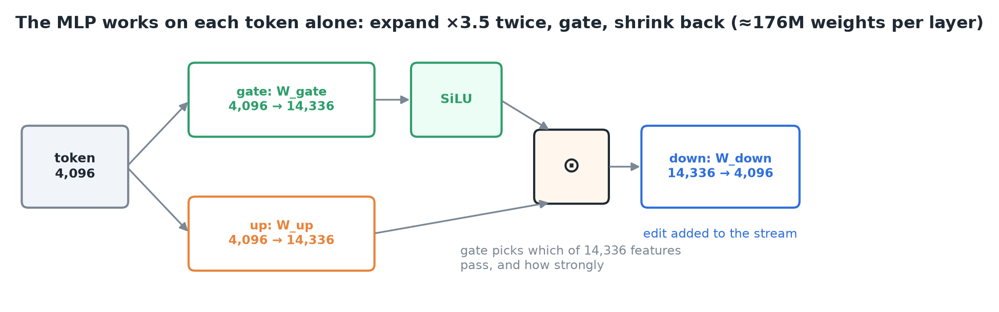
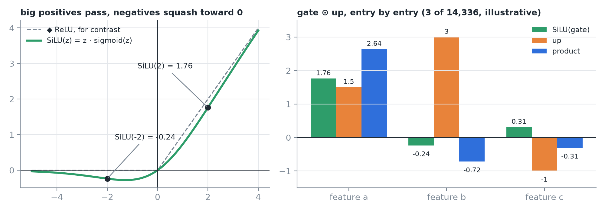
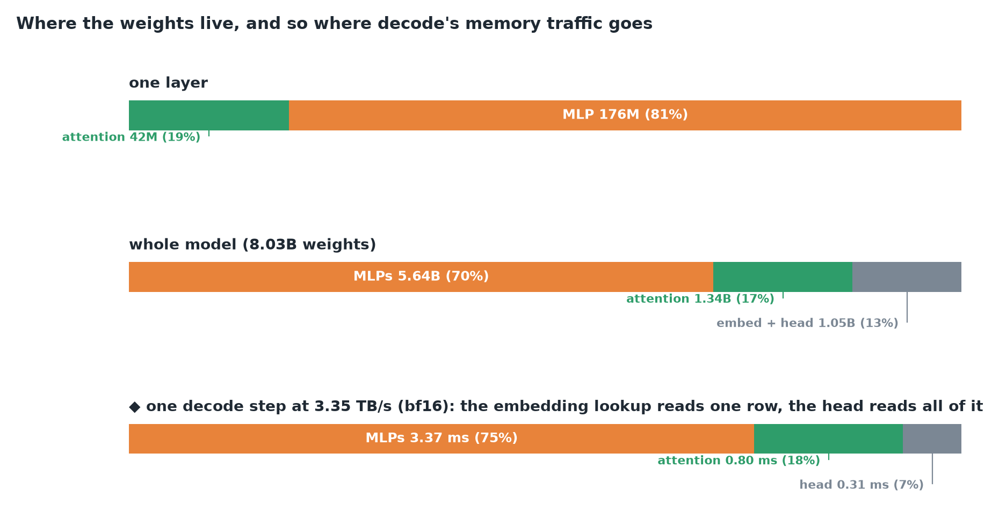
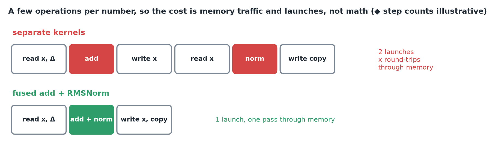
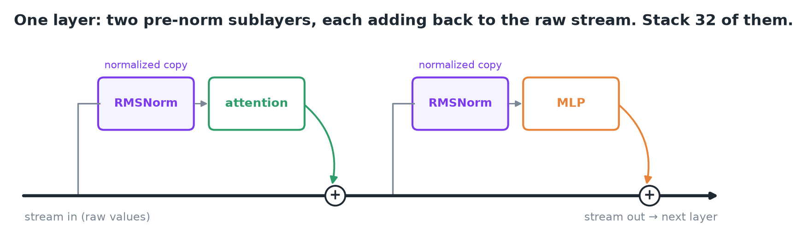
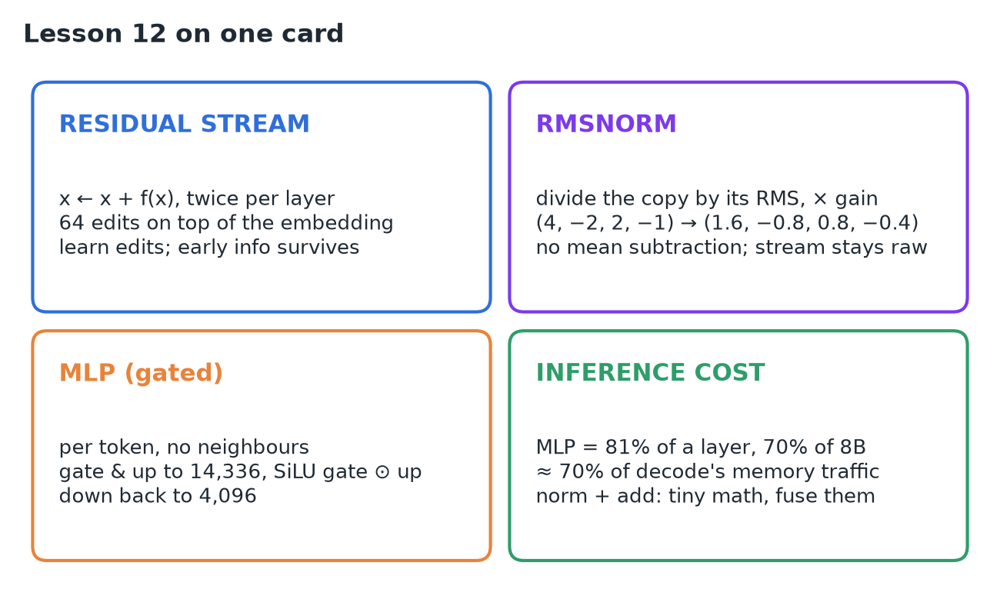

# 12 · MLP, RMSNorm & Residual Connections

**Source:** [fanout.sh / inference-eng / 02-03](https://fanout.sh/inference-eng/curriculum/02-03) · ~7 min

> [!NOTE]
> Besides attention, every layer has a **normalization step**, an **MLP** and **two additions**. The additions form the **residual stream**: each sublayer reads a copy, computes an edit and adds it back (x ← x + f(x)). **RMSNorm** rescales that copy to a predictable size before each sublayer. The **MLP** works on each token alone: expand 4,096 → 14,336 twice (gate and up), gate with SiLU, shrink back. For inference, the MLP is where the weights are: **81% of a layer, ~70% of the 8B model**, so ~70% of every decode step's memory traffic. Norms and adds are tiny math, so engines **fuse** them.

## 1. The residual stream: edits, not rebuilds

Think of each token's hidden state as a vector traveling down a highway through all 32 layers. A layer **doesn't replace** the vector: it reads a copy, computes a change, and **adds** the change back.

*Right (◆): adding edit after edit lets the stream's scale wander, which is why each sublayer gets a normalized copy.*

- Each layer adds **twice** (attention, then MLP), so the final stream = embedding + **64 edits**.
- A layer only has to learn a **useful edit**, not rebuild the whole representation.
- Information from early layers **survives to the end**, because nothing overwrites it.

## 2. RMSNorm: rescale the copy

Sublayers work best on inputs of a **predictable scale**, but the stream's numbers drift. So before attention and again before the MLP, the copy going in is normalized. Llama uses **RMSNorm** (root mean square normalization).

*Then a learned gain, one number per dimension, scales each entry back up or down.*

| | LayerNorm (older transformers) | RMSNorm (Llama) |
|---|---|---|
| Formula | γ · (x − μ) / σ + β | γ · x / RMS(x) |
| Subtracts the mean? | Yes | **No**: skipped, works just as well |
| Learned shift β? | Yes | No |

> [!IMPORTANT]
> **Only the copy is normalized.** The stream itself keeps its raw values.

## 3. The MLP: per-token feature gating

Attention **moves information between tokens**. The MLP (feed-forward network) works on **each token completely on its own** and never looks at its neighbors.

*Llama 3 8B: two 4,096 → 14,336 projections (gate, up), then down 14,336 → 4,096. The result is the edit added to the stream.*

The gate goes through **SiLU**, a smooth curve: big positive inputs pass almost unchanged, negative ones are squashed toward zero. The gated vector then multiplies the up vector **entry by entry**.

*SiLU(gate) ⊙ up = (1.76, −0.24, 0.31) ⊙ (1.5, 3, −1) = (2.64, −0.72, −0.31).*

> [!TIP]
> The gate decides, **per token**, which of the 14,336 features get through and how strongly. Researchers have found that much of what a model knows (facts, patterns) is **stored in these MLP weights**.

## 4. Where the weights are (and the memory traffic)

*Per layer: attention ≈ 42M, MLP ≈ 176M (81%). Whole model: MLPs hold 5.64B of 8.03B (70%).*

Generating one token means **reading every weight from memory**, so roughly **70% of every decode step's memory traffic is the MLP**. ◆ Per token, the embedding lookup reads only one row, so the MLP's share of bytes actually read is closer to 75%. Either way, the MLP is the first place to look when shrinking weights.

**Norms and adds** do only a few operations per number, but each still has to **read the whole hidden state from memory and write it back**. So engines **fuse** them: one kernel does the add and the norm in a single pass.

## 5. The full layer

*Normalized copy → attention → add back. Normalized copy → MLP → add back. Thirty-two of these make the model body, and the stream ends holding a rich vector for the last token.*

## 6. Recap

## Interview cheat sheet

*Revise from these pages alone. ◆ = my addition beyond the video; everything else is from the lesson. Parameter counts per block are derived in 07; the 4.8 ms decode floor in 01.*

### Say it in 30 seconds

> A transformer layer is two pre-norm sublayers on a residual stream: x ← x + attention(norm(x)), then x ← x + MLP(norm(x)). The stream carries 64 additive edits on top of the embedding, so early information survives and each sublayer only learns an edit. RMSNorm divides the copy by its root mean square and applies a learned gain, without mean subtraction. The MLP is per token: SiLU(gate) ⊙ up at 14,336 wide, then down to 4,096. It holds about 70% of the weights, so about 70% of decode's memory traffic. Norms and adds are memory-bound tiny ops, so they get fused.

### Only numbers worth memorizing

- **Llama 3 8B MLP:** 4,096 → **14,336** → 4,096; **81%** of a layer, **70%** of all weights (5.64B / 8.03B).

### Derive, don't memorize

#### 1. The stream is a sum of edits

Two adds per layer, nothing overwritten.

$$x_{\mathrm{final}} = x_{\mathrm{embed}} + \sum_{i=1}^{2L} \Delta_{i} \qquad 2L = 64\ \mathrm{for}\ L = 32$$

#### 2. RMSNorm by hand

Square, average, root, divide, then scale by the gain γ.

$$\mathrm{RMSNorm}(x) = \gamma \odot \frac{x}{\sqrt{\frac{1}{h}\sum_{j} x_{j}^{2}}} \qquad (4, -2, 2, -1): \sqrt{\frac{25}{4}} = 2.5 \Rightarrow (1.6, -0.8, 0.8, -0.4)$$

> [!TIP]
> LayerNorm adds two steps: subtract the mean first, add a learned β after. RMSNorm drops both. ◆ Real kernels add a tiny ε under the root to avoid dividing by zero.

#### 3. The gated MLP

Two expansions, one gated by SiLU, multiplied, then shrunk.

$$\mathrm{MLP}(x) = W_{\mathrm{down}} \left( \mathrm{SiLU}(W_{\mathrm{gate}} x) \odot W_{\mathrm{up}} x \right) \qquad \mathrm{SiLU}(z) = z \cdot \sigma(z) \qquad \mathrm{SiLU}(2) = 2 \times 0.88 \approx 1.76$$

#### 4. The MLP's share of a decode step ◆

$$\frac{32 \times 176\mathrm{M} \times 2\ \mathrm{B}}{3.35\ \mathrm{TB/s}} = \frac{11.3\ \mathrm{GB}}{3.35\ \mathrm{TB/s}} \approx 3.4\ \mathrm{ms\ of\ the} \approx 4.5\ \mathrm{ms\ step}$$

> [!TIP]
> ◆ By Amdahl (04), making only attention weights free caps decode speedup near 1.2×. Shrinking MLP weights (quantization, MoE) is the bigger lever.

### Attention vs MLP vs norm + add

| | Attention | MLP | RMSNorm + add |
|---|---|---|---|
| Mixes tokens? | Yes, across positions | No, per token | No, per number |
| Weights per layer | ≈ 42M | ≈ 176M | 4,096 gains |
| Decode cost | Weights + KV reads | ≈ 70% of weight reads | Memory passes, launches |
| Inference fix | GQA, KV cache | ◆ Quantize, MoE | Fuse into one kernel |

### Symptom → diagnosis

| Symptom | Diagnosis |
|---|---|
| Hidden-state values grow layer by layer | Normal: the raw stream accumulates edits; only copies are normalized |
| Profiler shows many tiny norm/add kernels | Unfused: each re-reads and re-writes the hidden state |
| ◆ Quantized attention only, decode barely faster | MLP weights dominate the bytes read |

### Rapid-fire Q&A

| Question | Crisp answer |
|---|---|
| Why residual connections? | Layers learn edits, and early information is never overwritten. |
| What's the difference between RMSNorm and LayerNorm? | No mean subtraction and no shift; works just as well. |
| Does the MLP see other tokens? | No. Attention moves information between tokens; the MLP is per token. |
| What does the gate do? | Picks which of 14,336 features pass for this token, and how strongly. |
| Why fuse add and norm? | Tiny math, but each would read and write the whole hidden state. |

> [!WARNING]
>
> - Saying the norm changes the stream: only the sublayer's copy is normalized.
> - Assuming attention dominates the weights: the MLP is 81% of a layer.
> - Judging norm/add cost by FLOPs: it's memory passes and launches.
