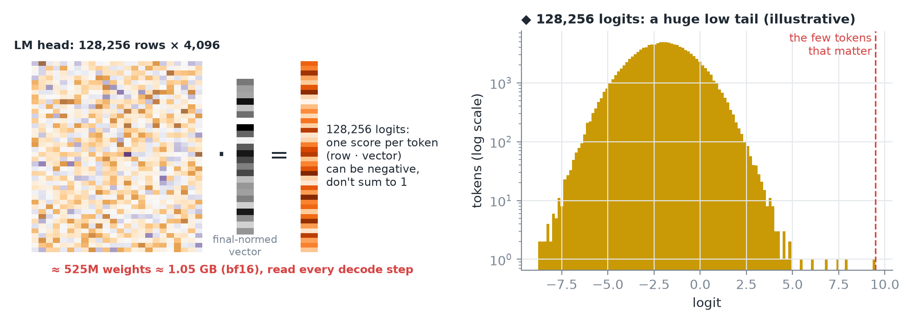
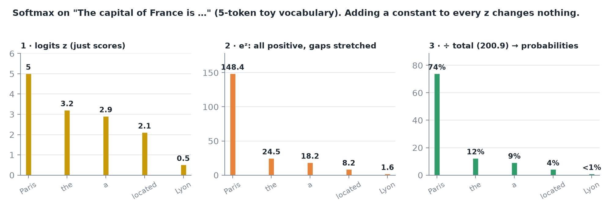
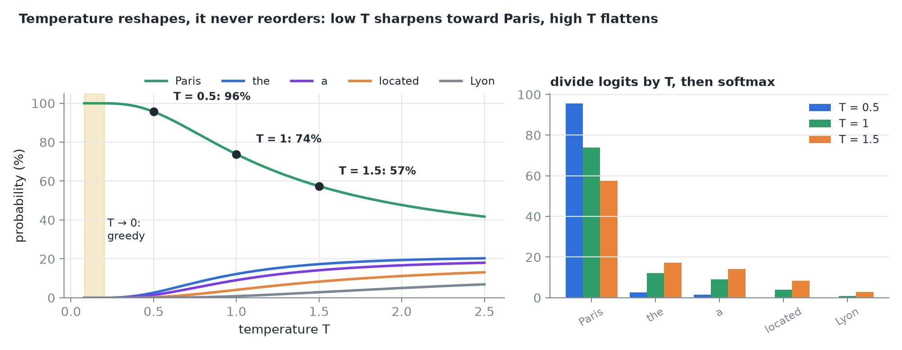
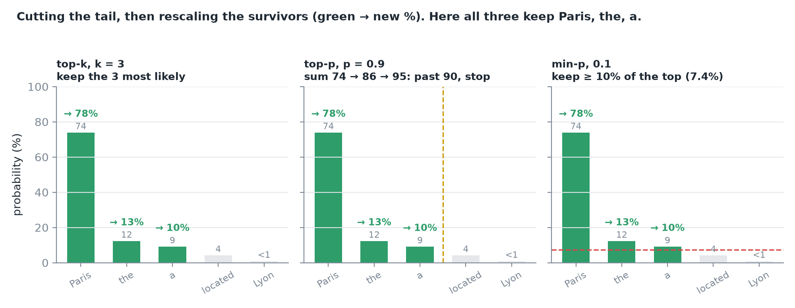
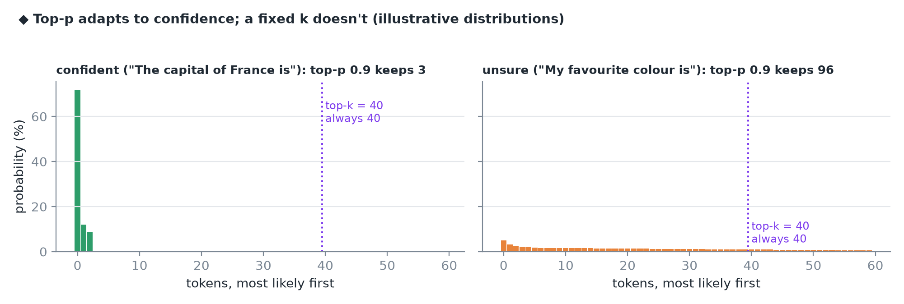
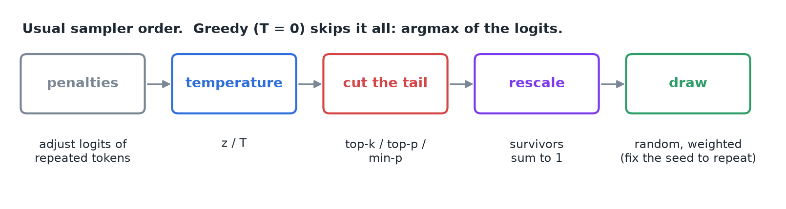
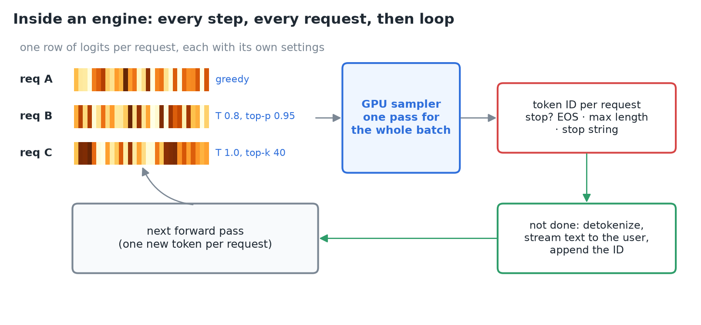
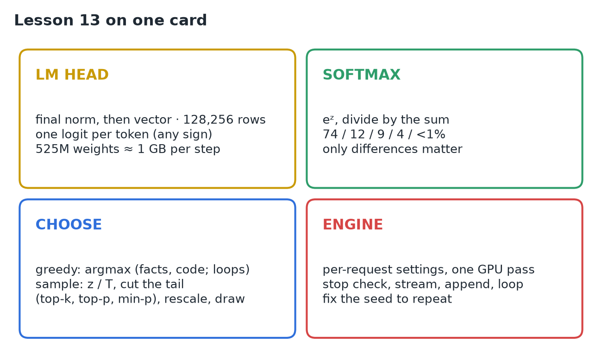

# 13 · Logits, Sampling & the Next Token

**Source:** [fanout.sh / inference-eng / 02-04](https://fanout.sh/inference-eng/curriculum/02-04) · ~7 min

> [!NOTE]
> After 32 layers, the last token's vector becomes text in three steps: **scores** for every vocabulary entry, **probabilities** from the scores, and **one choice**. The **LM head** (after one last RMSNorm) dots the vector with **128,256 rows** to get **logits**. **Softmax** turns them into probabilities, and only their **differences** matter. Then either take the top one (**greedy**) or **sample**, after **temperature** reshapes the distribution and **top-k / top-p / min-p** cut its tail. An engine does this for **every request in the batch, every step**, on the GPU, then checks for a stop, streams, appends and loops.

## 1. The LM head: one score per token

The vector gets **one last RMSNorm**, then is multiplied by the **language model head**: a matrix with **one row per vocabulary token** (128,256 for Llama 3). Each row is a direction in the same 4,096-d space; the **dot product** with the vector is that token's score, its **logit**. Rows pointing the same way as the vector get high logits.

*128,256 × 4,096 ≈ 525M weights ≈ 1 GB in bf16, read on every decode step.*

> [!TIP]
> Only the **last position's** logits pick the next token, so during prefill engines run the head for **one position**, not the whole prompt (sizes in 10).

## 2. Softmax: scores to probabilities

Logits are just scores: they can be **negative** and don't add up to anything. Toy vocabulary, prompt *"The capital of France is"*:

*Raise e to each logit (all positive, gaps stretched), then divide by the total (200.9) so they sum to 1.*

> [!IMPORTANT]
> Adding the same number to every logit **changes nothing**. Only the **differences** between logits matter.

## 3. Choosing: greedy or sample

- **Greedy:** always take the most likely token (here, Paris). **Fast and repeatable**, great for facts and code. In open-ended writing it can **lock into loops** (*"…and the cat sat on the mat and the cat sat on the mat…"*).
- **Sample:** draw at random, **weighted by the probabilities**.

**Temperature** reshapes the probabilities before the draw: divide every logit by **T**, then softmax again.

*T = 1 changes nothing; T = 0.5 stretches the gaps (Paris 96%); T = 1.5 squeezes them (Paris 57%). As T → 0, sampling becomes greedy, which is why APIs treat temperature 0 as greedy.*

## 4. Cutting the tail

Even at a sensible temperature, the ~128,000 unlikely tokens **share a little probability**. Draw enough tokens and one of the weird ones eventually gets picked. So we **cut off the tail** and rescale what's left to sum to 1.

*Top-k keeps a fixed count; top-p keeps the smallest set whose running sum passes p; min-p keeps any token at least a fraction of the top one's probability.*

A **fixed k ignores how confident** the model is. **Top-p adapts**: when the model is confident, the nucleus is tiny; when it's unsure, it grows. **Min-p** is a newer rule with the same spirit.

The usual order:

## 5. Inside an engine

Serving many requests at once, each step produces **one row of logits per request**, and **every request can bring its own settings** (one greedy, another T 0.8 with top-p 0.95). The engine's **sampler applies each request's settings to its own row, all on the GPU, in one pass**.

*Out comes one token ID per request. Stop if it's an end-of-text token, the maximum length, or a stop string. Otherwise turn the ID back into text, stream it, and append it so the next forward pass produces the token after it.*

Need the **same sampled output twice**? Fix the **random seed**.

## 6. Recap

## Interview cheat sheet

*Revise from these pages alone. ◆ = my addition beyond the video; everything else is from the lesson. Softmax overflow (subtract the max) is in 05; last-row-only logit sizes in 10; Llama 3.1's default sampling settings in 08.*

### Say it in 30 seconds

> The final-normed vector is dotted with the LM head's 128,256 rows to give logits, one score per token. Softmax exponentiates and normalizes them, and only logit differences matter. Greedy takes the argmax: repeatable, good for facts and code, but it can loop. Sampling divides logits by a temperature, cuts the tail with top-k, top-p or min-p, rescales, and draws; T → 0 is greedy. An engine applies each request's settings to its own logits row on the GPU in one pass, checks stop conditions, streams, appends, and loops. Fix the seed to reproduce samples.

### Only numbers worth memorizing

- **Toy logits 5 / 3.2 / 2.9 / 2.1 / 0.5** → 74 / 12 / 9 / 4 / <1%. Paris at T = 0.5: **96%**; at T = 1.5: **57%**.

### Derive, don't memorize

#### 1. Only gaps over T matter

Divide any two probabilities: the softmax denominator cancels, leaving the logit gap scaled by T.

$$\frac{p_{i}}{p_{j}} = e^{(z_{i} - z_{j})/T} \qquad \frac{p_{\mathrm{Paris}}}{p_{\mathrm{the}}} = e^{1.8} \approx 6\ (T = 1), \quad e^{3.6} \approx 37\ (T = 0.5)$$

> [!TIP]
> Add c to every logit and the gap is unchanged, so nothing moves. As T → 0 every ratio blows up and the top token takes everything: greedy. Temperature never reorders tokens.

#### 2. Cut, then rescale

Keep a set S of tokens, then divide each survivor by the kept mass.

$$p'_{i} = \frac{p_{i}}{\sum_{j \in S} p_{j}} \qquad \mathrm{top}\ p = 0.9: 74, 86, 95 \Rightarrow 3\ \mathrm{kept}, \quad p'_{\mathrm{Paris}} = \frac{74}{95} \approx 78\%$$

> [!TIP]
> Min-p 0.1 keeps p ≥ 0.1 × 74% = 7.4%: the same three tokens here. Top-k = 3 keeps them by count.

#### 3. The head is a fixed cost per step ◆

$$V \cdot h \cdot 2\ \mathrm{B} = 128256 \times 4096 \times 2 \approx 1.05\ \mathrm{GB} \qquad \frac{1.05\ \mathrm{GB}}{3.35\ \mathrm{TB/s}} \approx 0.31\ \mathrm{ms\ per\ decode\ step}$$

### Decoding rules compared

| Rule | What it does | Adapts to confidence? | Toy result |
|---|---|---|---|
| Greedy (T = 0) | argmax | n/a | Paris, always |
| Temperature | z / T before softmax | Reshapes, keeps order | Paris 96% (0.5), 57% (1.5) |
| Top-k | Keep the k most likely | No: fixed count | k = 3 → 78 / 13 / 10 |
| Top-p | Smallest set with Σ ≥ p | Yes: nucleus grows when unsure | p = 0.9 → 3 tokens |
| Min-p | Keep p ≥ m × p_max | Yes: relative to the top | m = 0.1 → cutoff 7.4% |

### Symptom → diagnosis

| Symptom | Diagnosis |
|---|---|
| Output repeats the same phrase | Greedy on open-ended text: sample, or add penalties |
| Rare bizarre token mid-answer | No tail cut: add top-p or min-p |
| Can't reproduce a sampled answer | Seed not fixed |

### Rapid-fire Q&A

| Question | Crisp answer |
|---|---|
| What is a logit? | The dot product of the final vector with one LM-head row: an unnormalized score. |
| Why compute logits only at the last position? | Only it picks the next token; prefill runs the head for one position. |
| Why is temperature 0 allowed? | APIs treat it as greedy, the T → 0 limit. |
| Why top-p over top-k? | A fixed k ignores confidence; top-p's nucleus shrinks or grows. |
| What order does a sampler apply? | Penalties, temperature, cut the tail, rescale, draw. |
| How do mixed settings share a batch? | Each request's settings apply to its own logits row, in one GPU pass. |
| When does a request stop? | End-of-text token, maximum length, or a stop string. |

> [!WARNING]
>
> - Thinking temperature reorders tokens: it only sharpens or flattens.
> - Forgetting to rescale after cutting the tail: survivors must sum to 1.
> - Treating logits as probabilities: they can be negative and don't sum to 1.
