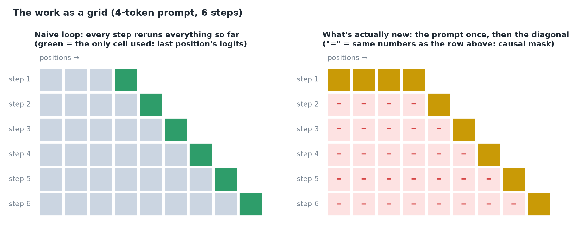
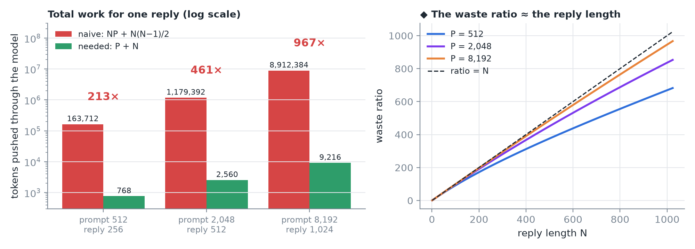
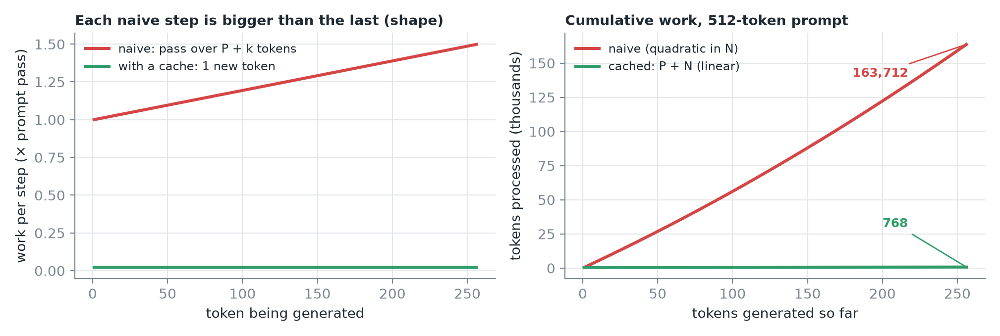
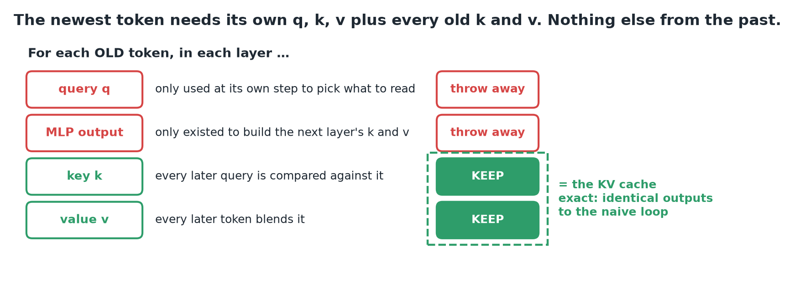
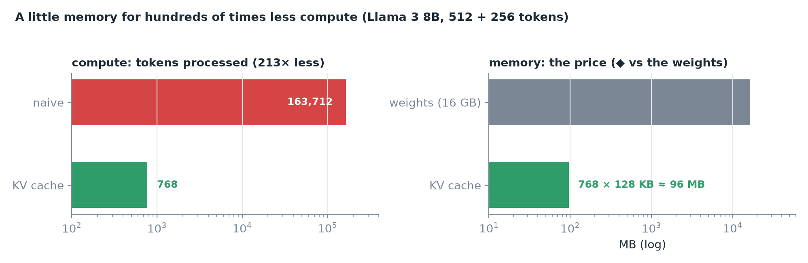
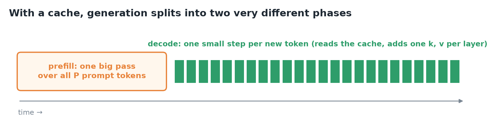
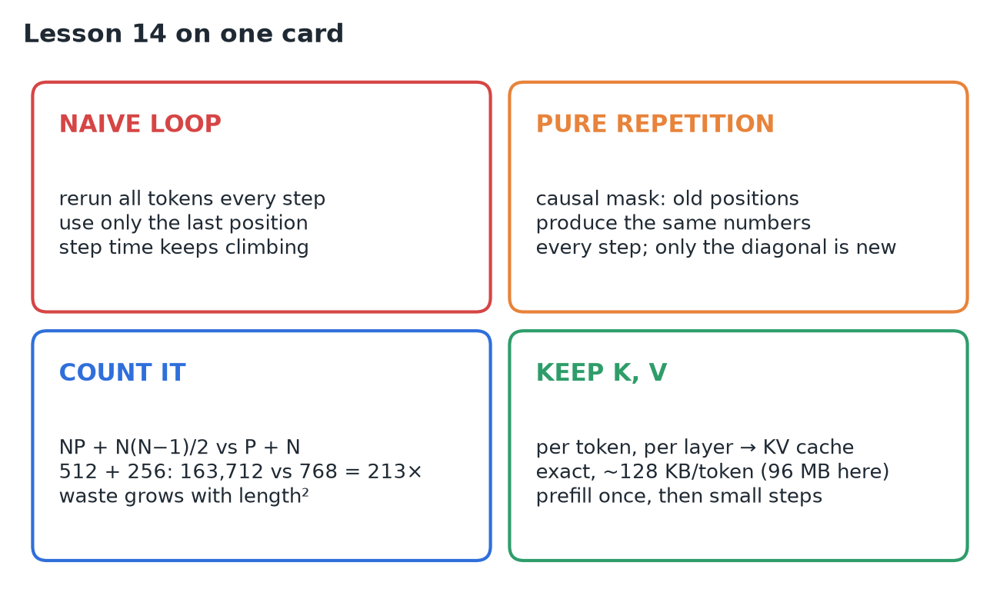

# 14 · Why Autoregressive Generation Recomputes Work

**Source:** [fanout.sh / inference-eng / 03-01](https://fanout.sh/inference-eng/curriculum/03-01) · ~6 min

> [!NOTE]
> A 512-token prompt plus a 256-token reply is **768 tokens of text**, but the obvious generation loop pushes **163,712 tokens** through the model: **213× more**. The loop reruns the whole sequence every step yet uses **only the last position's logits**. Because of the **causal mask**, every old position produces **exactly the same numbers** every step, so the waste is pure repetition, and it grows with the **square** of the length. The newest token only needs **every old token's keys and values, in every layer**. Save those (the **KV cache**) and each token goes through the model once. The cache is **exact**, and costs ~**128 KB per token** (≈ 96 MB here).

## 1. The obvious loop

Run the model on all tokens so far, take the logits at the last position, pick a token, append it, repeat.

```python
while not done:
    logits = model(tokens)          # full pass over everything so far
    nxt = sample(logits[-1])        # only the last position is used
    tokens.append(nxt)
```

Draw the work as a grid: **rows are steps, columns are positions**. Step 1 covers the prompt, step 2 the prompt plus one token, and so on. The rows grow into a **staircase**.


*Left: each step uses only its last cell; the rest is computed and thrown away. Right: only the diagonal is genuinely new.*

## 2. The thrown-away work is the same work

Recall the **causal mask**: a token sees only itself and earlier tokens. So everything the model computes at position 5, in every layer, depends **only on tokens 1–5**. Adding token 6 can't change it.

> [!IMPORTANT]
> Column 5 holds **identical numbers** in step 1, step 2 and every step after, and so does every old column. Only **one cell per row is new**: the diagonal, where the newest token enters. Everything left of it is **recomputation**.

## 3. Count it

With a prompt of **P** tokens and a reply of **N**, the naive loop processes P, then P + 1, then P + 2, … The total is **NP + N(N − 1)/2**. The work actually needed is **P + N**: each token once.


*The video rounds the middle and right cases to "2,000 + 500" and "8,000 + 1,000"; its 461× and "almost 1,000×" come from 2,048 + 512 and 8,192 + 1,024. Right (◆): the ratio sits a bit under N and approaches it as the prompt grows.*

You feel it in **latency** too: each naive step is a bigger pass than the last, so **time per token keeps climbing** as the reply grows.



## 4. What the newest token actually needs

Trace the new token through one layer. It needs its **own query, key and value** (from its own hidden state), then compares its query with **every earlier token's key** and blends their **values**.


*Old queries and old MLP outputs only existed to produce the old tokens' keys and values one layer up.*

Save each old token's **keys and values in every layer**, and the new token has everything it needs. Each token then goes through the model **once**, adds its K and V to the store, and is never recomputed. That store is the **KV cache**.

> [!TIP]
> The cache is **exact**: outputs are identical to the naive loop. The price is memory.


*~128 KB per token for Llama 3 8B (derived in 05). 768 tokens × 128 KB ≈ 96 MB.*

With a cache, generation splits into two very different phases:



## 5. Recap



## Interview cheat sheet

*Revise from these pages alone. ◆ = my addition beyond the video; everything else is from the lesson. KV bytes per token (128 KB) are derived in 05; KV capacity on an 80 GB GPU in 02.*

### Say it in 30 seconds

> The naive loop reruns the model over the whole sequence each step but uses only the last position's logits. Under the causal mask, old positions produce identical numbers every step, so all of that is recomputation, and it totals NP + N²/2 instead of P + N: 213× for 512 + 256. The new token only needs its own q, k, v and every old token's keys and values per layer, so we cache K and V. The KV cache is exact, costs ~128 KB per token on Llama 3 8B, and splits generation into one big prefill pass and small decode steps.

### Only numbers worth memorizing

- **512 + 256 tokens:** naive **163,712** vs needed **768** (≈ **213×**); cache ≈ **96 MB**.

### Derive, don't memorize

#### 1. Naive work is a staircase

Step k passes over P + k tokens; add the steps.

$$\sum_{k=0}^{N-1} (P + k) = NP + \frac{N(N-1)}{2} \qquad 512 \times 256 + \frac{256 \times 255}{2} = 131072 + 32640 = 163712$$

#### 2. The waste ratio approaches the reply length ◆

$$\frac{NP + N^{2}/2}{P + N} \rightarrow N\ (P \gg N) \qquad 213\ (N = 256), \quad 461\ (N = 512), \quad 967\ (N = 1024)$$

> [!TIP]
> ◆ Each generated token reruns roughly the whole context, so N tokens cost about N full passes. That is why the waste is quadratic in total length.

#### 3. What to keep, and what it costs

$$\mathrm{cache} = \mathrm{tokens} \times \mathrm{KV/token} = 768 \times 128\ \mathrm{KB} \approx 96\ \mathrm{MB}$$

> [!TIP]
> Causal mask ⇒ old K, V never change ⇒ store them once. Old queries are never reused, and old MLP outputs only fed the next layer's K, V.

### Naive loop vs KV cache

| | Naive loop | KV cache |
|---|---|---|
| Work per step | Whole sequence (P + k tokens) | One new token |
| Total work | NP + N(N − 1)/2 | P + N |
| Time per token | Keeps climbing | Roughly flat ◆ (grows slowly with cache reads) |
| Extra memory | None | ~128 KB per token |
| Outputs | Reference | Identical (exact) |

### Symptom → diagnosis

| Symptom | Diagnosis |
|---|---|
| Time per token climbs as the reply grows | No KV cache: every step reruns the sequence |
| GPU memory grows with conversation length | Expected: the cache adds ~128 KB per token |
| ◆ Cached and uncached outputs disagree beyond float noise | Cache bug (wrong positions or a stale entry) |

### Rapid-fire Q&A

| Question | Crisp answer |
|---|---|
| Why is the naive loop wasteful? | It reruns every position each step and keeps only the last logits. |
| Why can old work be reused at all? | The causal mask: position i depends only on tokens 1 … i. |
| Why not cache queries or MLP outputs? | Old queries are never used again; MLP outputs only built the next layer's K, V. |
| Is the KV cache an approximation? | No: outputs are identical to the naive loop. |
| How does the waste scale? | Quadratically in length; the ratio is a bit under the reply length. |

> [!WARNING]
>
> - Calling the KV cache approximate: it's exact.
> - Thinking the waste is linear: total naive work is quadratic in length.
> - Forgetting the price: cache memory grows with every token of every request.
