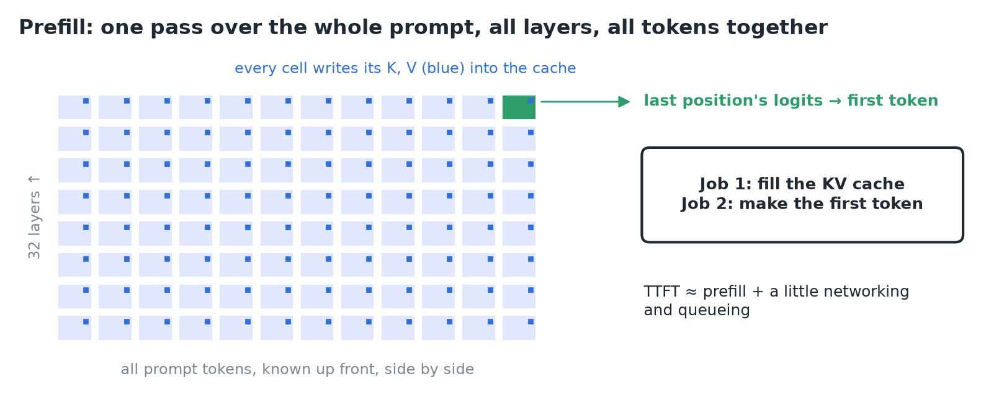
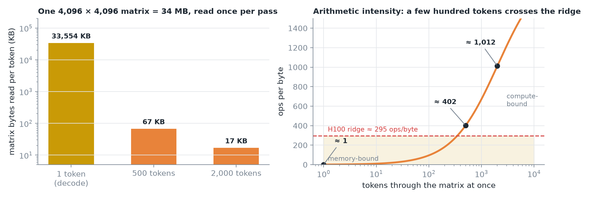
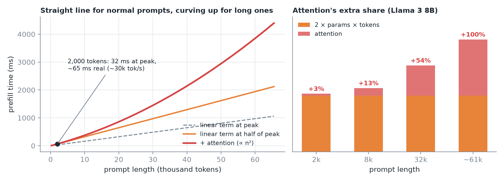
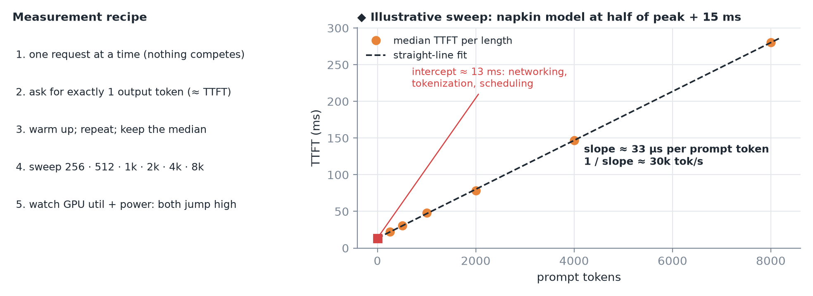
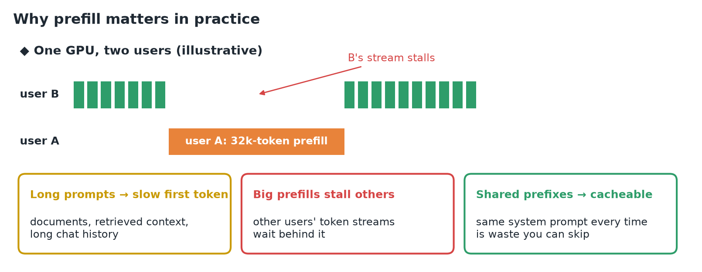
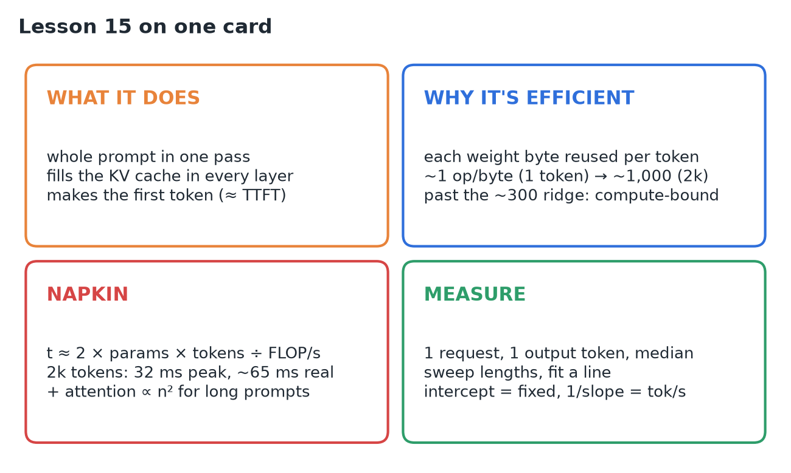

# 15 · Understand & Measure the Prefill Phase

**Source:** [fanout.sh / inference-eng / 03-02](https://fanout.sh/inference-eng/curriculum/03-02) · ~6 min

> [!NOTE]
> Most of the pause before the first word is **prefill**: one pass of the model over **every prompt token at once**, which **fills the KV cache** in every layer and **produces the first token**. So TTFT ≈ prefill + a little networking and queueing. Prefill is efficient because each weight byte read is **reused by every prompt token**: ~1 op/byte for one token, ~400 for 500, ~1,000 for 2,000, past the H100's **~300 ridge**, so it's **compute-bound**. Napkin: **time ≈ 2 × params × tokens ÷ achievable FLOP/s**: 2,000 tokens on Llama 3 8B ≈ 32 ms at peak, **~65 ms** real (~30k tokens/s). Attention adds a term **∝ n²** that only matters for long prompts. Measure it with **one request, one output token, a length sweep and a line fit**.

## 1. What prefill does

With a KV cache, generation has two phases, and prefill is the first. The whole prompt is **known up front**, so no token waits for another: all 2,000 tokens flow through all 32 layers **together**.

*Each layer writes keys and values for every prompt token into the cache. At the end, only the last position's logits are used.*

> [!IMPORTANT]
> Prefill does **two jobs**: fill the cache, and make the first token. That's why **TTFT is mostly prefill**, plus a little networking and queueing.

## 2. Why prefill is so efficient

Take one **4,096 × 4,096** weight matrix: about **34 MB** that the GPU must read from memory to use it.

- **Decode:** one token passes through it. 34 MB read for one small vector of work.
- **Prefill:** 2,000 tokens pass through, and it's read **once**. Every byte is reused 2,000 times.

*Arithmetic intensity = math operations ÷ bytes read. Below ~300 ops/byte an H100 waits on memory; above it, the math units are the limit.*

> [!TIP]
> A prompt of **a few hundred tokens** is already enough to make prefill compute-bound.

## 3. The napkin estimate

A forward pass costs about **2 operations per parameter per token**.

- Llama 3 8B, 2,000-token prompt: 2 × 8B × 2,000 ≈ **32 trillion operations**.
- H100 peak ≈ 1,000 trillion/s (16-bit) → **~32 ms** at peak.
- Real kernels reach **maybe half of peak** → expect **~65 ms**, around **30,000 prompt tokens/s**.

One more term: **attention** compares every token with every earlier one, so its work grows with **the square of the prompt length**.

*≈ +3% at 2k tokens, more than half again at 32k, and equal to everything else around 60k. Prefill time is a straight line for normal prompts, curving upward for very long ones.*

## 4. Measure it for real

*The intercept is the fixed cost (networking, tokenization, scheduling); the slope is time per prompt token, and 1 / slope is your prefill throughput.*

Compare the result with the napkin estimate: **far below half of peak means something's wrong**. Watch the GPU too: during a long prefill, **utilization and power draw jump high**, the signature of compute-bound work.

## 5. Why prefill matters in practice

*The fixes are known as **chunked prefill** and **prefix caching**.*

## 6. Recap

## Interview cheat sheet

*Revise from these pages alone. ◆ = my addition beyond the video; everything else is from the lesson. The ~300 ops/byte ridge and the at-peak prefill estimate are in 01, derivation 2; MFU in 09.*

### Say it in 30 seconds

> Prefill runs the whole prompt through the model in one pass, writing every token's K and V into the cache in every layer, and the last position's logits give the first token, so TTFT is mostly prefill. Each weight byte is reused by every prompt token, so a few hundred tokens push arithmetic intensity past the ~300 ridge and prefill is compute-bound. Estimate it as 2 × params × tokens ÷ achievable FLOP/s: about 65 ms for 2k tokens on Llama 3 8B at half of H100 peak, plus an n² attention term for long prompts. Measure with single requests, max_tokens = 1, warm-up and medians over a length sweep, then fit a line.

### Only numbers worth memorizing

- **Llama 3 8B, 2k-token prompt on an H100:** ~**65 ms** (half of peak), ~**30k tokens/s**; attention adds ~**3%** at 2k, ~**+54%** at 32k.

### Derive, don't memorize

#### 1. Intensity of one matmul with T tokens

FLOPs: 2Th². Bytes: the h² weights once, plus T input and T output activations (2 bytes each).

$$\mathrm{AI} = \frac{2Th^{2}}{2h^{2} + 4Th} = \frac{Th}{h + 2T} \qquad T = 1: 1, \quad 500: \approx 400, \quad 2000: \approx 1000$$

> [!TIP]
> For small T the weights dominate the bytes, so AI ≈ T: every extra token is nearly free math on bytes already read. ◆ For huge T it saturates near h/2, because activations dominate.

#### 2. Prefill time from the FLOPs

$$t \approx \frac{2 \cdot N \cdot n}{\mathrm{MFU} \times \mathrm{peak}} = \frac{2 \times 8\mathrm{B} \times 2000}{0.5 \times 989\ \mathrm{TFLOPS}} \approx 65\ \mathrm{ms} \quad \Rightarrow \quad \frac{2000}{65\ \mathrm{ms}} \approx 30\mathrm{k\ tok/s}$$

#### 3. When attention starts to matter

Causal attention is about half of an n × n square per layer (scores plus value mixing), against 2N per token for the weights.

$$\frac{2 L n^{2} h}{2 N n} = \frac{L h n}{N} = \frac{32 \times 4096 \times n}{8\mathrm{B}} \approx 3\%\ (2\mathrm{k}), \quad 54\%\ (32\mathrm{k}), \quad 100\%\ (\approx 61\mathrm{k})$$

#### 4. Read the sweep as a line

$$\mathrm{TTFT}(n) \approx t_{0} + \frac{n}{\mathrm{prefill\ tok/s}} \qquad \mathrm{intercept} = t_{0}, \quad \frac{1}{\mathrm{slope}} = \mathrm{throughput}$$

### What the sweep tells you

| Feature | Meaning |
|---|---|
| Intercept | Fixed cost: networking, tokenization, scheduling |
| Slope | Time per prompt token |
| 1 / slope | Prefill throughput (tokens/s) |
| ◆ Upward curve at long lengths | The n² attention term |
| High GPU util and power | Compute-bound work, as expected |

### Symptom → diagnosis

| Symptom | Diagnosis |
|---|---|
| Measured throughput far below half the napkin | Something's wrong: investigate the setup |
| TTFT numbers jump around | Concurrent requests, no warm-up, or no median |
| Other users' streams stall during long prompts | A big prefill occupies the GPU (fix: chunked prefill) |
| The same long system prompt is slow every time | Shared prefix recomputed (fix: prefix caching) |

### Rapid-fire Q&A

| Question | Crisp answer |
|---|---|
| What two jobs does prefill do? | Fills the KV cache and produces the first token. |
| Why can prefill run all tokens at once? | The whole prompt is known up front; no token waits for another. |
| Why is prefill compute-bound? | Each weight byte is reused by every prompt token. |
| Why set max_tokens = 1 when measuring? | The response time is then basically TTFT. |
| When does attention dominate prefill? | Around 60k tokens on Llama 3 8B; ~3% at 2k. |

> [!WARNING]
>
> - Measuring TTFT under concurrent load: other requests contaminate it.
> - Estimating at peak FLOP/s: real kernels reach about half.
> - Assuming prefill is linear forever: attention bends it upward at long prompts.
