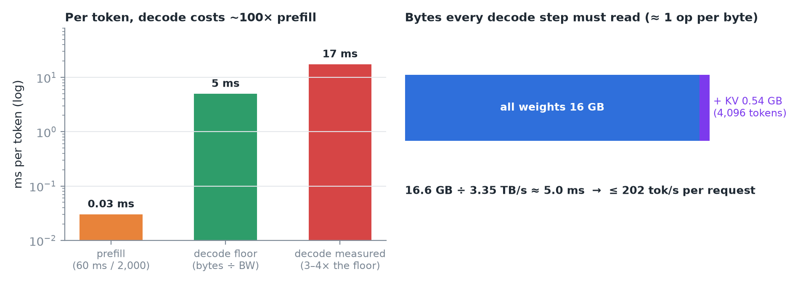
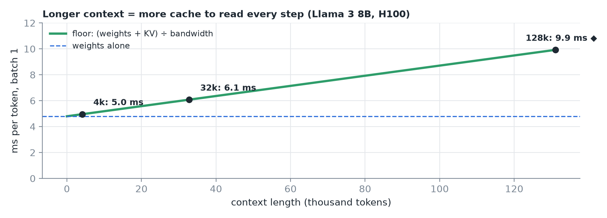
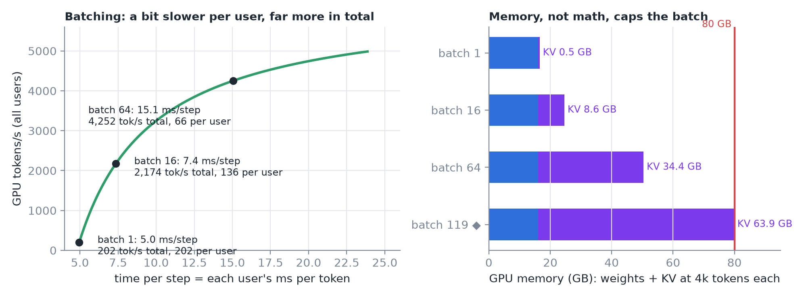
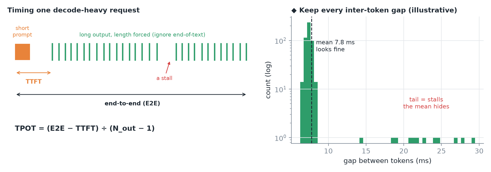
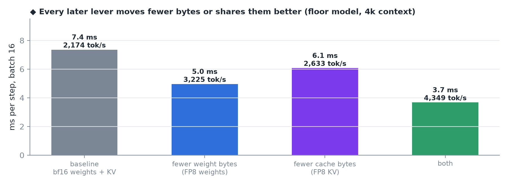
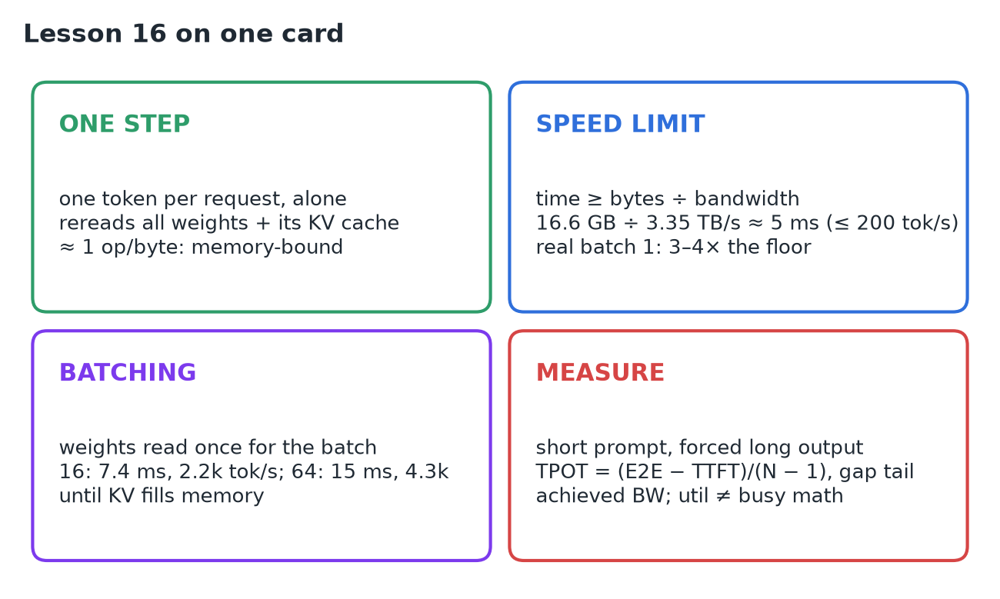

# 16 · Understand & Measure the Decode Phase

**Source:** [fanout.sh / inference-eng / 03-03](https://fanout.sh/inference-eng/curriculum/03-03) · ~6 min

> [!NOTE]
> Prefill handles 2,000 tokens in ~60 ms; decode then spends **several ms on every single token**, so per token it can be **~100× more expensive**. Each decode step pushes the newest token through all 32 layers **alone** (vector × matrix) and must read **all the weights plus this request's whole KV cache**, doing ~1 op per byte: **memory-bound**. So **time per token ≥ bytes ÷ bandwidth**: ~16.6 GB ÷ 3.35 TB/s ≈ **5 ms** (≤ ~200 tokens/s per request), and real batch-1 systems land **3–4× above** that floor. **Batching** shares the weight read: batch 64 is 15 ms per step but **>4,000 tokens/s**, until the **KV cache fills memory**. Measure with a short prompt, a forced long output, TPOT, the inter-token gap tail, and a concurrency sweep.

## 1. One decode step

The newest token goes through all 32 layers **by itself**. In each layer it meets every weight matrix, but as **one vector times a matrix**, not a block of tokens. In attention, its query reads the **keys and values of every earlier token** from the cache. One token comes out, its K and V join the cache, and the next step begins.

*Every step reads two things: all the weights and this request's whole KV cache, with ~1 op per byte against the H100's ~300 ridge.*

> [!IMPORTANT]
> Decode is **memory-bound**: the GPU spends its time waiting for bytes, so its speed limit is **bytes read ÷ memory bandwidth**.

## 2. The speed limit

- Llama 3 8B weights ≈ **16 GB**; a 4,096-token conversation adds ≈ **0.5 GB** of KV cache.
- 16.6 GB ÷ 3.35 TB/s ≈ **5 ms per token**: one request can't beat ~**200 tokens/s** on this GPU.
- Longer context means more cache to read: at **32k tokens** the floor rises to ~**6 ms**.

> [!WARNING]
> Real systems land **above** the floor. One recent study measured batch-1 decode of 7–8B models on H100s at **a quarter to a third** of this ideal: small kernels and launch overheads eat the time. The floor tells you **where the ceiling is, not where you are**.

## 3. Batching: how servers reach thousands of tokens/s

If 16 requests decode together, the **weights are read once for all 16**. Each request still reads its own KV cache, but the big 16 GB read is **shared**.

*Left: each user's stream slows a little; the GPU does far more. Right: every request keeps its KV cache in memory; 64 requests × 4k tokens ≈ 34 GB on top of 16 GB of weights. ◆ At 4k each, ~119 fit in 80 GB (see 02).*

> [!TIP]
> Decode's central trade-off is **latency per user vs total throughput**, and **memory, not math, caps the batch**.

## 4. Measure it honestly

- **Short prompt, long output** (a few hundred tokens), so prefill barely matters.
- **Force the length** (e.g. ignore the end-of-text token) so every run generates the same count.
- Record **TTFT** and **end-to-end** time, then TPOT = (E2E − TTFT) ÷ (N_out − 1).
- Keep the **individual inter-token gaps**: their tail shows stalls an average hides.

Then **sweep concurrency** (1, 2, 4, 8 … 64), plot throughput against time per token, and convert to **achieved bandwidth** = bytes per step ÷ measured step time, e.g. 16.6 GB ÷ 12 ms ≈ 1.4 TB/s ≈ **41% of peak**.

> [!CAUTION]
> GPU utilization can read **~100% during decode while the math units are mostly idle**. It only means *some kernel was running* (see 09).

## 5. Every later lever

Quantization, cache compression and smarter batching all **move fewer bytes or share them better**.

*◆ Floor-model arithmetic at batch 16, 4k context: halving weight bytes helps most here; halving cache bytes matters more as batch or context grows.*

## 6. Recap

## Interview cheat sheet

*Revise from these pages alone. ◆ = my addition beyond the video; everything else is from the lesson. The weights-only floor is in 01 (derivations 1 and 4 for the batched step), KV capacity in 02, launch overhead in 02, TTFT/TPOT request time in 08, MBU and utilization in 09.*

### Say it in 30 seconds

> Decode runs one token per request through every layer as vector-times-matrix, rereading all weights plus that request's KV cache at about one op per byte, so it's memory-bound and time per token is at least bytes over bandwidth: about 5 ms for Llama 3 8B at 4k context on an H100, or 200 tokens/s, and real batch-1 runs are 3–4× slower. Batching shares the weight read, so batch 64 gives 15 ms per step but over 4,000 tokens/s, until KV memory runs out. Measure with a short prompt and forced long output, compute TPOT and the inter-token gap tail, sweep concurrency, and report achieved bandwidth, not GPU utilization.

### Only numbers worth memorizing

- **Llama 3 8B, H100, 4k context:** floor ≈ **5 ms/token** (≤ 200 tok/s); batch 16 ≈ **7.4 ms, 2.2k tok/s**; batch 64 ≈ **15 ms, 4.3k tok/s**, 34 GB of KV.

### Derive, don't memorize

#### 1. Decode vs prefill, per token

$$\frac{60\ \mathrm{ms}}{2000\ \mathrm{tokens}} = 0.03\ \mathrm{ms} \quad \mathrm{vs} \quad \approx 5\ \mathrm{ms} \quad \Rightarrow \quad 100\times\ \mathrm{or\ more}$$

#### 2. The floor includes this request's cache

$$t \geq \frac{W + C \cdot \mathrm{KV}}{\mathrm{BW}} = \frac{16.06\ \mathrm{GB} + 4096 \times 128\ \mathrm{KB}}{3.35\ \mathrm{TB/s}} = \frac{16.6\ \mathrm{GB}}{3.35\ \mathrm{TB/s}} \approx 5.0\ \mathrm{ms} \qquad C = 32\mathrm{k}: \approx 6.1\ \mathrm{ms}$$

> [!TIP]
> The weights dominate until the cache rivals them: ◆ at batch 1 that takes ~122k tokens (05). Real kernels add small-kernel and launch costs, landing 3–4× above.

#### 3. Batching: throughput = batch ÷ step time

$$\frac{B}{t(B)}: \quad \frac{16}{7.4\ \mathrm{ms}} \approx 2170\ \mathrm{tok/s} \qquad \frac{64}{15.1\ \mathrm{ms}} \approx 4250\ \mathrm{tok/s} \qquad \mathrm{KV} = 64 \times 0.54\ \mathrm{GB} \approx 34\ \mathrm{GB}$$

> [!TIP]
> Per user, tokens/s = 1 ÷ t(B): 200 → 136 → 66. Total goes up 21× while each user slows ~3×.

### Batch size vs speed (floor model, 4k context)

| Batch | Step time | Per user | GPU total | KV in memory |
|---|---|---|---|---|
| 1 | 5.0 ms | 202 tok/s | 202 tok/s | 0.5 GB |
| 16 | 7.4 ms | 136 tok/s | 2,174 tok/s | 8.6 GB |
| 64 | 15.1 ms | 66 tok/s | 4,252 tok/s | 34 GB |

### Measurement recipe

| Do | Why |
|---|---|
| Short prompt, long output | Prefill barely matters |
| Force the output length (ignore EOS) | Every run generates the same count |
| TPOT = (E2E − TTFT) ÷ (N_out − 1) | Decode pace without the first-token pause |
| Keep every inter-token gap | The tail shows stalls the mean hides |
| Sweep concurrency 1 → 64 | Traces the latency vs throughput curve |
| Report achieved bandwidth | Bytes per step ÷ step time: distance to the floor |

### Symptom → diagnosis

| Symptom | Diagnosis |
|---|---|
| GPU util ~100% but decode is slow | Util only means a kernel ran; check achieved bandwidth |
| Batch-1 TPOT 3–4× the floor | Small kernels and launch overheads |
| Mean TPOT fine, users see stutters | Inter-token gap tail: stalls |
| Out of memory as concurrency rises | KV cache, not math, caps the batch |

### Rapid-fire Q&A

| Question | Crisp answer |
|---|---|
| Why is decode memory-bound? | One token per step reuses each weight byte once: ~1 op/byte vs ~300 needed. |
| What two things does every step read? | All the weights and the request's whole KV cache. |
| How does batching help? | The weight read is shared by every request in the batch. |
| What caps the batch? | KV memory: each request keeps its cache on the GPU. |
| How close to the floor am I? | Achieved bandwidth ÷ peak, e.g. 16.6 GB ÷ 12 ms ≈ 1.4 TB/s ≈ 41%. |

> [!WARNING]
>
> - Treating the floor as the expected speed: it's the ceiling.
> - Trusting GPU utilization during decode: the math units can be idle.
> - Averaging TPOT only: stalls hide in the gap tail.
