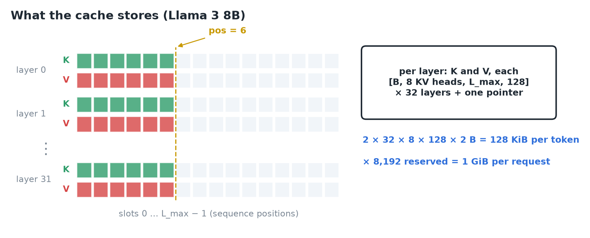
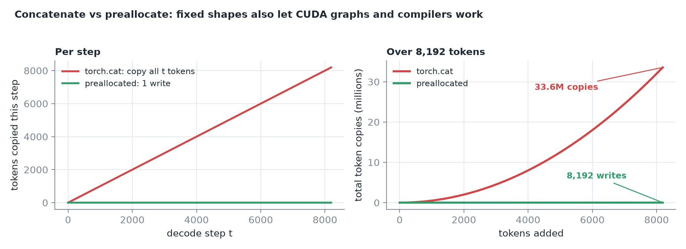
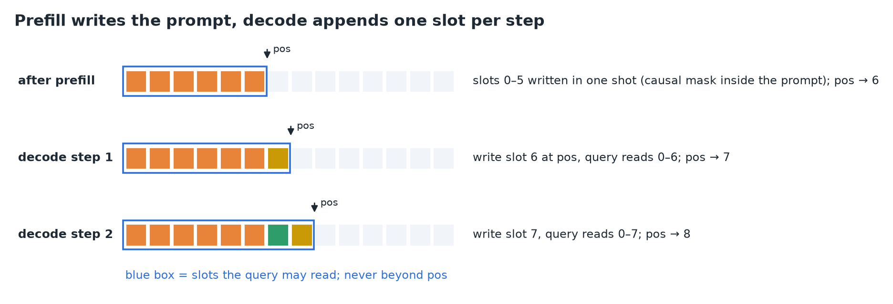
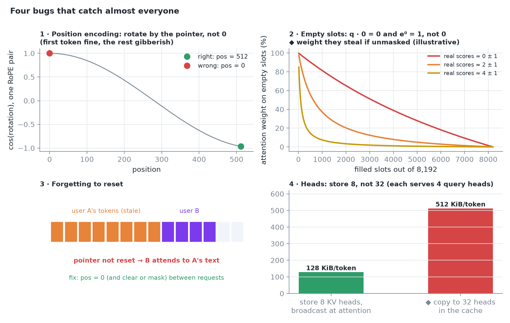
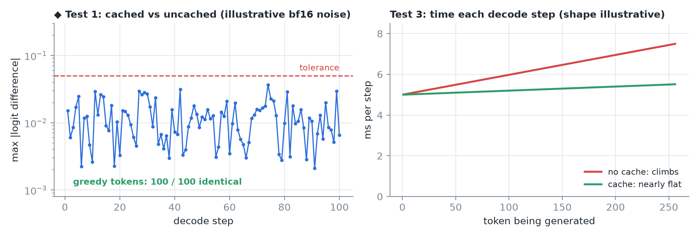
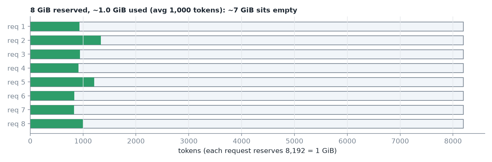
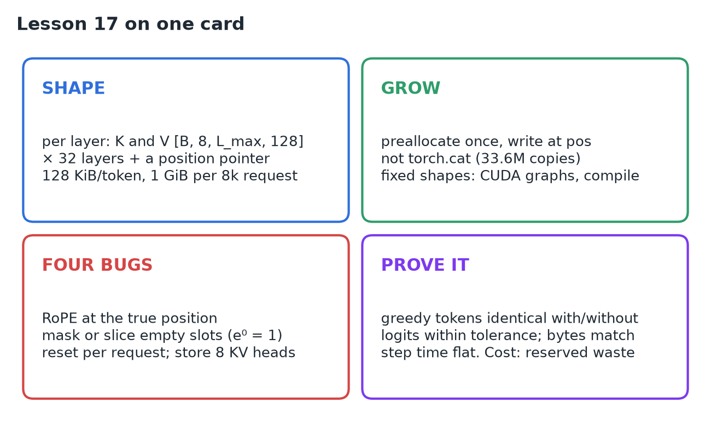

# 17 · Build a KV Cache

**Source:** [fanout.sh / inference-eng / 03-04](https://fanout.sh/inference-eng/curriculum/03-04) · ~7 min

> [!NOTE]
> A KV cache is **one key tensor and one value tensor per layer**, shaped **[batch, 8 KV heads, max length, 128]** for Llama 3 8B, plus a **pointer** saying how many slots are filled: **128 KiB per token**, so 8,192 reserved tokens is exactly **1 GiB per request**. **Preallocate** the buffer and write each new K/V **in place** (concatenating copies everything every step: 33.6M token copies over 8k tokens). Prefill writes slots 0 … P−1 in one shot; each decode step writes at the pointer, reads only slots 0 … pointer, and advances it. Four classic bugs: **wrong RoPE position, reading empty slots, not resetting, copying KV heads**. Prove it with identical greedy tokens, matching byte counts and flat step time. The hidden cost: reserved but **unused memory**.

## 1. What we store

In every layer, attention produces a key and a value **per token, per KV head**. So each layer gets two tensors:


*32 layers × (K, V), each [B, 8, L_max, 128], plus one small but essential piece: the position pointer.*

The per-token size is lesson 05's 128 KiB (2 × 32 × 8 × 128 × 2 bytes). Reserve 8,192 tokens and a single request's cache is **exactly 1 GiB**.

## 2. How the cache grows

```python
# naive: a brand-new tensor every step, copying everything
k = torch.cat([k, k_new], dim=2)

# better: allocate once, write into the next empty slot
k_cache = torch.empty(B, 8, L_max, 128)
k_cache[:, :, pos] = k_new
pos += 1
```


*Concatenation: more than 33 million token copies just to add 8,192 tokens. Preallocation: one small write per step, whatever the length.*

> [!TIP]
> With preallocation the **tensor shapes never change**, exactly what **CUDA graphs and compilers** need. Production code (e.g. torchtune) uses a fixed buffer plus a position counter.

## 3. Prefill writes, decode appends



- **Prefill:** the whole prompt arrives at once; its K/V go into slots **0 … P−1 in one shot**, in every layer. Inside the prompt, attention still uses the **causal mask**. The pointer jumps to the end of the prompt.
- **Decode:** each step writes the new token's K/V **at the pointer**, its query reads slots **0 … pointer and nothing beyond**, then the pointer moves forward by one.

## 4. Four bugs that catch almost everyone



1. **Position encoding.** Llama rotates each query and key by an angle set by the token's **position** (RoPE). In decode you feed one token, so it's tempting to call it position 0, but it's really **position 512** (or wherever the pointer is). Get it wrong and the first token is fine, then **gibberish**.
2. **Reading empty slots.** A preallocated buffer is full of zeros. A zero key gives score **0**, and **e⁰ = 1, not 0**, so unfilled slots quietly **steal attention weight**. Always **slice or mask** to the filled length.
3. **Forgetting to reset.** If the pointer isn't cleared between requests, the next user's prompt **attends to the previous user's text**.
4. **Heads.** Llama stores only **8 KV heads**, each shared by 4 query heads. **Broadcast** them at attention time; don't copy them into the cache.

## 5. Prove it works



- **Correctness:** generate 100 tokens greedily with and without the cache; the token sequences must **match exactly**. Caching changes **how** we compute, not **what**. Logits won't be bit-identical in 16-bit, but should agree **within a small tolerance**.
- **Memory:** allocated bytes must equal 2 × layers × KV heads × head dim × length × bytes per number.
- **Speed:** time each decode step: **flat with the cache**, climbing without.

## 6. The hidden cost of preallocating


*Eight requests reserved for 8,192 tokens each set aside 8 GiB. If they average 1,000 tokens, about 7 GiB sits empty, which limits how many requests fit on the GPU. Paged memory fixes this.*

## 7. Recap



## Interview cheat sheet

*Revise from these pages alone. ◆ = my addition beyond the video; everything else is from the lesson. Why the cache exists is in 14; KV bytes per token in 05, derivation 2; GQA in 07.*

### Say it in 30 seconds

> Per layer I keep a key and a value tensor shaped [batch, KV heads, max length, head dim], plus a position pointer. That's 128 KiB per token for Llama 3 8B, 1 GiB for an 8k reservation. I preallocate and write in place instead of concatenating, which avoids quadratic copying and keeps shapes static for CUDA graphs. Prefill fills slots 0 to P−1 at once under a causal mask; each decode step writes at the pointer, reads only up to it, and advances. The classic bugs are RoPE at the wrong position, attending to zero-filled slots (e⁰ = 1), not resetting between requests, and copying KV heads instead of broadcasting. I test that greedy outputs match the uncached loop, bytes match the formula, and step time stays flat.

### Only numbers worth memorizing

- **Llama 3 8B cache:** per layer K, V = [B, **8**, L_max, **128**]; **8,192 tokens = 1 GiB** per request.

### Derive, don't memorize

#### 1. Bytes the cache should allocate (test 2)

$$\mathrm{bytes} = 2 \cdot L \cdot H_{\mathrm{kv}} \cdot d \cdot L_{\mathrm{max}} \cdot b \cdot B = 128\ \mathrm{KiB} \times 8192 = 1\ \mathrm{GiB\ per\ request}$$

#### 2. Why concatenation is quadratic

Each step copies everything so far, then adds one.

$$\sum_{t=1}^{L} t = \frac{L(L+1)}{2} = \frac{8192 \times 8193}{2} \approx 33.6\mathrm{M\ copies} \quad \mathrm{vs} \quad 8192\ \mathrm{writes}$$

#### 3. Reserved but empty

$$\mathrm{waste} = R \cdot (L_{\mathrm{max}} - \bar{L}) \cdot 128\ \mathrm{KiB} = 8 \times (8192 - 1000) \times 128\ \mathrm{KiB} \approx 7\ \mathrm{GiB}$$

#### 4. What an unmasked empty slot steals ◆

Each zero slot scores 0 and contributes e⁰ = 1 to the softmax denominator.

$$w_{\mathrm{empty}} = \frac{n_{\mathrm{empty}}}{\sum_{i} e^{s_{i}} + n_{\mathrm{empty}}}$$

> [!TIP]
> ◆ Early in a long reservation almost every slot is empty, so the weight they steal can be huge. Masking to −∞ (or slicing to the pointer) makes it exactly 0.

### The four bugs

| Bug | Symptom | Fix |
|---|---|---|
| RoPE at position 0 in decode | First token fine, then gibberish | Rotate by the pointer's position |
| Reading empty slots | Attention diluted toward zeros | Slice or mask to the filled length |
| Not resetting | Next user attends to the previous user's text | Reset the pointer per request |
| Copying KV heads to 32 | ◆ 4× the memory (512 KiB/token) | Store 8, broadcast at attention |

### Three tests

| Test | Pass criterion |
|---|---|
| Correctness | 100 greedy tokens identical with/without cache; logits within tolerance (16-bit) |
| Memory | Allocated bytes = 2 · layers · KV heads · head dim · length · bytes |
| Speed | Per-step time nearly flat with the cache, climbing without |

### Rapid-fire Q&A

| Question | Crisp answer |
|---|---|
| Why preallocate instead of torch.cat? | cat copies everything every step (quadratic); preallocation is one write and fixed shapes. |
| Why do fixed shapes matter? | CUDA graphs and compilers need static shapes. |
| What does the pointer do? | Marks the filled length: where to write next and how far to read. |
| Why aren't cached logits bit-identical? | 16-bit kernels compute in a different order; they agree within tolerance. |
| What's the cost of preallocating? | Reserved-but-unused memory caps how many requests fit (paged memory fixes it). |

> [!WARNING]
>
> - Feeding the decode token at position 0: RoPE needs its true position.
> - Assuming zero-filled slots are harmless: e⁰ = 1 gives them weight.
> - Expecting bit-identical logits in 16-bit: compare tokens exactly, logits with a tolerance.
