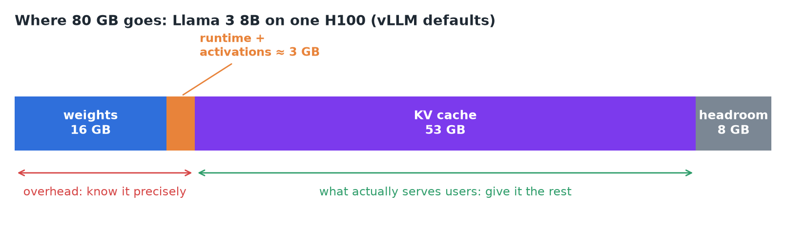
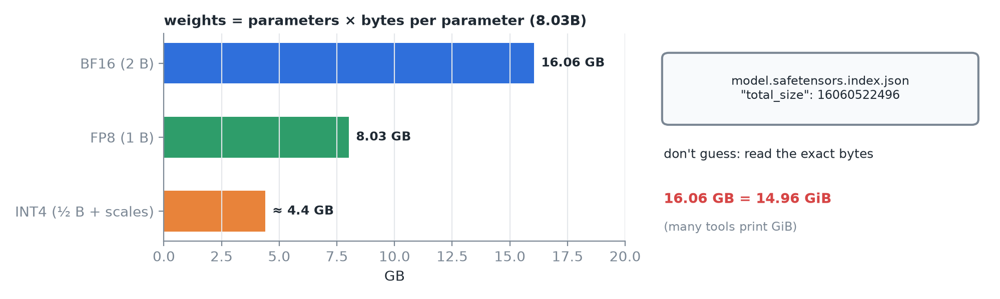
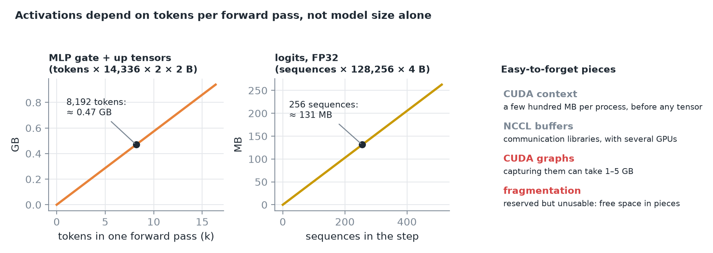
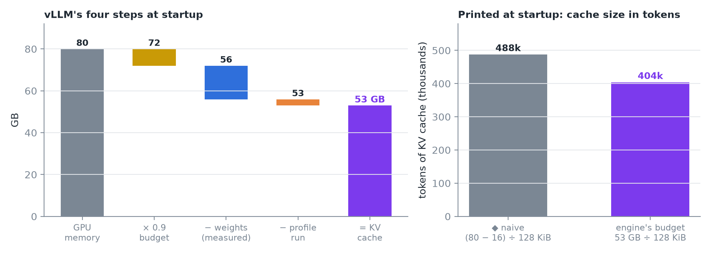
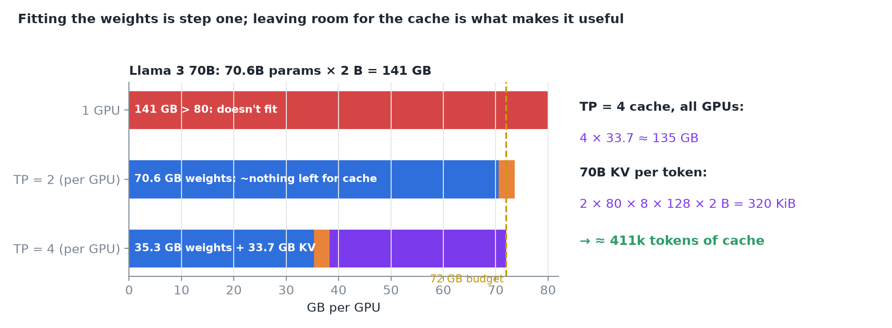
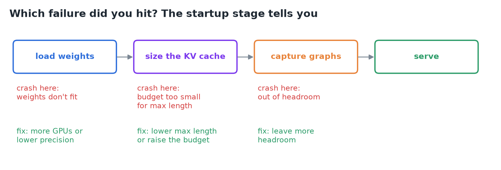
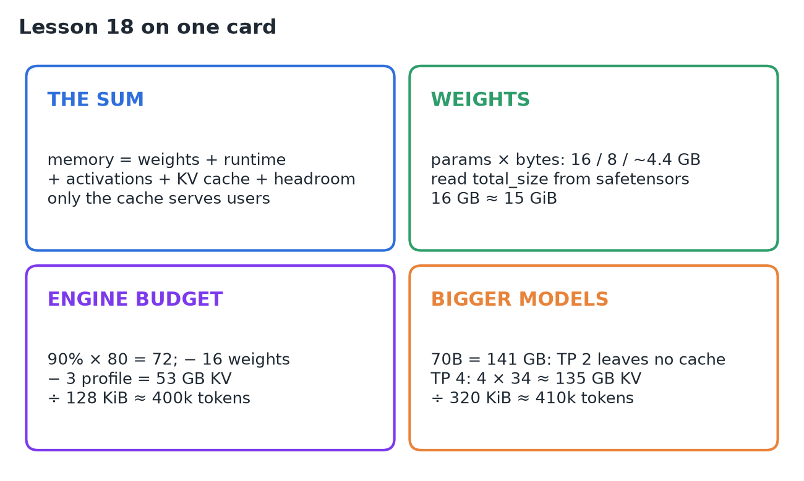

# 18 · Calculate Model & Runtime Memory

**Source:** [fanout.sh / inference-eng / 03-05](https://fanout.sh/inference-eng/curriculum/03-05) · ~7 min

> [!NOTE]
> 16 GB of Llama 3 8B weights on an 80 GB H100 does **not** leave 64 GB spare. GPU memory = **weights + runtime overhead + activations + KV cache + headroom**, and only the **KV cache** actually serves users, so the game is: **know the overhead precisely and give the rest to the cache**. vLLM does this at startup: take a **90% budget** (72 GB), subtract the **measured weights** (16) and a **profile run's peak** (≈ 3), and the rest, **≈ 53 GB ≈ 400k tokens**, becomes KV cache. Llama 3 70B (141 GB) doesn't fit on one GPU, leaves no cache on two, and on **four** gets ≈ 135 GB of cache ≈ 410k tokens.

## 1. Where GPU memory goes

*Weights (the biggest fixed piece), a runtime slice (CUDA context, communication buffers, kernel workspaces), activations (temporary tensors of a forward pass), the KV cache (every active request's keys and values), and headroom you never plan to use (CUDA graphs, fragmentation, safety margin).*

> [!IMPORTANT]
> Everything except the KV cache is **overhead**. The KV cache is what lets you **serve users**.

## 2. Weights: the easy part

*Four-bit formats come to a little over 4 GB because the scaling factors add extra.*

- **Don't guess** the parameter count: the model's `model.safetensors.index.json` lists the exact `total_size` in bytes.
- **Watch the units:** 16 GB ≈ 15 GiB, the unit many tools actually print (unit table in 04).

## 3. The runtime's share (easy to forget)

1. **CUDA context:** just initializing the GPU in a process takes a few hundred MB, before any tensor exists. With several GPUs, **NCCL** adds its own buffers.
2. **Activations:** depend on **how many tokens one forward pass handles**, not on model size alone. 8,192 tokens in one step: the MLP's gate and up tensors alone take ~0.5 GB, for an instant. Logits for 256 sequences in FP32: ~131 MB.
3. **CUDA graphs:** capturing them to cut launch overhead can take **1–5 GB**.
4. **Fragmentation:** the allocator may reserve memory it can't hand out, because free space is split into pieces too small to use.

## 4. How a real engine sizes the cache

*Step 1: budget = 90% of the GPU (72 GB). Step 2: load and measure the weights (16 GB). Step 3: one fake forward pass at the largest allowed batch records peak activation and non-torch memory (say 3 GB). Step 4: the rest is KV cache, ~53 GB ≈ 400k tokens at 128 KiB each. ◆ The naive "(80 − 16) ÷ 128 KiB" from 02 overstates it by ~20%.*

The engine **prints this at startup**: KV cache size in tokens, and how many full-length requests fit. The last 10%, outside the budget, is left for **CUDA graphs and surprises**.

## 5. A bigger model: Llama 3 70B

*70.6B × 2 B ≈ 141 GB. Tensor parallelism splits it: 2 GPUs hold 70.6 GB each, leaving almost nothing of the 72 GB budget; 4 GPUs hold ~35 GB each and leave ~34 GB each for cache.*

> [!TIP]
> **Fitting the weights is only step one.** Leaving room for the cache is what makes the deployment useful.

## 6. Which failure did you hit?

## 7. Recap

## Interview cheat sheet

*Revise from these pages alone. ◆ = my addition beyond the video; everything else is from the lesson. Weight bytes per precision and the GB/GiB table are in 04; naive KV capacity in 02; the dashboard memory sum in 09; 128 KiB/token in 05.*

### Say it in 30 seconds

> GPU memory is weights plus runtime overhead (CUDA context, NCCL, workspaces) plus activations (set by tokens per forward pass) plus the KV cache plus headroom for CUDA graphs and fragmentation. Only the cache serves users, so measure the overhead and give it the rest. vLLM takes 90% of the GPU, subtracts measured weights and a profile run's peak, and allocates the remainder as cache: for Llama 3 8B on an H100, 72 − 16 − 3 ≈ 53 GB, about 400k tokens. Llama 3 70B needs 141 GB: tensor parallel 2 leaves no cache, TP 4 leaves about 135 GB, roughly 410k tokens at 320 KiB each.

### Only numbers worth memorizing

- **Llama 3 8B on one H100:** 72 GB budget − 16 − ~3 ≈ **53 GB of cache ≈ 400k tokens**. **70B:** 141 GB, needs **TP 4** for useful cache.

### Derive, don't memorize

#### 1. The engine's cache budget

$$\mathrm{KV} = u \cdot \mathrm{HBM} - W - A_{\mathrm{peak}} = 0.9 \times 80 - 16 - 3 \approx 53\ \mathrm{GB} \quad \Rightarrow \quad \frac{53\ \mathrm{GB}}{128\ \mathrm{KiB}} \approx 400\mathrm{k\ tokens}$$

#### 2. Activation spikes scale with tokens per step

$$\mathrm{gate + up} = T \cdot 2i \cdot 2\ \mathrm{B} = 8192 \times 2 \times 14336 \times 2 \approx 0.47\ \mathrm{GB} \qquad \mathrm{logits} = S \cdot V \cdot 4\ \mathrm{B} = 256 \times 128256 \times 4 \approx 131\ \mathrm{MB}$$

> [!TIP]
> These are why the profile run uses the **largest batch it will ever allow**: the peak, not the average, must fit.

#### 3. Tensor parallel: split the weights, then check what's left

$$\mathrm{KV}_{\mathrm{total}} = \mathrm{TP} \cdot \left( 72 - \frac{141}{\mathrm{TP}} - 3 \right): \quad \mathrm{TP} = 2 \Rightarrow < 0, \quad \mathrm{TP} = 4 \Rightarrow 4 \times 33.7 \approx 135\ \mathrm{GB}$$

#### 4. 70B's KV per token, and the token count

$$2 \cdot 80 \cdot 8 \cdot 128 \cdot 2\ \mathrm{B} = 320\ \mathrm{KiB} \qquad \frac{135\ \mathrm{GB}}{320\ \mathrm{KiB}} \approx 410\mathrm{k\ tokens}$$

> [!TIP]
> ◆ 70B has 80 layers vs 32 but the same 8 KV heads, so 2.5× the KV per token. Four GPUs bought 2.5× the cache memory (135 vs 53 GB), which the bigger tokens eat: about the same ~400k tokens.

### The memory budget, piece by piece

| Piece | Scales with | Llama 3 8B / H100 |
|---|---|---|
| Weights | Params × bytes | 16 GB (BF16) |
| Runtime | Process, GPU count (NCCL) | A few hundred MB + buffers |
| Activations | Tokens per forward pass | ~3 GB peak (profiled) |
| KV cache | Whatever is left | ~53 GB ≈ 400k tokens |
| Headroom | 10% outside the budget | 8 GB: graphs (1–5 GB), fragmentation |

### Symptom → diagnosis

| Symptom | Diagnosis |
|---|---|
| Crash while loading | Weights don't fit: more GPUs or lower precision |
| Crash while sizing the cache | Budget too small for the max length: lower it or raise the budget |
| Crash during graph capture | Not enough headroom outside the budget |
| Tool says 15 for "16 GB" | It prints GiB |

### Rapid-fire Q&A

| Question | Crisp answer |
|---|---|
| Why isn't 80 − 16 = 64 GB free? | Runtime, activations and headroom claim their share first. |
| Where do you get the exact weight size? | `total_size` in model.safetensors.index.json. |
| What do activations depend on? | Tokens in one forward pass, not model size alone. |
| What does vLLM's 90% mean? | Its memory budget; the last 10% is left for CUDA graphs and surprises. |
| Why does 70B on 2 GPUs fail to serve? | 70.6 GB per GPU leaves ~nothing of 72 GB for overhead and cache. |

> [!WARNING]
>
> - Subtracting only the weights: runtime, activations and headroom are real.
> - Mixing GB and GiB: 16 GB is ~15 GiB.
> - Stopping at "the weights fit": with no room for cache, it can't serve.
