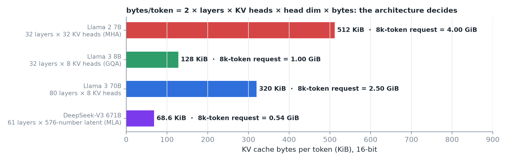
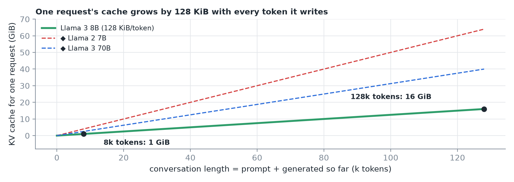
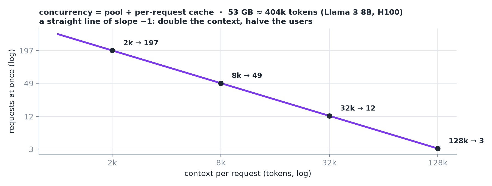
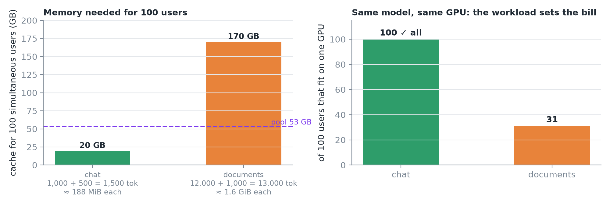
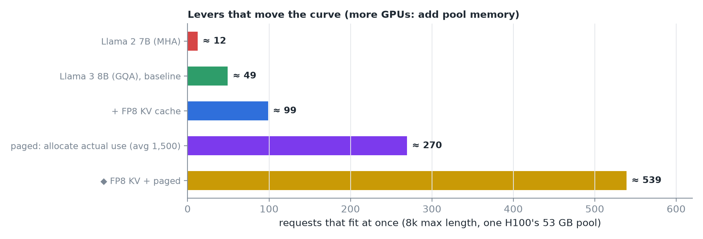
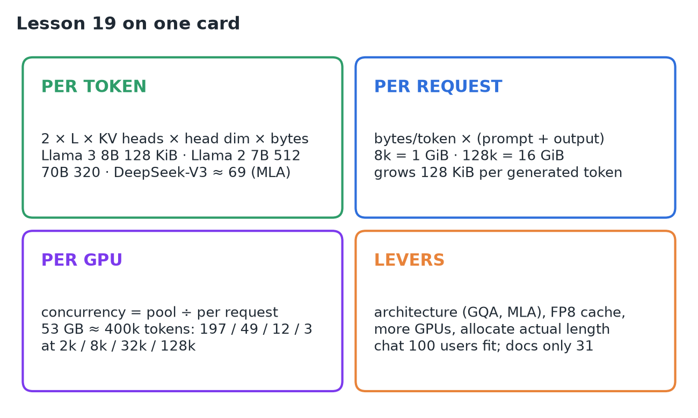

# 19 · Calculate KV Memory, Context & Concurrency Limits

**Source:** [fanout.sh / inference-eng / 03-06](https://fanout.sh/inference-eng/curriculum/03-06) · ~6 min

> [!NOTE]
> Two questions decide what a deployment can promise: **how long can one conversation be**, and **how many can run at once**? Both come from the same KV pool and one division. **Per token:** 2 × layers × KV heads × head dim × bytes (Llama 3 8B: 128 KiB). **Per request:** that × (prompt + output) (8k = 1 GiB, 128k = 16 GiB). **Per GPU:** pool ÷ per-request: ~53 GB ≈ 400k tokens fits **197 requests at 2k, 49 at 8k, 12 at 32k, 3 at 128k**. Context and concurrency trade **one for one**. The same model serves 100 chat users but only **31 document users** on one H100: the **workload sets the bill**. Levers: architecture (GQA, MLA), FP8 cache, more GPUs, and allocating actual rather than maximum length.

## 1. Per token: the architecture decides

For every layer, the cache stores one key and one value vector for every KV head, so bytes per token = **2 × layers × KV heads × head dim × bytes per number**.

*Llama 2 7B gives every head its own K/V (32 heads). Llama 3 8B shares 8 KV heads across 32 query heads: a quarter as much. 70B has 80 layers. DeepSeek-V3 compresses K/V into a small latent vector per layer: ~69 KiB/token for a 671B model.*

## 2. Per request: everything it has seen

A request's cache holds the **whole prompt plus every token generated so far**, so per-request memory = bytes per token × total length.

*Llama 3 8B: an 8k conversation holds 1 GiB; a 128k one holds 16 GiB, all for one user.*

## 3. Per GPU: one division

The engine found ~53 GB of cache on an H100 (lesson 18), about **400k tokens**. Divide the pool by each request's length:

> [!IMPORTANT]
> Context length and concurrency **trade off directly**: double one and you halve the other. A huge context window is expensive because every user who fills it **takes the seat of many others**.

## 4. Plan two real services on one H100

*Chat: 1,500 tokens ≈ 190 MB each; 100 users ≈ 20 GB fits easily. Documents (retrieval QA): 13,000 tokens ≈ 1.6 GiB each; 100 users would need ≈ 170 GB, and the pool holds ~31.*

> [!TIP]
> Same model, same GPU: **the workload, not the model, sets the hardware bill**.

## 5. What moves the curve

1. **The model:** at 8k each, Llama 2 7B fits ~12 requests; Llama 3 8B fits 49, mostly thanks to **grouped-query attention**.
2. **Cache precision:** store K/V in **8-bit** instead of 16 and the pool doubles to ~800k tokens, at a small risk to quality.
3. **More GPUs:** more memory for the pool.
4. **Allocation:** stop reserving the maximum length for every request. Real conversations rarely hit the limit: at an average of 1,500 tokens, handing out memory **as tokens actually arrive** fits ~270 requests. That's the idea behind **paged KV memory**.

Engines like vLLM print this at startup as the **maximum concurrency for a given request length**; now you can check it by hand.

## 6. Recap

## Interview cheat sheet

*Revise from these pages alone. ◆ = my addition beyond the video; everything else is from the lesson. The per-token formula is derived in 05 (derivation 2); the 53 GB pool in 18 (derivation 1); reservation waste in 17.*

### Say it in 30 seconds

> Bytes per token is 2 × layers × KV heads × head dim × bytes: 128 KiB for Llama 3 8B, 512 for Llama 2 7B without GQA, 320 for 70B, ~69 for DeepSeek-V3 with MLA. A request holds that times prompt plus output, so 8k tokens is 1 GiB and 128k is 16 GiB. Concurrency is the KV pool divided by per-request cache: an H100's ~53 GB, about 400k tokens, fits 197 requests at 2k, 49 at 8k, 3 at 128k. Context and concurrency trade one for one, so the workload sets the bill: 100 chat users fit but only 31 document users. GQA or MLA, an FP8 cache, more GPUs, and paged allocation by actual length move the curve.

### Only numbers worth memorizing

- **H100, Llama 3 8B, ~400k-token pool:** **197 / 49 / 12 / 3** requests at 2k / 8k / 32k / 128k.

### Derive, don't memorize

#### 1. Concurrency is one division

$$\mathrm{concurrency} = \frac{\mathrm{pool}}{\mathrm{bytes/token} \times \mathrm{length}} = \frac{53\ \mathrm{GB}}{128\ \mathrm{KiB} \times 8192} \approx \frac{404\mathrm{k}}{8192} \approx 49$$

#### 2. Plan a service: users × length × bytes/token vs the pool

$$100 \times 1500 \times 128\ \mathrm{KiB} \approx 20\ \mathrm{GB}\ (\mathrm{fits}) \qquad 100 \times 13000 \times 128\ \mathrm{KiB} \approx 170\ \mathrm{GB} \Rightarrow \frac{404\mathrm{k}}{13000} \approx 31$$

#### 3. The levers multiply

Concurrency ∝ pool ÷ (bytes per token × allocated length), so each lever is a factor.

$$\mathrm{GQA}\ 4\times\ (12 \rightarrow 49) \qquad \mathrm{FP8\ KV}\ 2\times\ (\rightarrow 98) \qquad \mathrm{actual\ length}\ \frac{8192}{1500} \approx 5.5\times\ (\rightarrow 270)$$

> [!TIP]
> ◆ Factors stack: FP8 cache plus paged allocation ≈ 2 × 270 ≈ 540 requests on the same GPU.

#### 4. Why DeepSeek-V3 is so small ◆

MLA stores one 512-number latent plus a 64-number RoPE key per layer, instead of K and V for every head.

$$(512 + 64) \times 61\ \mathrm{layers} \times 2\ \mathrm{B} \approx 68.6\ \mathrm{KiB/token}$$

### KV cache per token, by architecture

| Model | Why | Per token | 8k request |
|---|---|---|---|
| Llama 2 7B | 32 layers, 32 KV heads (MHA) | 512 KiB | 4 GiB |
| Llama 3 8B | 32 layers, 8 KV heads (GQA) | 128 KiB | 1 GiB |
| Llama 3 70B | 80 layers, 8 KV heads | 320 KiB | 2.5 GiB |
| DeepSeek-V3 671B | MLA latent, 61 layers | ~69 KiB | ~0.54 GiB |

### Symptom → diagnosis

| Symptom | Diagnosis |
|---|---|
| Far fewer concurrent users than expected | Long contexts: each fills many users' seats |
| Same GPU fine for chat, overloaded for RAG | Per-request cache is ~9× bigger (13k vs 1.5k tokens) |
| Startup "max concurrency" is low | Max length × bytes/token too big for the pool: check by hand |
| Memory reserved but mostly empty | Allocating max length per request (fix: paged KV) |

### Rapid-fire Q&A

| Question | Crisp answer |
|---|---|
| What sets bytes per token? | The architecture: layers, KV heads, head dim, cache precision. |
| How does context trade with concurrency? | One for one: double the length, halve the requests. |
| Why is a huge context window expensive? | One user filling it takes many users' seats. |
| How does GQA help serving? | 8 KV heads instead of 32: 4× more tokens in the same pool. |
| What does FP8 KV cost? | Doubles the pool, at a small risk to quality. |

> [!WARNING]
>
> - Sizing for the average model, not the workload: RAG and chat differ ~9× per request.
> - Reserving max length per request: real conversations rarely reach it.
> - Forgetting output tokens: the cache holds prompt plus everything generated.
